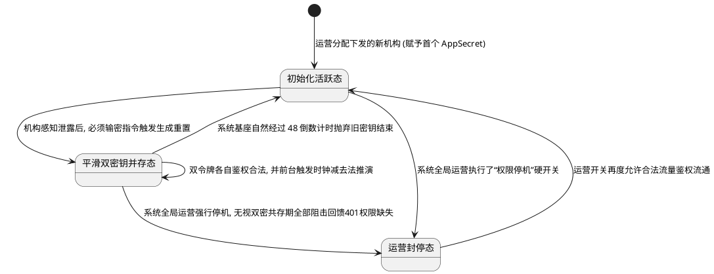

# AISE 产品需求文档 (PRD) - 组织后台体系扩充 (一期)

## 1. 项目背景
- **需求简介**：针对日益增加的 B 端对接需求，我们需要为内部管理端新增“第三方渠道方组织”的授权能力，并构建一个全新的“组织后台”。供这些第三方机构（租户）管理自身的 API 开发凭据、接收 Webhook 回调、查阅接口日志，以及监控本机构名下考生的报名与测评成绩流转结果。
- **业务诉求**：提供 API 联调与排错测试的数据闭环工具，实现第三方生源信息的自动化流入与业务状态的对齐监控。第一期目标以核心流程为主，控制开发成本（例如：C 端用户在前期依然使用标准独立考试入口，不接入复杂的单点登录 SSO 机制）。

## 2. 业务流程简述
运营人员在【内部管理端】通过新建组织并开启权限（生成系统标识） -> 机构的开发或运营负责人凭借初始分配的管理员账号登入专属的【组织后台】 -> 机构在开发者中心查阅 `AppKey/AppSecret` 并选定和订阅业务触发的 `Webhook` 回调节点 -> 机构技术通过接口向 AISE 下单推送自己的考生并进行系统联调 -> 机构运营在组织后台报表中心，实时查询名下全部考生是否参加了测评、是否完成了交卷并取得了证书反馈。

## 3. 详细功能需求说明

### 3.1 内部管理端 - 渠道管理列表及组织配置
- **位置**：运营中心 -> 渠道管理模块
- **目标**：赋予内部运营人员给各个渠道方开通独立组织后台、分配登录账号、随时切断与管理 API 调用鉴权状态的后台管理能力。

#### 3.1.1 界面元素与展示规则 (数据展示与溢出)
1. **列表新增“[组织后台状态]”列**：
   - 静态/动态拼接：作为独立字段位于渠道创建时间之后。
   - 视觉规则：读取服务端状态。开启时以“绿色原点+正常”两词标签提示；若手动关闭则以“灰色原点+已禁用”呈现；若该记录尚未由内部人员去触碰初始化则灰显为“未开通”。
2. **列表上方状态筛选器（下拉单选框组件）**：
   - 交互规则：单选。选项包含针对上述三种动态状态枚举的精确收拢（全部、正常、已禁用、未开通）。
   - 空态兜底：页内首次加载未发生动作前，下拉框输入内容显示“组织后台状态”作为水痕占位符。

#### 3.1.2 界限与总体状态控制 (编辑组织大弹窗)
1. **初始化条件**：后台登录用户拥有相应的渠道管理菜单编辑最高权限，且列表页至少有一条业务数据。
2. **默认态**：在操作列点击“编辑组织”关联的卡片操作区域。
3. **触发指令**：用户对列表中特定渠道数据执行左键单击“编辑组织”。
4. **执行中过程态**：主界面立刻蒙上一层暗色半透明全屏遮罩，避免在弹窗未销毁前操作底侧列表。随后从屏幕中滑入宽约 800px 的独立模块大弹窗。此时如内部接口较慢，弹窗内容区域先亮起一层渐变骨架屏刷动作过渡。
5. **执行异常**：若当前渠道因网络中断获取内部信息获取失败，系统自动阻断弹窗呈现，且在原位弹出红色悬浮轻提示：“网络中断未获取数据，请检查网络重试”。
6. **执行成功（展现内容）**：弹窗左侧为主状态开关与管理员列表，右侧为开发者技术凭证区域。

#### 3.1.3 交互逻辑 - 组织总体状态开关
1. **界面元素**：弹窗左上方标题旁置入 Switch 开关组件。
2. **状态机与流转**：
   - 默认态：读取服务端数据回显。开启则开关靠右呈现纯绿色，旁置静态文案“已启用”；关闭则开关靠左变灰点，旁置静态文案“已停用”。
   - 触发指令：点击 Switch 开关体。
   - 二次确认拦截：若用户从“已启用”尝试切换为“已停用”，中央需弹出警示窗：“停用后，该渠道下属所有管理员皆被强制踢线下线无法登入，且所有 API 接口瞬间拒止 401，是否继续禁用？”
   - 执行成功：点击“是”后，文案与色彩发生即时反转，并在弹窗底部点击保存时作为一个主 Payload 字段提交更改。

#### 3.1.4 交互逻辑 - 管理员账号配置
弹窗左下方负责分配可登录第三方组织后台的具体人员。
1. **列表元素与展示规则**：
   - 展现形式：内嵌精简型 Table 表格结构。
   - 字段排布：包含[登录账号]、[姓名/手机号]、[角色]、[状态]、[操作列]。
   - 脱敏规则：为内部可见，姓名如实渲染，手机号亦如实显示，支持双击单元格快捷复制。
2. **账号新增与边界校验**：
   - 触发指令：点击表格右上方“新增管理员”次级按钮。
   - 过程态（二次防呆弹窗）：弹出内嵌层级的二次轻量级对话框，需填入 `登录账号` (必填)、`初始密码` (必填)、`姓名` (选填)、`手机号` (选填)。
   - 键盘与输入限制：登录账号限制只能由半角英文字母、数字或下划线组成，最短 5 位，最长 16 位。输入时实时屏蔽中文与特殊符号。密码框强绑定只呈现密文星号状态。
   - 保存异常：点击对话框“保存”若服务端探测账号与系统全局账号有重名冲突，阻断动作，账号输入框边框变红并底部文字：“该登入账号在全系统已存在，请换用其他组合”。
   - 保存成功：对话框关闭，表格静默向下新增一行新账号数据。
3. **行内操作命令（CRUD）**：
   - **重置密码**：点击小钥匙图标。确认后强制打断原密码有效性，随即生成一个 8 位随机密码（大写+小写+数字），并通过浏览器 alert / 或复制命令让操作员能复制给对方。
   - **编辑信息**：可修改姓名和手机号，绝对禁止修改登录账号名（锁闭置灰禁止编辑）。
   - **禁用/启用**：管理员状态的拨弄。被禁用的普通管理员无论输入怎样正确的账密，都将在自己的登录页拦载：“您的权限已被停用，请联系渠道商务人员”。
4. **特殊兜底机制 (默认保护主账号)**：每个渠道必须有且仅有唯一一个“默认管理员”（超级 Admin），系统锁死此行的“禁用”与“删除”按钮操作（按钮做置灰并无事件挂载），彻底规避渠道处于失去所有管理权限节点的死锁真空地带。

#### 3.1.5 交互逻辑 - 开发者凭证展示与管控
弹窗右部分专属于渠道联调阶段的技术对接凭据下发。
1. **元素展示边界（安全脱敏管控）**：
   - `AppKey` 与 `AppSecret` 本质是不可自行撰写的高敏机密文。
   - 界面上所有的系统自动生成秘钥在日常开启弹窗时均以星号密码 `******` 取代。只配一个“小眼睛”切换与外挂的“一键复制”剪贴板指令按钮。
2. **重置操作降级体系**：
   - 在弹窗内点击红色的“重置密钥”按钮，必须二次弹窗拦截（误点会导致线上一秒钟大量断接客诉）。
   - 核心系统补偿：点击“强制立即摧毁并换新秘钥”命令发生后，老秘钥随风消散，新串立刻替代；但为了照顾旧业务对接不被阻断，我们在 PRD 的第 `3.2` 节针对系统自带的“过期平滑过渡设定机能”专门开辟了针对客户端发起的双密共存过渡期。（在内部管理端由运营直切无缓冲期，强调雷霆熔断性）。

#### 3.1.6 异常与系统边界 (系统级弹窗干涉规避)
- **遮罩强阻断交互**：严格配置大弹窗属性，**不允许点击背部半透明阴影遮罩进行窗口自动解散**。必须强制用户点击明确的右上角“X”或底部“关闭”按键。若是用户点“X”且中间发生了输入数据尚未按保存，弹出一个阻塞层质询：“本次弹窗发生了表单录入但还未提交写盘，确定要不保存直接放弃离开吗？”
- **冲突并发写盘**：不同端两名系统超管人员同时操作同一个机构的信息并先后按保存。采取“谁最晚发起请求网络写盘，就全权冲淡前者的一切资料覆盖落库”为准基调机制。

### 3.2 内部管理端 - 报名管理列表扩充 (支付维度)
- **位置**：考务与用户 -> 报名管理
- **目标**：在现有的 C 端报名明细中，补充 B 端联调的资金流向分类标识，支撑独立渠道代收后付、系统直连结算或联调免单等多种新业务场景的核对调度。

#### 3.2.1 界面元素与展示规则 (支付渠道字段)
1. **订单主表新增“[支付方式]”列**：
   - 位置：置于原“实际支付金额”或“报名时间”的相邻位置。
   - 动态映射枚举：强依赖底层状态机，映射具体的文案：
     - 若为常规通道：展现静态文本“微信支付”或“支付宝”。
     - 若为 B 端下发特批的测试/福利：呈现绿色文本徽标“平台免单”。
     - 若为机构通过 API 下单，费用由机构在线下代收，平台集中结算的模式：呈现突出的蓝色标签“机构后付”。
   - 异常/无兜底：应对可能存在的历史污染订单字段为空情况，此项格子强制输出短横占位符“—”，鼠标悬停释义气泡：“无法追踪到具体来源，系旧版历史数据”。
2. **侧边栏详情抽屉映射**：
   - 当点击某考生所在行的“查看详情”滑起右侧大抽屉时，在【订单交易】子信息区块中，同步新增一行 [支付通道] 字段并与上方的列表文本表现风格保持全等约束。

#### 3.2.2 交互逻辑与状态流转 (列表前端筛选筛选器)
1. **界面元素**：报名列表正上方条件检索引擎区，新增下拉过滤框“支付方式”。
2. **状态机与流转**：
   - 默认态：占位水印“全部支付方式”。
   - 触发指令：点击下拉三角，展开所有合规的资金来源枚举池（普通支付、免单通道、B 端代收通道）。
   - 过程态与系统联动：选中某个枚举点击外侧“搜索”主按钮。由于列表牵扯资金重型检索，搜索请求发往后台时局部必须施加 Loading 过渡骨架，防止连续阻断刷榜。
   - 边界（级联禁用）：当首位大筛选条件为“仅展示自主报名流向”的前提下，应将“机构后付”的选项在这层支付选择器中做硬性置灰禁用（因两者业务上绝不会互斥共存）。

### 3.3 组织后台 - 身份鉴权与中心入口 (登录模块)
- **位置**：组织后台独立网络入口
- **目标**：提供封闭的第三方渠道专网访问入口，保障渠道核心数字资产的私密授权。

#### 3.3.1 界面元素与展示规则 (品牌透传与表单区)
1. **左侧视觉与品牌宣发面**：
   - 常驻展示机构自身生态愿景或系统对接优势的宣传区域，作为品牌调性基座。
2. **核心登录交互区**：
   - [登录账号]：预留占位符提示"输入机构账号"，获取焦点时外框高亮。
   - [安全密码]：具备基础的密文展示能力并配套小眼睛显隐切换控件。
   - [辅助功能]：提供"记住账号"复选勾选框以及"忘记密码？需联系平台运营"的强指引引导链接。

#### 3.3.2 交互逻辑与状态流转 (入网鉴权)
1. **初始化条件**：渠道技术开发或运营人员被发放初始账密后，首次访问该后台网络地址。
2. **默认态**：界面静止，等待人为接管表单输入。
3. **输入边界限制**：暂不强设图形验证码，但若极短时间内高频录入错误密码，将触动防爆破系统级的账号临时冻结并抛出警示。
4. **过程态（登录指令下达）**：点击登录按钮后，按钮本身转为处理中状态阻止重复派发，同时将表单数据封装发往鉴权控制中心比对。
5. **执行异常**：如中心识别密码不正确，于密码框下缘红字提示"您输入的密码无效"并配合区域轻微震动。如账号处于禁用冻结期，明确阻击并提示"此账号已被禁用"。
6. **执行成功**：系统下放合法通行凭证，平滑跳转至控制台概览主界面。

### 3.4 组织后台 - 业务数据中心 (本渠道学生列表)
- **位置**：组织后台系统菜单 -> 业务数据中心 -> 本渠道学生
- **目标**：提供组织专属的渠道生源数字大盘底座，供机构运营人员检索归属与自己子域下的所有学生资料。

#### 3.4.1 界面元素与展示规则 (数据脱敏与信息卡片)
1. **主表格核心字段与脱敏**：
   - [学生信息]：包含头像、姓名及系统唯一标识展示。
   - [混合证件列]：证件号码实施严格脱敏掩码（如 `110105********1234`），下方需副标题补齐证件类型（如“身份证”、“护照”）。
   - [联系方式]：家长手机号展示掩盖中间四位（如 `138****8000`）。
   - [名下测评订单]：数字统计标签（例如“3 条记录”），鼠标悬停时呈现高亮色反馈，提示可点击钻取。
2. **极简学生详情抽屉**：
   - 交互规则：点击列表的任意一行触发右侧滑出的 `[600px]` 宽度的浮层抽屉，并在主体附带暗色半透明底盖全屏阻断。
   - 数据区块落定：抽屉内部区分“核心身份与联系信息”、“所在地区与学习信息”两大面板。对于涉及极端敏感的物流或住宿地址，允许系统输出统一底板提示：“详细地址涉及隐私已折叠，测评邮寄地址请以报名时所填为准”。

#### 3.4.2 交互逻辑与状态流转 (多维度并联精确检索)
1. **初始化条件**：用户进入学生列表页面，底层向服务端索要全域分页首屏缓存。
2. **默认态**：上方的综合复合搜寻区域呈三输入框空白状态。
3. **触发指令**：用户可在“学生姓名”、“家长注册手机(支持后四位)”或“证件号码”三框中输入单项或多条件。
4. **过程态限制（全字匹配优先原则）**：由于 B 端客户往往掌握精准的 C 端报备档案，除了名字允许进行右半部模糊搜索外，对“手机后四位”与“证件号缩影”两项系统实施精确的后联/定长等值抓取。
5. **执行异常**：系统判定入参非法（例手机框内键入了中文字符串），在“精确匹配检索”按钮底座飘红提示 “限定格式异常请排查”。
6. **执行成功**：表格刷新抛弃原缓存结果，挂载并重渲染新获得的业务数据视图。并同步更新左下角的“共查询到 N 名本渠道归档记录”。

### 3.5 组织后台 - 业务数据中心 (成绩与进度查询)
- **位置**：组织后台系统菜单 -> 业务数据中心 -> 成绩与进度查询
- **目标**：以可视化的看板核实推入本平台的学员全景生命周期的状态变迁，辅以考试维度做全局统筹。

#### 3.5.1 界面元素与展示规则 (跨周期状态枚举)
1. **进度状态强对齐标识列**：
   - 本列为全屏核心列。需将系统内部流转的主进程翻译成清晰的颜色徽记展示：
     - 若触发了 `PAYMENT_SUCCESS`（支付成功未开考）：紫色调标签。
     - 若抵达了 `STATUS_WAITING` 或 `STATUS_TESTING` (包括候场与作答完毕待算分中)：蓝色调标签。
     - 若生成了最终的判分及打证点 `RESULT_CERT`：变为最强绿调的标签组合，同时该行的[考评得分]字段不再是虚线，而是填入真实的数字字号，[考评等级]显现例如“A+卓越”并自带阴影强调。
2. **全周期追踪时间线（明细抽屉）**：
   - 当用户点击某条订单滑出抽屉后，核心区域呈报一个垂直的时间轴树。节点由下往上推演（底座为时间最前发生的支付，顶端为最后打出来的最终终态），并挂上服务端记录的精准到秒的时钟尾缀。

#### 3.4.2 交互逻辑与状态流转 (项目引擎筛选与数据导出)
1. **顶部搜索组件**：
   - 特点：支持按“全部测评项目”为主轴筛选，配以五大内置综合业务进度枚举，和输入学号/订单号构成的过滤矩阵。
2. **极端汇出请求管控（按钮节流防刷器）**：
   - 如果用户利用顶部常驻的“数据导出报表”功能，前台脚本需即刻锁死该按钮状态为“Disabled”（置灰并换图标为漏斗），倒数冷却 15 秒以杜绝并发轰炸导致数据库队列挂死。

### 3.6 组织后台 - 系统与开发者 (配置与密钥管理)
- **位置**：独立的组织后台系统菜单 -> 系统与开发者 -> 配置与密钥
- **目标**：给第三方的技术支持专员使用。提供对接令牌及重置入口，以及事件推送订阅地址维护。

#### 3.6.1 界面元素与展示规则 (关键隐私文本呈现)
1. **应用唯一标识**：
   - 全局固化文本不可选只读展示，旁置“一键复制”剪切板快捷机制。
2. **应用安全密钥**：
   - 默认以密码星号遮挡展示。旁配“小眼睛”显隐切换控件。
   - 空态与满态切换提示区块：正常情况下无任何提示条框。一旦机构发起了二次“强制重置密钥”行为，界面将推下一道显眼的红色倒计时警告模块。提醒用户正在维持两套（一旧一新）密钥共同存活调用的平滑期，同时打出最高达 48 小时的时钟倒推。

#### 3.6.2 交互逻辑与状态流转 (平滑重置密钥及其二次验证)
1. **初始化条件**：机构安全人员判断当前正在流通的秘钥泄露了。
2. **触发指令**：左键单击密码框右侧次级“重置密钥”。
3. **执行中过程态**：屏幕中压盖“重置安全密钥”宽弹窗。其中明定规则：“如果泄露发生请即刻填入您的登录平台自身密码以进行身份验证”。
4. **执行异常**：身份密码若输入偏误，文本框发红拒绝。
5. **执行成功**：旧秘钥立刻转成带遮罩隐退在底栏，新密钥跳上主窗体首界面，且此时系统立刻将两个密钥一并加入合规认证允许列表中。

#### 3.6.3 交互逻辑与状态流转 (事件推送订阅开启与注册)
这部分属于将状态变动第一时间通知给机构的回调管理。
1. **主控开关总闸**：右上角拨动开关按钮。开启时文案为蓝字“接收推送中”。停用期间不发出任何通知。
2. **地址与事件勾选**：
   - 回调地址文本框强求前缀包含网络协议特征。
   - 对于四种主要预制事件（支付事件、考务状态、归档下证、退款重批）准许复选打钩联动。保存确认时同步提交。

### 3.7 组织后台 - 系统与开发者 (联调与接口日志)
- **位置**：组织后台系统菜单 -> 系统与开发者 -> 联调与接口日志
- **目标**：形成问题追踪全貌报文的“透明化”查看，支持定位双向丢包以及模拟事件人工补发。

#### 3.7.1 界面元素与数据校验规范 (跨模式长流水)
1. **复合检索条目设计**：
   - 支持从“记录模式”（系统接收调用 / 系统外发推送）入手第一层区分。
   - 第三个框内建精确的业务追踪标识或者报文摘要强搜索能力。
2. **联调日志报文区块（数据列表行展示原则）**：
   - 方向识别标记：行首用带箭头的文本（如 “← 接收调用”、“→ 事件推送”）区隔通讯主从关系。
   - 响应状态加粗染色：明确处理成功为全绿配置，处理超时全红，鉴权拦截为黄系警告。并配有“请求经过耗时”。

#### 3.7.2 交互逻辑与状态流转 (日志重推与报文查阅)
1. **初始化条件**：某条推送外部遭遇了“处理超时”后记录于列表。
2. **触发指令**：点击进入该行详细抽屉。
3. **透明化展现态**：抽屉深层展示原始投递业务数据（原格式结构化数据）、对方服务器的报文返回原文缩影。同时在顶部附加一个“主动重推”（针对失败记录）功能。
4. **人工强制重推**：在抽屉里点击重推，发起内部任务调令。页面上无需死等重推完毕（耗时通常较长），轻提示一闪而退回到列表即可：“重推任务执行中，稍后刷新查看新日志”。

## 4. 流程与状态图表 (PlantUML)

### 4.1 开发者配置端：应用密钥平稳重置与过度状态流转
此类业务为了不破坏正在对接与调用的服务器间平滑通讯体系，必须有复杂的交接期：

**状态机架构描述**

## 5. 附录 (Appendix)
详见上述所有的 PlantUML 图及交互要求准则对照。
