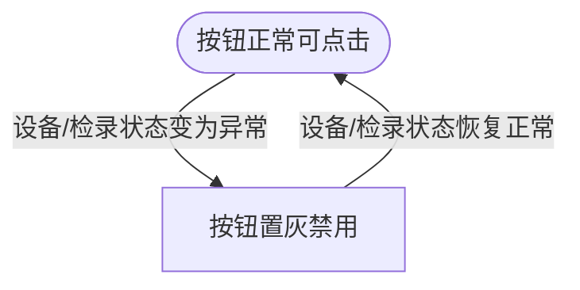
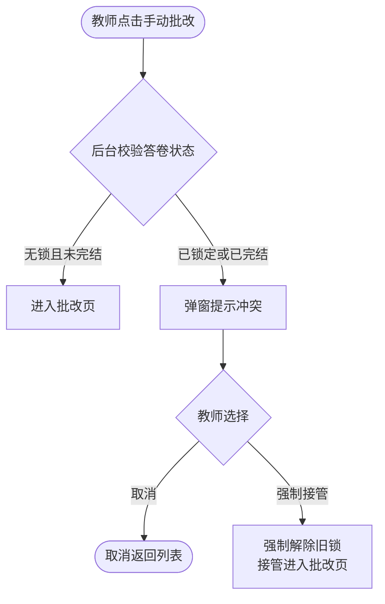

# AISE 考中考后功能优化 PRD

**PRD 版本**：V1.0
**修订日期**：2026-05-12
**修订人**：重写

---

## 🔷 0. PRD 类型判定

| 项目 | 内容 |
|------|------|
| PRD 类型 | 🏗 **功能型** |
| 功能数量 | 6 项 |

## 🔷 1. 项目背景与收益预估

### 1.1 需求简介

对 AISE 考试系统的监考端、阅卷端、后台管理端及用户端进行集中功能优化，覆盖监考状态联动、视频回放体验、身份审核闭环、操作日志溯源、在线阅卷预览、阅卷冲突防御六大场景。

### 1.2 业务诉求

当前系统存在以下痛点：
- 监考人员无法快速定位异常考生，依赖逐项点查，效率低下
- 考后视频回放仅支持小窗播放，排查异常片段耗时过长
- 用户身份信息变更缺乏审核机制，存在合规风险
- 考试异常时缺乏行为溯源工具，排查依赖研发介入
- 阅卷附件的强制下载流程打断批改连贯性
- 多教师并发操作同一答卷时无碰撞检测，存在覆盖风险

### 1.3 收益预估

- **用户收益**：
  - 监考官异常考生定位时间从逐项点击 15s 缩减至卡片内一目了然（预计减少 80% 排查耗时）
  - 阅卷教师单题附件查阅时间从"下载→打开→返回"的 30s 缩减至即时预览的 3s（减少 90%）
  - 视频排查效率从 5 分钟定位关键帧提升至倍速拖拽 1 分钟内完成（减少 80%）
- **业务收益**：
  - 身份审核上线后预计拦截不合规变更申请 100%，消除身份信息被随意篡改的风险敞口
  - 多教师阅卷冲突防御预计消除 100% 答卷覆盖事故
  - 操作日志导出预计减少 70% 研发侧排查排障人力投入
- **不做风险**：监考效率持续低下影响场次规模化；身份审核缺失可能导致合规审计不通过。

## 🔷 2. 业务流程简述

监考/阅卷/管理三类角色在 AISE 系统中执行监考巡查、考后回溯、阅卷批改、身份审核等核心操作时，系统提供：
- 监考端：卡片按钮状态与考生设备/检录状态实时联动
- 监考/阅卷端：视频全屏播放器支持倍速与进度拖拽
- 后台管理端：身份信息变更的审批流转
- 监考端：操作日志的结构化展示与导出
- 阅卷端：附件在线预览避免强制下载
- 阅卷/管理端：阅卷并发冲突检测与接管机制

## 🔷 3. 版本管理

### 3.1 PRD 文档修订记录

| 版本号 | 日期 | 修订人 | 修订内容 |
|--------|------|--------|---------|
| V1.0 | 2026-05-12 | 重写 | 基于原始 PRD 重构，统一共享层结构 |

### 3.2 产品版本信息

| 项目 | 内容 |
|------|------|
| 所属平台 | AISE 考试系统 |
| 涉及终端 | AISE 监考端（Web）、AISE 阅卷端（Web）、AISE 运营后台（Web）、爱测评 iceping 用户端 |
| 目标上线版本 | 待定 |
| 依赖模块及基线 | AISE 考试管理后台基线版本、iceping 用户端基线版本 |

## 🔷 4. 系统关联与依赖

| 关联模块 | 数据流向 | 依赖说明 |
|---------|---------|---------|
| AISE 监考端 ↔ AISE 后台 | 监考端读取考生设备状态（摄像头、录屏、检录），后台提供数据接口 | 功能一、二、四依赖 |
| AISE 运营后台 → iceping 用户端 | 后台审核结果回写至 iceping 用户端，触发状态更新与数据回滚 | 功能三依赖 |
| AISE 阅卷端 ↔ AISE 后台 | 阅卷端发起批改请求，后台校验答卷锁定状态并返回冲突结果 | 功能六依赖 |
| iceping 用户端 → AISE 后台 | 用户提交身份变更申请，写入后台审核队列 | 功能三依赖 |

- **接口依赖**：摄像头状态、录屏状态、检录状态需后台提供实时查询接口；答卷锁定状态需后台提供原子性校验与加锁接口
- **硬件兼容**：Web 端运行，无硬件耦合
- **耦合度评估**：功能三涉及 iceping 外部系统联动，需双方约定审核状态回调协议

## 🔸 5. 详细功能说明

### 5.1 功能一：监考页面考生卡片状态与操作联动

- **位置**：监考页面 → 考生卡片底部操作按钮组
- **目标**：根据考生实时设备状态（摄像头、录屏）和检录状态，自动禁用对应操作按钮，帮助监考官快速辨识异常考生

**按钮禁用规则**：

| 按钮 | 禁用触发条件 | 恢复触发条件 |
|------|-------------|-------------|
| "查看摄像头" | 摄像头状态 = 关闭 / 异常 | 摄像头恢复开启且系统刷新到正常数据 |
| "查看录屏" | 录屏状态 = 关闭 / 异常 | 录屏恢复开启且系统刷新到正常数据 |
| "查看检录" | 检录状态 = 未检录 | 检录状态变更为已检录 |

**禁用态交互规范**：
- 视觉表现：按钮呈灰度显示，鼠标悬浮无高亮反馈
- 指针表现：鼠标悬停显示禁用标志
- 动作反馈：点击不触发任何操作或提示

**数据刷新**：系统周期性拉取考生状态数据，状态恢复后对应按钮自动解除禁用。

### 5.2 功能二：测评详情视频查看及全屏播放

- **位置**：考后监控 → 视频列表页 → 点击卡片的封面区域
- **目标**：在保留原有网格图文框架的基础上，新增全局全屏播放器，支持倍速与进度拖拽

**5.2.1 视频卡片网格视图**
- 布局：自适应网格排列
- 卡片元素：缩略图封面（关键帧提取）+ 左下角信息（视频序号、格式分类、生成时间，如「1、录屏视频-2026-01-24 14:02:45」）
- 交互：鼠标悬停封面 → 浮现半透明暗色遮罩及中心播放图标 → 点击唤起全屏播放器

**5.2.2 沉浸式播放弹窗**
- 展现：全局弹窗层 + 深色遮罩
- 关闭方式：右上角关闭按钮 / 点击遮罩 / 按 ESC 键
- 播放控制：
  - 播放 / 暂停切换
  - 进度滑动条：支持拖拽与点击定位
  - 倍速调节：1.0x、1.25x、1.5x、2.0x
  - 全屏模式：画面最大化铺满显示器

### 5.3 功能三：用户信息审核管理

- **位置**：AISE 运营后台 → 考务管理 → 「用户信息审核」菜单
- **目标**：建立考生身份信息变更的人工审批闭环，防范敏感信息被随意篡改

**5.3.1 审核列表页**
- 框架：复用 AISE 考务管理列表组件
- 展示字段：考生姓名、证件类型、证件号、手机号、监护人姓名、监护人手机号、提交时间
- 操作列：每行提供「审核」按钮，点击进入审批详情页

**5.3.2 审批详情页**
- 信息面板：只读展示考生当前信息与变更后信息，左右分栏对比
- 决策按钮（替换原有的"修改/保存"能力）：
  - **不通过审核**：驳回变更，状态变更为拒绝，数据不回写
  - **通过审核**：变更生效，系统将修改后数据落库覆盖旧档案

- **完成回调**：审批完成后提示操作成功，自动返回待办列表，该工单移出待办队列

**5.3.3 iceping 用户端状态联动**
- **入口**：iceping 前台 → 个人中心 → 个人信息页
- **审批锁定**：用户提交修改后，本地信息不立即生效
  - "保存修改"按钮转为禁用态，并在操作区附近显示提示："正在审核中"
  - 审核期间表单保持修改后的最新值为只读视图
- **审核通过**：提示消除，页面恢复可用，新数据结构正式生效
- **审核不通过**：提示消除，个人信息回滚为修改前的原始数据，页面恢复可用

**5.3.4 边界防范**
- 重复申请拦截：同一账号存在待审记录时，禁止在前台发起新的资料修改申请
- 考试校验隔离：审核期间，系统调用该考生**修改前的历史快照数据**进行签到与报名核准

### 5.4 功能四：监考卡片操作日志管理与离线导出

- **位置**：测评详情 → 考生卡片底部操作区 → 「查看日志」
- **目标**：为监考与巡考人员提供结构化的考生行为日志查看与导出能力，支持断考、防作弊误判、网络中断等场景的前置溯源

**5.4.1 入口控制**
- 位置：考生详情卡片底部功能面板末端
- 可用性判定：若考试进度为"未开始"，「查看日志」按钮置灰不可点击

**5.4.2 日志弹窗**
- 展现：中心模态弹窗
- 数据列：
  1. **发生时间**：精确到秒（如 `2026-01-04 18:53:36`）
  2. **行为摘要**：产品视角的非技术描述（如"学员完成程序登录""检测到终端非法切屏""点击正式交卷"）
  3. **完整报文**：面向技术排障的原始数据，默认折叠，悬停或点击展开查看

**5.4.3 导出功能**
- 点击「导出日志」触发下载
- 输出格式：CSV 文件
- 文件命名规范：`日志文件_{考场号}_{考生姓名}_{日期时间}.csv`

### 5.5 功能五：实践题批改效率优化 - 在线阅卷预览

- **位置**：阅卷端 → 考生试题给分区域 → 附件列表
- **目标**：对可在线查阅的附件提供即时预览，替代强制下载，缩短阅卷教师附件查阅时间

**5.5.1 预览触发条件**
- 触发位置：附件操作队列中，「下载」按钮旁并列展示「预览」
- 白名单策略：支持在线预览的格式（图片、音频、视频、PDF、主流代码文件等），显示「预览」按钮
- 黑名单格式：压缩包、可执行文件等不支持平台内预览的格式，仅保留「下载」，不显示「预览」

**5.5.2 预览弹窗**
- 展现：居中全局弹窗
- 顶部栏：文档名称 + 关闭按钮 + 下载原文件按钮
- 中心区：内嵌文档查看器，支持滚动与缩放
- 隔离性：预览弹窗不遮挡、不影响页面底部的评分操作区域

### 5.6 功能六：多教师阅卷流转控制（并判冲突防御）

- **位置**：测评管理端 → 批改数据管理 → 「手动批改」
- **目标**：在教师发起阅卷操作时检测答卷锁定状态，防止多人同时批改同一答卷导致覆盖事故

**5.6.1 碰撞检测时机**
- 触发点：点击「手动批改」指向具体答卷时，系统先校验后台答卷状态标识
- 碰撞条件（任一触发即拦截）：
  - **活跃锁定**：答卷已被其他教师锁定且处于批改进行中
  - **已完结**：答卷已有批改完成的终结标志

**5.6.2 拦截弹窗**
- 展现：模态弹窗阻断页面操作
- 提示文案：「当前答卷正被其他教师处理」或「当前答卷已完成批改」
- 决策选项：
  - **取消**：关闭弹窗，返回列表继续浏览其他答卷
  - **强制接管**：解除前教师的锁定归属，清除旧锁凭证并以新教师身份进入批改页；新成绩提交后覆盖旧记录，批改流程完结

## 🔸 6. 流程与状态图表

### 6.1 功能一：按钮状态流转图



### 6.2 功能三：用户信息审核流程

```mermaid
flowchart TD
  用户提交修改([用户提交身份变更])
  待审核[后台待审列表]
  审核详情{审批决策}
  审核通过[数据落库覆盖旧档案]
  审核不通过[驳回变更数据不回写]
  用户端恢复([用户端恢复可用状态])
  用户端锁定[用户端显示"审核中"\n表单只读]
  
  用户提交修改 --> 用户端锁定
  用户提交修改 --> 待审核
  待审核 --> 审核详情
  审核详情 -->|通过| 审核通过
  审核详情 -->|不通过| 审核不通过
  审核通过 --> 用户端恢复
  审核不通过 --> 用户端恢复
```

### 6.3 功能六：阅卷并发冲突处理流程



## 🔷 8. 验收标准

| # | 测试场景 | 前置条件 | 操作 | 期望结果 | 判定 |
|---|---------|---------|------|---------|------|
| 1 | 摄像头关闭时按钮禁用 | 考生摄像头状态 = 关闭 | 监考官浏览该考生卡片 | "查看摄像头"按钮置灰，鼠标悬浮显示禁用标志，点击无效 | 按钮置灰且不可交互 |
| 2 | 摄像头恢复后按钮恢复 | 考生摄像头状态从关闭变为正常，系统刷新数据 | 监考官查看同一考生卡片 | "查看摄像头"按钮恢复蓝色可点击态 | 按钮恢复正常 |
| 3 | 检录未完成时按钮禁用 | 考生检录状态 = 未检录 | 监考官浏览该考生卡片 | "查看检录"按钮置灰不可点击 | 按钮置灰 |
| 4 | 全屏播放器唤起 | 视频列表页正常加载 | 点击任意视频卡片封面 | 弹出全局弹窗，深色遮罩，视频自动加载 | 弹窗正确展现 |
| 5 | 倍速切换 | 全屏播放器已打开 | 选择 1.5x 倍速 | 视频按 1.5 倍速播放 | 播放速率正确 |
| 6 | ESC 关闭播放器 | 全屏播放器已打开 | 按键盘 ESC 键 | 弹窗关闭，返回视频列表页，播放停止 | 弹窗关闭 |
| 7 | 审核通过 | 后台有待审记录 | 运营人员进入审批详情，点击"通过审核" | 提示操作成功，返回列表，工单移出待办；用户端状态解除，新数据生效 | 两端状态同步正确 |
| 8 | 审核不通过 | 后台有待审记录 | 运营人员进入审批详情，点击"不通过审核" | 提示操作成功，返回列表；用户端回滚为修改前数据 | 数据回滚正确 |
| 9 | 审核期间防重复提交 | 用户已提交审核且审核未完结 | 用户在 iceping 再次尝试修改信息 | 保存按钮置灰，无法提交，显示"正在审核中" | 提交被阻止 |
| 10 | 审核期间考试校验 | 用户身份信息处于审核中 | 该考生参与考试签到时 | 系统调用修改前历史快照数据校验，签到不受影响 | 使用旧数据校验 |
| 11 | 未开始考试时日志按钮禁用 | 考生考试进度 = 未开始 | 监考官查看该考生卡片 | "查看日志"按钮置灰不可点击 | 按钮置灰 |
| 12 | 查看日志弹窗 | 考生考试已开始且有行为日志 | 点击"查看日志" | 弹窗展示时间、行为摘要、折叠报文三列 | 数据正确展示 |
| 13 | 导出日志 | 日志弹窗已打开 | 点击"导出日志" | 触发 CSV 下载，文件名符合规范 | 文件下载成功且命名正确 |
| 14 | 支持预览的附件显示预览按钮 | 附件为 PDF/图片等白名单格式 | 阅卷教师查看附件列表 | "预览"按钮在"下载"旁并列显示 | 按钮显示 |
| 15 | 不支持预览的附件隐藏预览按钮 | 附件为压缩包格式 | 阅卷教师查看附件列表 | 仅显示"下载"，无"预览" | 预览按钮不显示 |
| 16 | 预览弹窗不遮挡评分区 | 预览弹窗已打开 | 向下滚动页面 | 底部评分操作区域可见可操作 | 评分区不受影响 |
| 17 | 答卷被锁定时的冲突拦截 | 答卷已被教师 A 锁定 | 教师 B 点击该答卷的"手动批改" | 弹窗提示冲突，展示取消和接管两个选项 | 弹窗正确拦截 |
| 18 | 强制接管 | 弹窗已展现冲突提示 | 教师 B 点击"强制接管" | 进入批改页，旧锁解除，教师 B 可正常批改 | 接管成功 |
| 19 | 已完结答卷不可重复批改 | 答卷已有终结标志 | 教师点击"手动批改" | 弹窗提示"答卷已完成批改" | 正确拦截 |

## 🔷 9. 辅助材料清单

| 材料类型 | 涉及功能 | 状态 |
|---------|---------|------|
| UI 设计稿 | 功能二（全屏播放器）、功能三（审核详情对比面板）、功能五（预览弹窗） | 需补充 |
| 流程图 | 功能三（审核流转）、功能六（冲突检测） | 已提供 Mermaid |
| 状态机图 | 功能一（按钮状态流转） | 已提供 Mermaid |
