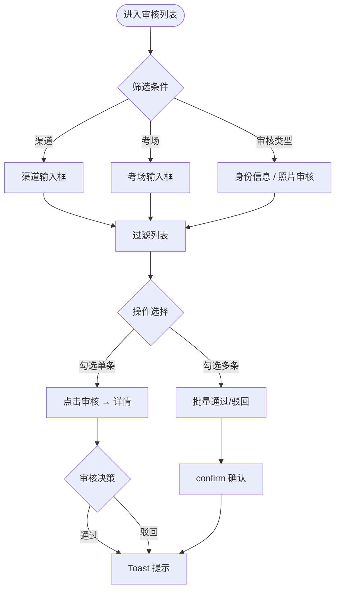

# 审核信息管理-证件照审核与批量审批 PRD

## 0 PRD 类型判定

🏗 **功能型** PRD：在现有「用户信息审核」页面集成证件照审核能力，新增照片列、批量审批、渠道/考场筛选，与已有的身份信息审核共处同一审核工作流。

---

## 1 项目背景与收益预估

### 1.1 需求简介

将证件照审核从报名管理页面剥离，整合进「用户信息审核」页面，与身份信息变更审核共用同一套审核流程（列表 → 详情对比 → 通过/驳回），并新增批量审批能力。

### 1.2 业务诉求

考后审核阶段，运营人员需要：
- 在统一的审核工作台完成身份信息变更审核和证件照审核，避免在多个页面间切换
- 通过缩略图快速预览考生照片，判断是否合格
- 批量处理多条审核工单，提升审核效率
- 按渠道和考场维度筛选，聚焦特定渠道或场次的审核任务

### 1.3 收益预估

- **用户收益**：审核结果统一通知，考生在 C 端个人中心可实时查看照片审核状态
- **业务收益**：审核效率预计提升约 50%（统一工作台减少页面切换 + 批量审批减少逐条操作）
- **不做风险**：审核功能分散在多个页面导致运营人员操作复杂度上升，照片审核积压影响准考证和证书生成

---

## 2 业务流程简述

```
运营人员进入「用户信息审核」页面
  → 按渠道/考场/审核类型筛选待审核工单
    → 列表查看照片缩略图和审核类型
      → 单条：点击「审核」进入详情视图，查看照片大图+身份信息对比，决定通过/驳回
      → 批量：勾选多条 → 点击「批量通过」或「批量驳回」
        → 审核完成 → Toast 提示 → 考生 C 端个人中心状态更新
```

---

## 3 版本管理

### 3.1 PRD 文档修订记录

| 版本号 | 日期 | 修订人 | 修订内容 |
|--------|------|--------|---------|
| V2.0 | 2026-05-14 | — | 重构：将照片审核从报名管理迁移至用户信息审核，新增批量审批 |

### 3.2 产品版本信息

| 项目 | 内容 |
|------|------|
| 所属平台 | AISE Admin 后台 |
| 目标上线版本 | 2026年5月迭代 |
| 依赖模块 | 用户信息审核（25）、消息中心（19）、C 端个人中心（user/13、user/14） |
| 本期范围 | 审核信息管理列表改造（照片列/批量审批/渠道考场筛选）+ 详情视图照片集成 + C 端状态卡片 |
| 后续范围 | 审核不通过原因的 C 端推送通知、用户重新上传照片的联动 |

---

## 4 系统关联与依赖

| 依赖模块 | 影响说明 |
|---------|---------|
| 25_用户信息审核 | 本次主要改造页面，集成照片审核列、批量审批、渠道考场筛选 |
| 11_报名管理 | 剥离照片审核功能，回归纯粹报名管理 |
| 19_消息中心 | 已有照片修改通知，保留不动 |
| user/13、user/14 个人中心 | 已有照片审核状态卡片，保留不动 |

---

## 5 详细功能说明

### 5.1 审核列表页改造

#### 5.1.1 位置

admin 后台 → 侧边栏「考务与用户」→「用户信息审核」

#### 5.1.2 目标

在同一审核列表中同时展示身份信息变更工单和照片审核工单，支持按类型区分、按渠道/考场筛选、批量操作。

#### 5.1.3 筛选区新增

| 元素 | 类型 | 说明 |
|------|------|------|
| 渠道来源 | 输入框 | placeholder「渠道来源（如猿编程）」，支持模糊输入 |
| 考场/测评场次 | 输入框 | placeholder「考场 / 测评场次」，支持模糊输入 |
| 审核类型 | 下拉选择器 | 选项：全部 / 身份信息 / 照片审核 |

#### 5.1.4 复选框与批量操作

**复选框**：
- 表头行首列：全选/取消复选框，勾选后所有可见行同步勾选
- 每行首列：独立复选框，勾选/取消任意行时实时更新批量按钮显隐

**批量按钮**（筛选栏右侧）：
- **批量通过**（绿色）：至少一条勾选时显示，点击 → confirm「确认批量通过 N 条审核？」→ 确定后 Toast 提示，复选框重置
- **批量驳回**（红色边框）：同上逻辑
- 无勾选时两个按钮均隐藏

#### 5.1.5 表格列定义

| 列 | 说明 |
|---|---|
| ☑ 复选框 | 首列，蓝紫色 accent |
| 考生姓名 | 头像圆 + 粗体姓名（保留原有样式） |
| **照片**（新增） | 40×40px 圆角缩略图。照片审核工单的照片可能有视觉标记（如不合格照片半透明遮罩），审核通过后恢复正常 |
| **审核类型**（新增） | 标签：蓝色「身份信息」/ 紫色「照片审核」，替换原监护人姓名/监护人手机号列（照片审核工单这两列为空显示「—」） |
| 证件类型 | 身份信息工单显示，照片审核工单显示「—」 |
| 证件号 | 同上 |
| 手机号 | 同上 |
| **渠道**（新增） | 灰色小字标签，展示渠道来源 |
| 提交时间 | 格式 `YYYY-MM-DD HH:mm` |
| 操作 | 「审核」按钮，点击进入详情视图 |

#### 5.1.6 审核类型视觉区分

| 审核类型 | 标签 | 照片列 | 证件信息列 |
|---------|------|-------|----------|
| 身份信息 | 蓝色「身份信息」| 正常显示 | 正常显示证件号和手机号 |
| 照片审核 | 紫色「照片审核」| 正常显示（可能带半透明遮罩） | 显示「—」占位 |

---

### 5.2 审核详情视图-照片集成

#### 5.2.1 位置

列表点击「审核」进入的详情视图（已存在），与身份信息审核共用。

#### 5.2.2 目标

在现有详情视图中展示当前审核工单的照片，支持通过/驳回（按钮已存在，无需新增）。

#### 5.2.3 现有布局复用

详情视图已有：
- 顶部状态栏（待审核 + 通过/不通过按钮）
- 左侧：身份信息面板（含头像照片，标注「审核项：头像照片」）
- 右侧：报考记录时间线

**改造**：详情视图保持不变，照片已作为审核项之一呈现。审核人员审阅照片后点击「通过审核」或「不通过审核」完成决策。

---

### 5.3 C 端个人中心-照片审核状态

保持不变，已在 `user/13_个人中心.html` 和 `user/14_个人中心_多学生.html` 中实现。状态卡片随 admin 审核结果联动更新。

---

## 6 流程与状态图表

### 6.1 审核列表筛选与批量操作



---

## 7 验收标准

| # | 测试场景 | 前置条件 | 操作 | 期望结果 | 判定 |
|---|---------|---------|------|---------|------|
| 1 | 照片列展示 | 审核列表页加载 | 浏览列表 | 每行照片列显示 40×40 缩略图 | 照片清晰可见 |
| 2 | 审核类型区分 | 列表含身份信息和照片审核两种工单 | 查看审核类型列 | 身份信息蓝色标签，照片审核紫色标签，照片审核行的证件/手机列为「—」 | 类型标签正确，空列正确显示 |
| 3 | 渠道筛选 | 列表有多条不同渠道的工单 | 在渠道输入框输入「猿编程」| 列表仅展示渠道包含「猿编程」的行 | 筛选结果正确 |
| 4 | 审核类型筛选 | 列表有身份信息和照片审核工单 | 选择「照片审核」| 列表仅展示审核类型为照片审核的行 | 筛选结果正确 |
| 5 | 全选复选框 | 列表有 3 条工单 | 勾选表头复选框 | 3 行全部勾选，批量按钮显示 | 全选生效 |
| 6 | 批量通过 | 勾选 2 条工单 | 点击「批量通过」→ confirm 确定 | Toast「已批量通过 2 条审核」，复选框重置，批量按钮隐藏 | 批量操作正确 |
| 7 | 批量驳回 | 勾选 1 条工单 | 点击「批量驳回」→ confirm 确定 | Toast 提示，复选框重置 | 批量操作正确 |
| 8 | 无勾选时批量按钮隐藏 | 未勾选任何行 | 查看筛选栏右侧 | 批量通过和批量驳回按钮均不可见 | 按钮隐藏 |
| 9 | 详情视图照片展示 | 点击照片审核工单的「审核」按钮 | 查看详情视图 | 身份信息面板显示考生头像照片+「审核项：头像照片」标签 | 照片展示正确 |
| 10 | C 端状态卡片联动 | admin 审核通过后 | 考生打开个人中心 | 照片审核卡片状态更新为「已通过审核」 | 状态同步（Demo 中通过切换按钮手动验证） |

---

## 8 辅助材料

| 材料 | 路径 |
|------|------|
| 用户信息审核 Demo | `html/admin/25_用户信息审核.html` |
| 个人中心 Demo | `html/user/13_个人中心.html` |
| 个人中心_多学生 Demo | `html/user/14_个人中心_多学生.html` |
