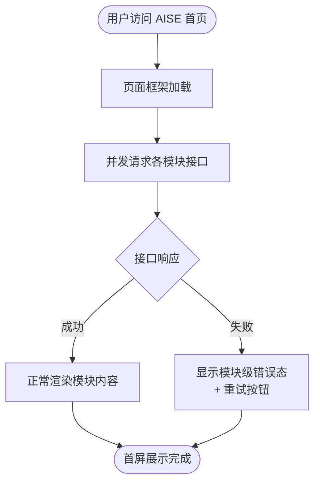

# AISE 首页及运营后台 PRD

**PRD 版本**：V1.0
**修订日期**：2026-05-12
**修订人**：重写

---

## 🔷 0. PRD 类型判定

| 项目 | 内容 |
|------|------|
| PRD 类型 | 🏗 **功能型** |
| 涉及端 | 用户端（AISE 官网首页）+ 运营后台 |
| 模块数量 | 用户端 6 个 + 运营后台 5 个，共 11 个 |

## 🔷 1. 项目背景与收益预估

### 1.1 需求简介

对 AISE 官网首页进行视觉改版并配套建设运营管理后台，使首页内容（导航、轮播图、新闻、专家、合作单位）完全可由运营人员自主配置，无需研发介入。

### 1.2 业务诉求

- 现有首页内容更新依赖研发修改代码，运营效率低
- 缺乏统一的运营管理入口，导航、轮播图配置分散
- 首页视觉陈旧，品牌形象需提升

### 1.3 收益预估

- **用户收益**：
  - 首页内容更新周期从"提需求→排期→研发→发布"的 3-5 天缩短至运营人员在后台即时生效（减少 95% 以上）
  - 新闻中心支持分类筛选与无限滚动，信息查找效率提升 50%
- **业务收益**：
  - 运营人员可在后台自助管理导航、轮播图、专家、合作单位等全部首页模块，预计减少 90% 的研发日常配置支持工作量
- **不做风险**：首页内容更新持续依赖研发，运营响应速度停滞，品牌形象落后于同类平台。

## 🔷 2. 业务流程简述

- 运营人员登录 AISE 运营后台 → 在对应模块（顶栏/Banner/专家/合作单位/文章分类）新增或编辑内容 → 配置保存后，首页实时生效
- 用户访问 AISE 官网首页 → 浏览轮播图、业务入口、新闻列表、专家团队、合作单位 → 点击对应入口跳转至目标页面

## 🔷 3. 版本管理

### 3.1 PRD 文档修订记录

| 版本号 | 日期 | 修订人 | 修订内容 |
|--------|------|--------|---------|
| V1.0 | 2026-05-12 | 重写 | 基于原始 PRD 重构，统一共享层结构 |

### 3.2 产品版本信息

| 项目 | 内容 |
|------|------|
| 所属平台 | AISE 官方网站 + AISE 运营后台 |
| 涉及终端 | Web（PC 端），需适配 1280px-1920px 主流分辨率 |
| 目标上线版本 | [目标版本号] |
| 兼容最低浏览器版本 | Chrome 90+, Edge 90+, Safari 14+ |
| 依赖模块及基线 | AISE 运营后台基础框架基线版本 |
| 本期范围 | 首页全部模块改版 + 运营后台对应管理功能 |
| 后续范围 | 移动端适配、首页模块新增（如活动日历、数据看板） |

## 🔷 4. 系统关联与依赖

| 关联模块 | 数据流向 | 依赖说明 |
|---------|---------|---------|
| 运营后台 → 首页前端 | 运营人员保存配置后，后台通过接口下发导航、轮播图、新闻、专家、合作单位数据 | 所有首页模块依赖 |
| 首页前端 → 后台接口 | 前端按需拉取最新配置（页面加载时 / 定时轮询） | 数据刷新依赖后台接口响应时间 |
| 文章分类管理 → 新闻中心 | 分类勾选"首页固定展示"后，新闻中心 Tab 动态渲染 | 新闻中心依赖分类管理 |

- **接口依赖**：顶栏导航接口（一级+二级）、Banner 列表接口、新闻列表接口（支持分类筛选+分页）、专家列表接口、合作单位接口（按分类分组）
- **硬件兼容**：纯 Web 端，无硬件耦合
- **耦合度评估**：首页与后台松耦合，后台配置变更不影响首页已有展示，仅新增/修改内容时触发更新

## 🔸 5. 详细功能说明

### 5.1 用户端：顶部导航栏

- **位置**：页面全局顶部，吸顶悬浮
- **目标**：提供全站导航路由，展示用户登录态

**5.1.1 界面元素与展示规则**
- Logo 区：展示品牌图标及文字标识，点击跳转首页
- 一级栏目：通过后台接口拉取，支持二级下拉菜单
- 二级栏目名称超长处理：最大宽度 160px，超出截断显示"..."，悬停展示完整文字气泡
- 用户状态区：
  - 未登录：显示"登录 | 注册"
  - 已登录：显示用户头像（无头像时截取姓氏首字母，背景取品牌色）、姓名、下拉箭头。姓名最多 6 个中文字符，超出截断

**5.1.2 交互逻辑**
- 吸顶效果：页面初始化时导航栏为毛玻璃半透明效果，无阴影；向下滚动超过 10px 后，导航栏变纯白并出现底部阴影
- 菜单悬停：鼠标悬停一级栏目时文字变品牌色，箭头旋转 180°，二级菜单面板下移 8px 渐显；鼠标移出后延时 200ms 收起
- 点击二级栏目：跳转至对应页面
- 点击"登录/注册"：跳转登录页

**5.1.3 加载态**
- 首屏加载时，导航栏骨架显示 Logo 占位 + 3 个一级栏目浅灰色占位条

**5.1.4 错误态**
- 导航接口加载失败时，显示默认导航项（首页、关于），右上角显示错误提示"导航加载异常"，提供"重试"按钮

**5.1.5 边界数值**
- 吸顶阈值：滚动距离 > 10px 时触发
- 菜单收起延时：200ms
- 栏目名截断宽度：160px
- 用户名截断字符数：6 个中文字符

---

### 5.2 用户端：焦点轮播图

- **位置**：导航栏正下方，首屏核心视觉区
- **目标**：强视觉曝光最高优先级官方活动或通告

**5.2.1 界面元素与展示规则**
- 尺寸比例锁定 **3:1**，圆角卡片式内嵌设计
- 轮播指示器：当前项为拉长蓝色胶囊体，非选中项为白色小圆点
- 每张轮播图支持配置标题文字、跳转链接

**5.2.2 交互逻辑**
- 自动轮播：默认每 5 秒切换至下一张，手动切换后重置计时
- 左右切换按钮：仅当图片 ≥ 2 张时激活显示；初始化时透明度为 0，鼠标悬停轮播区域时渐显至 100%；按钮悬停时等比放大 110%
- 点击轮播图：根据后台配置的链接，当前页或新标签页打开

**5.2.3 加载态**
- 图片加载中显示品牌色骨架屏占位图，占位图尺寸与轮播图一致，防止结构塌陷
- 无图片配置时，展示默认品牌背景图及引导文案"暂无活动"

**5.2.4 错误态**
- 图片加载失败时，显示默认占位图并在卡片左上角显示轻提示"图片加载失败"

**5.2.5 边界数值**
- 自动轮播间隔：5 秒
- 轮播切换动画时长：500ms
- 按钮透明度过渡时长：300ms

---

### 5.3 用户端：核心业务入口

- **位置**：轮播图下方
- **目标**：提供"进入评定""我要报名""档案查询"三个高频业务入口

**5.3.1 界面元素与展示规则**
- 三个入口卡片横向等距排列
- 每个卡片包含：图标、主标题、副标题简述

**5.3.2 交互逻辑**
- 卡片悬停：整体上浮 4px，底部投影扩大并带品牌色光晕，边框转浅蓝；内部图标放大 110%，主标题变品牌色
- 点击卡片：跳转至对应业务页面

**5.3.3 错误态**
- 业务入口链接后台可配置，若链接为空则卡片置灰不可点击

**5.3.4 边界数值**
- 卡片上浮距离：4px
- 图标放大比例：110%
- 悬停过渡时长：300ms

---

### 5.4 用户端：动态与新闻中心

- **位置**：核心业务入口下方，左侧 1/3 为重要通知焦点图，右侧 2/3 为新闻列表
- **目标**：展示最新新闻与重要通知，支持分类筛选与分页加载

**5.4.1 界面元素与展示规则**
- 重要通知焦点图：展示标记为"重要"的新闻，含封面图、标题（最多 2 行截断）、摘要（最多 3 行截断）
- 新闻列表：
  - 每条新闻包含：分类微标签（颜色随分类配置）、新闻标题（单行截断，超长显示"..."）、发布日期（等宽字体）
  - 支持按分类 Tab 筛选（Tab 来源于运营后台勾选"首页固定展示"的分类）
- 无新闻时显示："暂无新闻资讯"

**5.4.2 交互逻辑**
- 点击新闻标题或焦点图：跳转至新闻详情页
- Tab 切换：切换时列表刷新为对应分类内容
- 列表滚动加载：滚动至底部时自动加载下一页（无限滚动），每次加载 20 条

**5.4.3 加载态**
- 首屏加载：新闻列表区域显示 10 条浅灰色骨架占位条
- 滚动加载更多：底部显示加载旋转图标及"加载中..."

**5.4.4 错误态**
- 新闻接口报错：列表区域显示"新闻加载失败"，提供"重试"按钮
- 分类切换时接口报错：保持当前列表不变，顶部弹出轻提示"加载失败，请重试"（3s 消失）

**5.4.5 边界数值**
- 每页加载条数：20 条
- 焦点图摘要截断行数：3 行
- Tab 分类来源：后台文章分类管理中"首页固定展示"勾选的分类

---

### 5.5 用户端：专家团队

- **位置**：新闻中心下方
- **目标**：展示 AISE 专家团队成员信息

**5.5.1 界面元素与展示规则**
- 头像：1:1 圆形裁切，每行 4 个等距排列，支持多行折行
- 姓名：单行展示，溢出等比缩小
- 头衔：单行展示，超长截断显示"..."
- 无可配置专家时显示："暂无专家信息"

**5.5.2 加载态**
- 首屏加载时显示 4 个圆形浅灰色头像占位 + 姓名文字占位条

**5.5.3 错误态**
- 接口加载失败时显示"专家信息加载失败"，提供"重试"按钮

---

### 5.6 用户端：合作单位

- **位置**：专家团队下方
- **目标**：展示 AISE 合作单位，按分类分组

**5.6.1 界面元素与展示规则**
- 以白底圆角卡片包裹，按分类（学术指导单位、学校科普单位、产学研单位）分组展示
- 分类间以分割线隔开
- 单位名称居中换行排列
- 无可配置合作单位时显示："暂无合作单位"

**5.6.2 交互逻辑**
- 单位名称悬停：颜色由灰变品牌色，过渡 0.2s
- 点击单位名称：若后台配置了跳转链接则跳转，否则不触发

**5.6.3 加载态**
- 首屏加载时显示 8 个浅灰色文字占位条 + 分类标题占位

**5.6.4 错误态**
- 接口加载失败时显示"合作单位加载失败"，提供"重试"按钮

---

### 5.7 运营后台：首页顶栏配置

- **位置**：运营后台 → 首页顶栏管理
- **目标**：运营人员自主配置导航栏一级及二级栏目，无需代码干预

**5.7.1 配置字段**

| 字段 | 是否必填 | 校验规则 |
|------|---------|---------|
| 一级栏目名称 | 必填 | 最多 10 字符 |
| 一级栏目序号 | 必填 | 正整数 |
| 二级栏目名称 | 选填 | 最多 20 字符，仅在一级栏目下存在 |
| 二级栏目序号 | 条件必填（有二级栏目时） | 正整数 |
| 栏目跳转链接 | 选填 | 合法 URL |

**5.7.2 业务规则**
- 支持一级与二级两级导航，不支持三级
- 排序机制：若输入序号重复，系统自动将相同序号及后续栏目序号依次 +1
- 删除一级栏目时，必须弹窗二次确认："删除一级栏目将同步删除其下所有二级栏目，确认删除？"，确认后方可删除

**5.7.3 交互逻辑**
- 点击"新增一级栏目"：在列表顶部新增一行空数据行
- 保存：校验必填项通过后保存，提示"保存成功"（3s Toast），首页即时生效
- 保存失败：顶部弹出红色轻提示"保存失败：{失败原因}"，保留用户已填数据不丢失

**5.7.4 边界数值**
- 一级栏目名上限：10 字符
- 二级栏目名上限：20 字符
- Toast 显示时长：3 秒

---

### 5.8 运营后台：轮播图管理

- **位置**：运营后台 → Banner 管理
- **目标**：运营人员上传、排序和管理首页轮播图

**5.8.1 配置字段**

| 字段 | 是否必填 | 校验规则 |
|------|---------|---------|
| 图片 | 必填 | 前端强制 3:1 比例裁剪，未裁剪不可保存 |
| 跳转链接 | 选填 | 合法 URL |
| 排序序号 | 必填 | 正整数 |
| 展示状态 | 必填 | 上架 / 隐藏 |

**5.8.2 交互逻辑**
- 上传图片后自动弹出 3:1 裁剪器，裁剪完成后显示缩略图预览
- "上架/隐藏"一键切换，隐藏后首页不再展示该轮播图
- 删除轮播图：弹窗二次确认后删除

**5.8.3 错误态**
- 图片上传失败：提示"上传失败，请重试"
- 图片格式不支持：提示"仅支持 JPG、PNG、WebP 格式"

**5.8.4 边界数值**
- 支持图片格式：JPG、PNG、WebP
- 图片大小上限：[待定，如 5MB]
- 强制裁剪比例：3:1

---

### 5.9 运营后台：专家团队管理

- **位置**：运营后台 → 专家团队管理
- **目标**：运营人员管理首页展示的专家信息

**5.9.1 配置字段**

| 字段 | 是否必填 | 校验规则 |
|------|---------|---------|
| 头像 | 必填 | 前端强制 1:1 比例裁剪 |
| 姓名 | 必填 | 最多 10 字符 |
| 头衔 | 必填 | 最多 20 字符 |
| 展示序号 | 必填 | 正整数 |
| 展示状态 | 必填 | 上架 / 隐藏 |

**5.9.2 业务规则**
- 排序仲裁机制同顶栏管理：序号重复时依次 +1
- 隐藏状态的专家不在首页展示

**5.9.3 错误态**
- 头像未裁剪为 1:1 时，保存按钮旁显示红色提示："请裁剪为 1:1 比例"

---

### 5.10 运营后台：合作单位管理

- **位置**：运营后台 → 合作单位管理
- **目标**：运营人员管理首页展示的合作单位

**5.10.1 配置字段**

| 字段 | 是否必填 | 校验规则 |
|------|---------|---------|
| 单位名称 | 必填 | 最多 30 字符 |
| 所属分类 | 必填 | 枚举值：学术指导单位 / 学校科普单位 / 产学研单位 |
| 展示序号 | 必填 | 正整数 |
| 跳转链接 | 选填 | 合法 URL |
| 展示状态 | 必填 | 上架 / 隐藏 |

**5.10.2 业务规则**
- 排序机制同顶栏管理
- 跳转链接留空时，首页对应单位名称不可点击

**5.10.3 交互逻辑**
- 分类字段采用下拉选择框，选项与首页分组一一对应
- 保存成功后 Toast 提示"保存成功"，首页即时生效

**5.10.4 边界数值**
- 单位名称上限：30 字符

---

### 5.11 运营后台：文章分类管理

- **位置**：运营后台 → 文章分类管理
- **目标**：运营人员管理新闻分类及首页 Tab 展示

**5.11.1 配置字段**

| 字段 | 是否必填 | 校验规则 |
|------|---------|---------|
| 分类名称 | 必填 | 最多 10 字符 |
| 首页固定展示 | 选填 | 勾选项 |

**5.11.2 业务规则**
- 勾选"首页固定展示"：该分类作为 Tab 显示在首页新闻中心
- 未勾选：该分类仅在独立列表页可见，可将列表页 URL 配置到其他入口
- 创建后系统自动生成分类页路径（如 `/news/category/{slug}`），提供一键复制及跳转预览
- 删除分类时不删除已有文章，文章归属分类字段置空

**5.11.3 交互逻辑**
- 新建分类成功后，展示自动生成的 URL 及复制按钮
- 删除分类：弹窗提示"删除后该分类下文章将失去类别归属，确认删除？"

---

## 🔸 6. 流程与状态图表

### 6.1 首页加载流程



### 6.2 运营后台配置发布流程

```mermaid
flowchart TD
  运营编辑([运营人员编辑配置])
  点击保存[点击保存]
  校验{前端校验}
  校验失败[当场提示错误]
  提交后端[提交后台接口]
  后端响应{后台接口响应}
  保存成功[Toast提示"保存成功"\n首页即时生效]
  保存失败[Toast提示"保存失败\n+失败原因"]
  
  运营编辑 --> 点击保存
  点击保存 --> 校验
  校验 -->|未通过| 校验失败
  校验 -->|通过| 提交后端
  提交后端 --> 后端响应
  后端响应 -->|成功| 保存成功
  后端响应 -->|失败| 保存失败
```

---

## 🔷 8. 验收标准

| # | 测试场景 | 前置条件 | 操作 | 期望结果 | 判定 |
|---|---------|---------|------|---------|------|
| 1 | 导航栏吸顶效果 | 首页正常加载 | 向下滚动超过 10px | 导航栏变纯白背景并出现底部阴影 | 背景色和阴影正确切换 |
| 2 | 导航栏菜单悬停展开 | 导航栏正常显示，存在二级栏目 | 鼠标悬停一级栏目 | 文字变品牌色，箭头旋转 180°，二级菜单下移 8px 渐显 | 动画流畅，菜单内容正确 |
| 3 | 导航栏菜单收起 | 二级菜单已展开 | 鼠标移出一级栏目区域 | 延时 200ms 后二级菜单收起 | 延时准确，菜单正确收起 |
| 4 | 导航接口失败降级 | 模拟导航接口超时 | 刷新首页 | 显示"导航加载异常"提示及重试按钮，默认展示首页+关于两个一级栏目 | 降级显示正确 |
| 5 | 轮播图自动播放 | 已配置 ≥ 2 张轮播图 | 等待 5 秒 | 轮播图自动切换到下一张 | 5 秒后自动切换 |
| 6 | 轮播图手动切换 | 已配置 ≥ 2 张轮播图 | 点击左右切换按钮 | 切换到对应图片，重置自动播放计时 | 切换正确，计时重置 |
| 7 | 轮播图加载失败 | 图片 URL 无效 | 刷新首页 | 显示占位图，左上角提示"图片加载失败" | 占位图正确展示 |
| 8 | 业务入口悬停效果 | 首页正常加载 | 鼠标悬停入口卡片 | 卡片上浮 4px，阴影带品牌色光晕，图标放大 110% | 动效正确 |
| 9 | 新闻中心无限滚动 | 首页正常加载，新闻总量 > 20 条 | 滚动至列表底部 | 自动加载下一页 20 条，显示"加载中..." | 新数据追加显示 |
| 10 | 新闻中心分类切换 | 已配置 ≥ 2 个首页展示分类 | 点击不同 Tab | 列表刷新为对应分类内容 | 内容正确切换 |
| 11 | 新闻中心无数据 | 后台无任何新闻 | 访问首页新闻区域 | 显示"暂无新闻资讯" | 空状态正确 |
| 12 | 专家团队首屏加载 | 已配置 ≥ 4 位专家 | 刷新首页 | 加载中显示 4 个圆形占位头像 | 骨架屏正确展示 |
| 13 | 合作单位按分类分组 | 已配置 3 个分类各 ≥ 2 个单位 | 访问首页合作单位区域 | 3 个分类以分割线隔开，各单位在对应分组下 | 分组正确 |
| 14 | 合作单位链接跳转 | 某合作单位配置了跳转链接 | 点击该单位名称 | 新标签页打开目标链接 | 跳转正确 |
| 15 | 顶栏配置新增一级栏目 | 运营后台顶栏管理页 | 新增一级栏目，填写名称和序号，点击保存 | Toast 提示"保存成功"，首页导航即时显示新栏目 | 保存并即时生效 |
| 16 | 顶栏配置序号冲突 | 已有栏目序号为 1 | 新增栏目序号也为 1，保存 | 系统自动将新增及后续序号 +1 | 序号唯一且连续 |
| 17 | 顶栏配置删除一级栏目 | 存在带二级栏目的一级栏目 | 点击删除该一级栏目 | 弹窗二次确认"将同步删除其下所有二级栏目"，确认后删除 | 一二级同步删除 |
| 18 | Banner 图片 3:1 裁剪 | Banner 管理页 | 上传非 3:1 比例图片 | 自动弹出裁剪器，裁剪完成前保存按钮不可用 | 裁剪器强制 3:1 |
| 19 | Banner 上下架切换 | 已有 Banner 状态为"上架" | 切换为"隐藏" | 首页对应轮播图不再展示 | 隐藏生效 |
| 20 | 专家管理 1:1 裁剪 | 专家管理页 | 上传非 1:1 比例头像 | 自动弹出 1:1 裁剪器，保存按钮旁提示"请裁剪为 1:1 比例" | 裁剪器强制 1:1 |
| 21 | 文章分类创建并自动生成 URL | 文章分类管理页 | 输入分类名称，保存 | Toast 提示"创建成功"，展示自动生成的 `/news/category/{slug}` URL 及复制按钮 | URL 生成正确，可跳转 |
| 22 | 文章分类删除不影响文章 | 已有文章归属于分类 A | 删除分类 A | 文章未删除，文章归属分类字段置空 | 文章保留且分类字段为空 |

---

## 🔷 9. 辅助材料清单

| 材料类型 | 涉及功能 | 状态 |
|---------|---------|------|
| UI 设计稿 | 用户端全部 6 个首页模块（导航栏、轮播图、业务入口、新闻中心、专家团队、合作单位） | 需补充 |
| 运营后台页面原型 | 运营后台全部 5 个管理模块 | 需补充 |
| 流程图 | 首页加载流程、运营后台配置发布流程 | 已提供 Mermaid |
| 设计规范 | 品牌视觉定位（配色方案、字体规范） | 原始文档已有，建议补充独立设计规范文档链接 |
