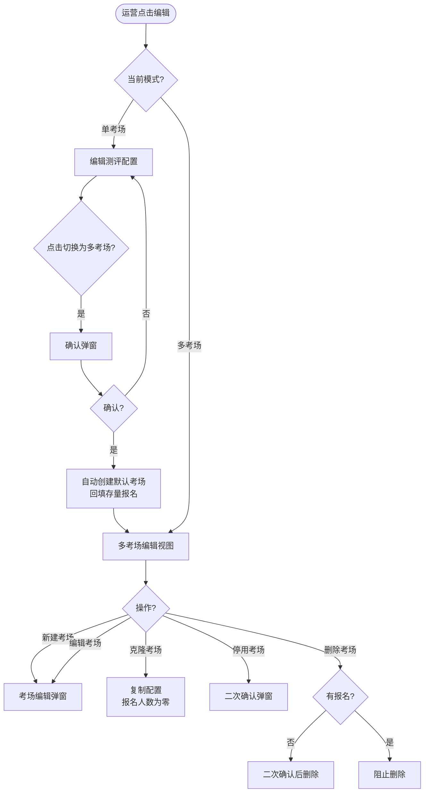
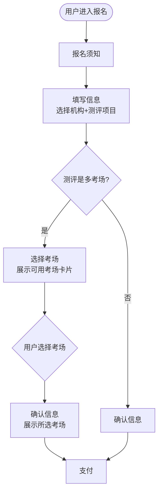

# 测评多考场 PRD

> PRD 版本：V1.0 | 日期：2026-07-10 | 作者：产品大师
> 类型：🏗 功能型

---

## 1. 项目背景与收益预估

### 1.1 需求简介

AISE 当前测评模型为「一个测评活动等于一个固定时间段」，无独立考场概念。随着合作方考试规模增长（某合作方每级别 6 个时间段、预计 4-6 个级别共 24-36 个考场），需要将测评升级为支持多考场模式：测评本身保留时间边界，运营可创建多个考场，每个考场独立配置时间、时长、交卷限制、标签和模拟考。用户端报名时自主选择考场。

### 1.2 业务诉求

- 运营可为一场测评配置多个时间段考场，灵活应对大规模考试
- 不同考场可设置不同的时长、标签、模拟考配置，满足差异化需求
- 用户报名时可选择适合自己的考场，满员自动截止

### 1.3 收益预估

- **用户收益**：报名时可自主选择考场时间，提升报名灵活性；每个考场独立展示时间和剩余名额，用户决策清晰
- **业务收益**：一场测评可承载更多考生（按考场扩容），运营配置效率提升（克隆考场快速批量创建）
- **不做风险**：合作方考试规模持续增长时，现有单考场模型无法支持 24-36 个独立时间段的管理需求

---

## 2. 业务流程简述

### 2.1 运营配置流程

运营在测评管理列表页点击某测评的「编辑」，弹出编辑弹窗。默认为单考场模式，可编辑测评名称、关联源数据、起止时间、时长、交卷限制、标签和模拟考。点击「切换为多考场」→ 确认弹窗 → 弹窗切换为多考场模式：测评仅保留名称、关联源数据和起止时间（作为边界），其余配置下沉到考场。运营可新建、编辑、克隆、停用、删除考场，每个考场独立配置。

### 2.2 用户报名流程

用户进入报名页，选择机构和测评项目后，若该测评是多考场，步骤自动变为 5 步：报名须知 → 填写信息 → 选择考场 → 确认 → 支付。用户从可用考场列表中选择一个（满员不可选），确认后进入支付。完成后在「我的活动」页面可查看所选考场信息，准考证中的测评日期和时长取对应考场数据。

---

## 3. 版本管理

### 3.1 PRD 文档修订记录

| 版本号 | 日期 | 修订人 | 修订内容 |
|--------|------|--------|---------|
| V1.0 | 2026-07-10 | 产品大师 | 初稿 |

### 3.2 产品版本信息

| 项目 | 内容 |
|------|------|
| 所属平台 | AISE 后台管理 + C 端用户端 |
| 目标上线版本 | 随需求发版 |
| 本期范围 | 单/多考场模式切换、admin 端考场 CRUD、user 端考场选择、准考证关联考场数据 |
| 后续范围 | 考场容量监控面板、名额预占、WebSocket 实时推送、级联过滤联动 |

---

## 4. 系统关联与依赖

### 4.1 依赖模块

- 测评活动管理模块（admin/03、04、05）
- 标签配置模块（admin/13）：考场标签筛选和级联过滤依赖标签关联能力（参见标签关联 PRD）
- 用户端报名流程（user/08、09）
- 用户端我的活动/准考证（user/15）

### 4.2 数据流

admin 端切换多考场 → 创建默认考场 + 回填存量报名记录 → 运营配置考场 → 用户报名时查询考场列表 → 报名记录写入考场 ID → 准考证取考场数据。

---

## 5. 详细功能说明

### 5.1 单考场与多考场模式

#### 5.1.1 模式定义

测评活动存在两种模式：

- **单考场模式**（默认）：测评本身承载全部配置（时长、交卷限制、标签、模拟考），无独立考场概念。现有测评均为单考场模式。
- **多考场模式**：测评仅保留名称、关联爱测评源数据、起止时间（作为考场时间边界约束）。时长、交卷限制、标签、模拟考配置下沉至每个考场独立管理。

#### 5.1.2 切换入口与确认

在测评管理列表页，点击行内「编辑」打开编辑弹窗。单考场模式下，弹窗底部显示「切换为多考场」按钮。点击后弹出确认弹窗，提示：

- 当前时长、交卷限制、标签、模拟考仅供历史参考，不再对考试生效
- 系统将自动创建一个默认考场，继承当前测评的时间配置
- 操作不可撤销

运营确认后：测评模式切换为多考场；系统自动创建 1 个默认考场（名称「{测评名称} - 默认考场」、时间继承原测评起止时间、容量不限）；存量报名记录自动回填至该默认考场。

#### 5.1.3 切换后的编辑弹窗

切换后再次打开编辑弹窗，展示多考场视图：

- 固有字段：测评名称（可编辑）、开始时间（边界）、结束时间（边界）。关联爱测评源数据在多考场模式下不再保留，该能力平移至每个考场的「关联爱测评试卷」字段。
- 历史参考提示：以灰色小字展示「时长、交卷限制、标签、模拟考已下沉至各考场独立配置。历史参考：120分钟 / 1分钟 / 智能工具实操·程序设计四级 / 模拟考已开启」
- 统计卡片：考场总数、总容量、已报名总数、剩余总容量
- 考场列表表格：名称、时间、时长/交卷限制、标签、关联试卷、模拟考状态、容量（已报名/上限）、状态（启用/停用）、操作（编辑/复制/停用或启用/删除）。表格支持横向滑动。
- 新建考场按钮

### 5.2 admin 端考场管理

#### 5.2.1 新建考场

点击「新建考场」弹出考场编辑弹窗，包含以下字段：

- 考场名称（必填）
- 开始时间（必填，必须大于等于测评开始时间）
- 结束时间（必填，必须小于等于测评结束时间）
- 测评时长，分钟（必填）
- 交卷时间限制，分钟（必填，必须小于等于测评时长）
- 关联爱测评试卷（必填，从爱测评试卷列表中选择）
- 容量上限（必填，大于等于零，零表示不限。修改时不能小于已报名人数）
- 报名截止时间（选填，默认为开始时间前三十分钟，必须小于等于开始时间）
- 标签配置（选填，使用分组标签选择器）
- 模拟考配置（选填，开关控制，展开后包含模拟卷来源、模拟考起止时间、考试次数限制）
- 排序（必填，数字）

保存后考场出现在考场列表中，统计卡片数据同步更新。

#### 5.2.2 编辑考场

点击考场行的「编辑」，弹窗回填当前配置，修改后保存。已有报名的考场禁止修改开始时间和结束时间。

#### 5.2.3 克隆考场

点击「复制」，系统复制该考场的全部配置（不包括报名数据），自动命名为「{原名称} - 副本」，报名人数为零。适用于运营需要基于已有考场快速批量创建。

#### 5.2.4 停用与启用

- 停用：点击「停用」，弹窗提示「该考场已有 N 人报名，停用后用户端不再展示该考场，已报名用户仍可正常参加考试。已报名用户无法收到停用通知，请谨慎操作」。确认后考场状态变为停用。
- 启用：停用状态考场可重新启用，恢复用户端展示。

#### 5.2.5 删除考场

无报名记录的考场可直接删除（需二次确认）。有报名记录（含已退款）的考场禁止删除。

#### 5.2.6 测评时间联动校验

编辑测评的开始或结束时间时，系统校验是否导致考场时间越界。如有考场时间超出新范围，阻止保存并提示「有 N 个考场的时间超出新的测评时间范围，请先调整考场时间」。

#### 5.2.7 考场时间重叠

考场之间时间允许重叠，不阻止。运营可根据业务需要安排同时段多考场。

### 5.3 user 端报名流程考场选择

#### 5.3.1 步骤动态化

用户进入报名页面后，选择机构和测评项目。若该测评是多考场，步骤指示器自动变为 5 步：报名须知 → 填写信息 → 选择考场 → 确认信息 → 支付。测评项目下拉中，多考场项目标注「（多考场）」后缀。

单考场测评保持现有 4 步流程不变。

#### 5.3.2 选择考场步骤

点击「确认信息」后自动进入「选择考场」步骤。页面展示该测评下所有可用考场的卡片列表。

**标签筛选区**：考场列表上方提供两个联动筛选下拉框——参测模块和参测等级。下拉选项取该测评所有考场中涉及的参测模块和参测等级标签的去重集合。选择筛选项后考场列表实时过滤，仅展示匹配的考场卡片。

**级联过滤**：若后台标签配置中参测模块与参测等级之间存在级联关联（参见标签关联 PRD），则级联关系在筛选下拉中生效——选择参测模块后，参测等级下拉仅显示与该模块关联的等级选项，不关联的选项隐藏。切换回「全部模块」则恢复全部等级选项。

**考场卡片展示**：

- 每个卡片显示：考场名称、日期和时间段、剩余名额（已报名人数/容量，含进度条）、状态标签（可选/已选/已满）
- 满员考场卡片置灰，不可点击
- 点击可选考场卡片，卡片高亮选中，底部展示「已选择：{考场名称}（{日期} {时间段}）」
- 选中后「确认信息」按钮激活
- 仅有一个可用考场时自动选中

#### 5.3.3 确认信息步骤

确认页在测评项目下方新增「所选考场」行，展示考场名称和时间。用户可返回修改考场选择（已填个人信息保留）。

### 5.4 user 端我的活动展示考场信息

#### 5.4.1 活动列表卡片

在「我的活动」页面，若某条报名记录所属测评是多考场，卡片中考试时间下方展示考场信息行：考场名称 + 时长/交卷限制。

#### 5.4.2 准考证弹窗

点击「查看准考证」，弹窗展示官方准考证样式。除原有信息外，新增考场行：考场名称、交卷限制。测评日期取考场开始时间，时长限制取考场测评时长。非多考场报名的记录不展示考场行。

---

## 6. 流程与状态图表

### 6.1 模式切换与考场管理流程

### 6.2 用户报名流程

---

## 7. 验收标准

| # | 测试场景 | 前置条件 | 操作 | 期望结果 | 判定 |
|---|---------|---------|------|---------|------|
| 1 | 单考场切换多考场 | 测评处于单考场模式，已有若干报名记录 | 编辑弹窗点击切换→确认 | 模式切换，自动创建默认考场，存量报名回填 | 考场列表出现默认考场 |
| 2 | 新建考场 | 测评处于多考场模式 | 点击新建→填写全量字段→保存 | 考场出现在列表中，统计卡片更新 | 考场创建成功 |
| 3 | 克隆考场 | 已有考场 A | 点击复制 | 新考场 B（名称=「A - 副本」、报名=0）出现在列表中 | 克隆成功 |
| 4 | 停用考场 | 考场有 N 人报名 | 点击停用→确认弹窗→确认 | 考场状态变为停用，用户端不再展示 | 停用成功 |
| 5 | 删除无报名考场 | 考场报名人数为 0 | 点击删除→确认 | 考场删除 | 删除成功 |
| 6 | 阻止删除有报名考场 | 考场有报名记录 | 点击删除 | 提示「该考场已有报名，无法删除」 | 阻止删除 |
| 7 | 编辑已报名考场禁止改时间 | 考场有报名 | 编辑弹窗中修改开始时间 | 开始时间输入框不可编辑 | 禁止修改 |
| 8 | 测评时间收缩联动校验 | 多考场模式，有考场时间在 7/5 | 修改测评结束时间为 7/3 | 阻止保存，提示考场越界 | 阻止保存 |
| 9 | 用户端多考场报名流程 | 测评是多考场，有 6 个考场 | 用户选择机构→选多考场项目→进入选择考场 | 3→5 步动态切换，展示 6 个考场卡片 | 步骤切换正确 |
| 10 | 选考场满员不可选 | 考场二已满员 50/50 | 用户进入选择考场 | 考场二卡片置灰，标记「已满」，不可点击 | 满员不可选 |
| 11 | 选定考场后确认 | 用户选中考场三 | 点击确认信息 | 确认页显示所选考场名称和时间 | 考场信息正确 |
| 12 | 单考场测评流程不变 | 测评是单考场 | 用户报名 | 保持现有 4 步流程 | 流程不变 |
| 13 | 我的活动展示考场信息 | 用户报名了多考场测评 | 进入我的活动 | 卡片显示考场名称、时长、交卷限制 | 考场信息展示 |
| 14 | 准考证取考场数据 | 用户报名了考场「下午场」 | 查看准考证 | 准考证显示考场名、考场开始时间、考场时长、交卷限制 | 数据对应考场 |
| 15 | 考场标签筛选 | 测评有参测模块和参测等级标签的多个考场 | 选择参测模块「智能工具实操」 | 考场列表只显示模块为智能工具实操的考场 | 筛选正确 |
| 16 | 级联过滤 | 后台配置参测模块「智能工具实操」关联参测等级「程序设计一级」「程序设计二级」 | 在考场选择页选模块「智能工具实操」→ 查看等级下拉 | 等级下拉仅显示程序设计一级、程序设计二级，其他等级隐藏 | 级联生效 |
| 17 | 级联恢复 | 筛选区已选模块「智能工具实操」，等级已过滤 | 切回「全部模块」 | 等级下拉恢复全部选项 | 恢复正确 |

---

## 8. 辅助材料

- **admin 端 Demo**：`/Users/didi/Documents/AISE/AISE_PRD/html/admin/04_测评活动详情.html`（编辑弹窗含单/多考场模式切换、考场管理表格、考场编辑弹窗、克隆/停用/删除）
- **user 端 Demo**：`/Users/didi/Documents/AISE/AISE_PRD/html/user/08_考试报名_主页.html`（多考场报名流程含考场选择步骤）
- **我的活动 Demo**：`/Users/didi/Documents/AISE/AISE_PRD/html/user/15_我的活动.html`（活动列表考场信息展示 + 准考证弹窗含考场数据）
- **方案概要**：`/Users/didi/Documents/AISE/AISE_PRD/PRD/20260708 多考场/方案概要.md`
