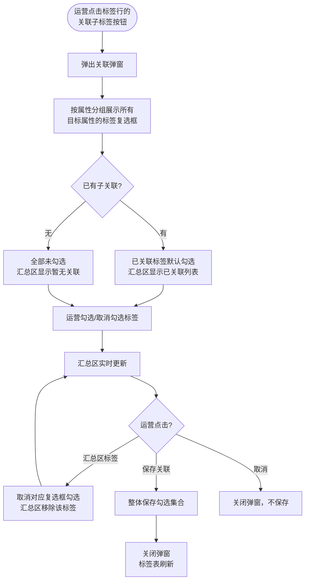

# 标签跨属性关联 PRD

> PRD 版本：V1.0 | 日期：2026-07-10 | 作者：产品大师

---

## 1. 项目背景与收益预估

### 1.1 需求简介

AISE 标签体系当前属性之间完全独立，不存在层级或关联关系。本次需求为标签配置管理新增跨属性关联能力：一个标签可以被设置为其他属性下若干标签的父标签，建立属性间的标签关联关系。

关联关系配置好后，后续可在测评活动配置等场景中启用级联过滤（本期不实现，届时单独出需求）。

### 1.2 业务诉求

- 建立标签间的结构化管理能力，使属性之间的逻辑关系可配置、可维护
- 关联关系全部在现有标签配置页内管理，不增加独立页面

### 1.3 收益预估

- **用户收益**：运营可为标签建立结构化关联，为后续级联过滤和智能推荐打基础
- **业务收益**：标签组合规则从「人脑记忆」变成「系统记录」，降低配置错误率的基础条件就位
- **不做风险**：参测等级等属性持续增长时，运营只能靠人工记忆判断哪些组合合理，后续级联过滤无法上线

---

## 2. 业务流程简述

运营在标签配置页进入某个属性（如参测模块），点击某个标签行（如「智能工具实操」）的「关联子标签」按钮，在弹窗中勾选其他属性下的标签（如参测等级的「一级」「二级」「三级」），保存后建立关联。关联关系存储在标签关联表中，供后续级联过滤等功能消费。

---

## 3. 版本管理

### 3.1 PRD 文档修订记录

| 版本号 | 日期 | 修订人 | 修订内容 |
|--------|------|--------|---------|
| V1.0 | 2026-07-10 | 产品大师 | 初稿 |

### 3.2 产品版本信息

| 项目 | 内容 |
|------|------|
| 所属平台 | AISE 后台管理 |
| 目标上线版本 | 随需求发版，不锁定版本 |
| 本期范围 | 标签配置页关联管理 + 测评活动配置页级联过滤 |
| 后续范围 | 关联关系全景图、批量导入导出关联 |

---

## 4. 系统关联与依赖

### 4.1 依赖模块

- **标签配置模块**：现有 admin/13_标签配置 页面，本次在其基础上新增关联功能

### 4.2 数据流

标签配置页保存关联 → 写入标签关联表。关联数据可供后续级联过滤等消费方查询。

### 4.3 耦合度评估

低耦合。关联功能是标签模块的内聚扩展，仅影响标签配置页的操作流程，不涉及其他业务模块。本期不启用级联过滤，已有页面的标签选择行为不变。

---

## 5. 详细功能说明

### 5.1 标签关联配置（标签配置页）

#### 5.1.1 入口

在标签配置页右侧标签列表的操作列，每个标签行新增「关联子标签」按钮，排在「编辑」和「删除」之间。按钮样式与同列其他操作按钮一致，颜色使用中性色以与编辑（蓝色）、删除（红色）区分。

#### 5.1.2 关联弹窗

点击「关联子标签」按钮后，弹出「标签关联管理 —— {标签名称}」弹窗。

##### 弹窗结构

弹窗标题下方展示当前标签的所属属性名称及功能说明。弹窗主体区域按属性分组展示所有可供关联的目标属性及其标签：

- **有标签的属性**：按属性名称分组，每组标题显示属性名、标签总数、已关联数量。每个标签以复选框形式展示，已关联的默认勾选
- **无标签的属性**：灰色展示，标注「0 个标签，无可用关联」，不展示复选框

弹窗底部固定展示汇总区，列出当前已关联的子标签（标签名 + 所属属性名），勾选变化时实时更新。

##### 约束规则

- 当前标签所属的属性不出现在目标属性列表中（禁止同属性内关联）
- 一个标签可以关联多个不同属性下的多个子标签，数量不设限
- 关联是单向存储的（存储父标签→子标签关系），但过滤效果是双向的

##### 删除关联

汇总区中的每个标签可以点击直接取消关联：点击标签后，对应的复选框取消勾选，汇总区同步移除该标签。不需要到上方分组中逐个翻找取消。

##### 保存

点击「保存关联」按钮，系统将弹窗中所有勾选的子标签集合整体保存为当前标签的关联关系。取消勾选的自动删除对应关联记录。

##### 空关联

如果一个标签没有关联任何子标签，弹窗中所有复选框均为未勾选状态，汇总区显示「暂无关联」。保存空关联即删除该标签的全部关联关系，对级联过滤无影响。

##### 加载态

弹窗打开时，分组区域展示骨架占位（属性名可见，标签复选框区域为占位块），数据就绪后替换为真实标签列表。数据加载失败时，弹窗内展示错误提示和重试按钮。

##### 保存失败

保存关联时如果接口异常（网络超时、服务端错误），弹窗不关闭，保留用户当前的勾选编辑状态，弹窗顶部展示错误提示「保存失败，请重试」，用户可重新点击保存或取消关闭弹窗。不因保存失败丢失用户的编辑成果。

##### 并发编辑

两个管理员同时编辑同一标签的关联关系时，后保存的覆盖先保存的（以最后提交的勾选集合为准）。此场景并发概率极低，不做乐观锁。

#### 5.1.3 标签删除时的关联保护

点击「删除」按钮删除标签时，系统检查以下情况：

- 该标签被其他标签关联为子标签 → 阻止删除，提示「该标签已被 N 个标签关联为子标签，请先解除关联后再删除」
- 该标签关联了其他标签（作为父标签）→ 允许删除，同时级联删除该标签的所有子关联记录

只有「被其他标签关联为子标签」时才会阻止删除，因为这会破坏其他标签的关联配置。作为父标签时允许删除更符合运营直觉——标签没了，关联自然失效。

#### 5.1.4 属性删除时的关联保护

删除属性时，系统检查该属性下的标签是否存在跨属性关联：

- 该属性下存在被其他属性标签关联为子标签的标签 → 阻止删除属性，提示「该属性下有标签被其他属性的标签关联为子标签，请先解除关联」
- 该属性下存在标签关联了其他属性标签（作为父标签）→ 允许删除属性，关联记录级联清理
- 该属性下不存在跨属性关联 → 允许删除属性

#### 5.1.5 合并标签时的关联迁移

使用「合并标签」功能将标签 A 合并到标签 B（标签 A 被删除）时，标签 A 的所有关联关系全部迁移到标签 B。如果迁移后出现重复关联（标签 B 已经关联了同一个子标签），自动去重。

---

### 5.2 级联过滤（本期不实现）

级联过滤能力——即在测评活动配置页面选中某属性的标签后，其他属性的候选列表自动缩减——本期不实现。后续需要启用时单独出需求定义过滤规则和生效范围。

本期实现的关联关系仅作为数据存储，不改变已有页面（测评活动列表/详情/新建/测评组管理）的标签选择行为。这些页面的标签下拉保持全部标签可选，不受关联关系影响。

---

## 6. 流程与状态图表

### 6.1 关联配置流程

---

## 7. 验收标准

| # | 测试场景 | 前置条件 | 操作 | 期望结果 | 判定 |
|---|---------|---------|------|---------|------|
| 1 | 正常关联 | 参测模块属性下有「智能工具实操」标签，参测等级属性下有 11 个标签 | 点击「关联子标签」→ 勾选一级/二级/三级 → 保存 | 弹窗关闭，标签表刷新。再次打开弹窗，一级/二级/三级默认勾选 | 关联关系正确保存 |
| 2 | 汇总区点击删除关联 | 「智能工具实操」已关联一级/二级/三级 | 打开关联弹窗 → 点击汇总区的「一级」标签 | 一级复选框取消勾选，汇总区只剩二级/三级 | 点击删除即时生效 |
| 3 | 空关联保存 | 「智能工具实操」已关联一级/二级/三级 | 打开弹窗 → 全部取消勾选 → 保存 | 关联关系全部删除，再次打开弹窗全部未勾选 | 空关联保存成功 |
| 4 | 同属性禁止关联 | 参测模块「智能工具实操」 | 打开关联弹窗 → 查看目标属性列表 | 列表中不包含「参测模块」 | 同属性排除 |
| 5 | 无标签属性灰显 | 难度等级属性下 0 个标签 | 打开关联弹窗 | 难度等级灰色显示，标注「0 个标签，无可用关联」 | 灰显正确 |
| 6 | 父标签删除级联清理 | 「智能工具实操」关联了一级/二级/三级 | 点击「删除」按钮删除「智能工具实操」 | 标签删除成功，关联记录级联删除 | 级联清理 |
| 7 | 子标签阻止删除 | 参测等级「一级」被「智能工具实操」关联 | 在参测等级属性下点击「一级」的删除 | 弹窗提示「该标签已被 N 个标签关联为子标签」，不删除 | 阻止删除 |
| 8 | 保存失败恢复 | 关联弹窗已打开，做了一些勾选修改 | 模拟接口异常 → 点击保存 | 弹窗不关闭，保留编辑状态，展示「保存失败，请重试」提示 | 不丢失编辑 |
| 9 | 属性删除保护 | 参测等级「一级」被参测模块「智能工具实操」关联为子标签 | 删除参测等级属性 | 提示「有标签被其他属性的标签关联为子标签」，阻止删除 | 阻止删除属性 |
| 10 | 合并标签关联迁移 | 标签 A 关联了一级/二级，标签 B 关联了一级/三级 | 将标签 A 合并到标签 B | 标签 B 的关联变为一级/二级/三级（去重后） | 迁移+去重 |
| 11 | 弹窗加载失败 | 关联弹窗打开时接口异常 | 打开关联弹窗 | 展示错误提示 + 重试按钮 | 错误态正确 |

---

## 8. 辅助材料

- **HTML Demo**：`/Users/didi/Documents/AISE/AISE_PRD/html/admin/13_标签配置.html`（含关联子标签弹窗完整交互）
- **方案概要**：`/Users/didi/Documents/AISE/AISE_PRD/PRD/20260710 标签关联/方案概要.md`
- **场景锚点**：`/Users/didi/Documents/AISE/AISE_PRD/PRD/20260710 标签关联/场景锚点.md`
