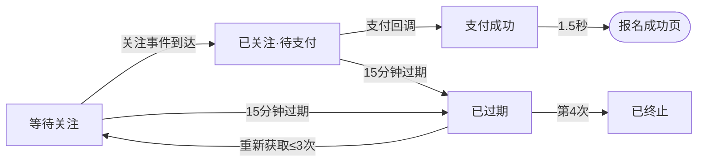
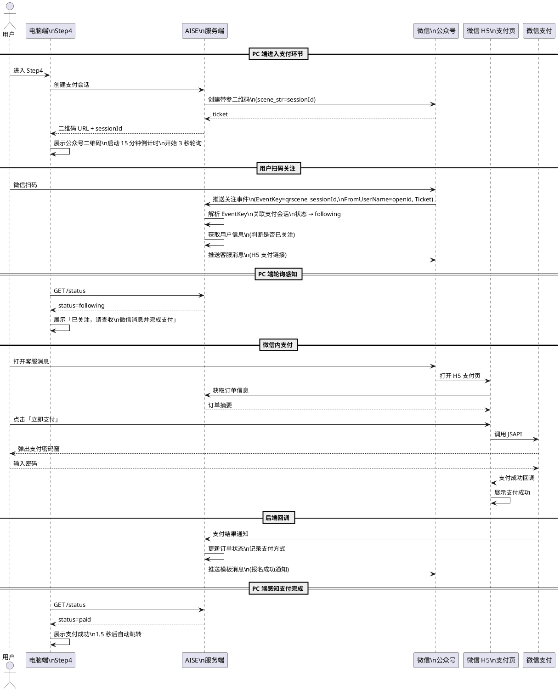
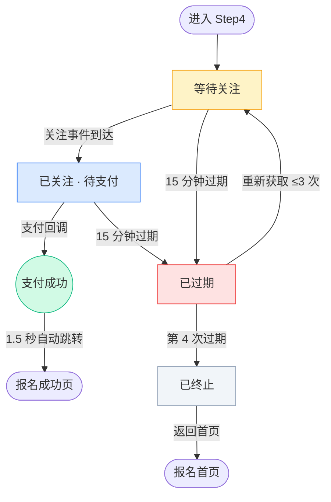

# AISE 微信支付集成

---

## 1. 项目背景

### 1.1 需求简介

为 AISE 考试报名平台接入微信支付，替代现有「静态二维码 + 用户手动点击确认」的线下转账模式，实现从支付到报名成功的全流程自动闭环。同时借支付环节引导用户关注公众号，建立后续触达能力。

### 1.2 业务诉求

- 报名支付效率低：当前用户扫码支付后须回到页面手动点击「我已完成支付」，流程断裂、体验差
- 缺乏自动化支付验证：系统无法感知支付是否完成，依赖用户自我报告
- 需要服务号触达通道：支付成功后推送考试安排通知，需要先完成用户关注和账号绑定

### 1.3 范围界定

涉及页面：

| 页面 | 改动 |
|------|------|
| 电脑端报名主页 Step4 支付环节 | 改造 |
| 微信 H5 支付页 | 新建 |
| 报名成功页 | 新建 |
| 管理端交易流水 | 改造 |
| 管理端交易数据统计 | 不改 |

不涉及：微信支付商户号申请、退款与对账功能、报名前三步的任何改动。

---

## 2. 业务流程简述

**完整支付流程（PC 端 → 公众号 → 微信 H5）**

用户进入电脑端报名 Step4 → 页面展示带场景参数的公众号关注二维码 → 用户用微信扫码关注公众号 → 微信服务端推送关注事件给 AISE 服务端（含 EventKey 和 Ticket）→ 服务端通过 EventKey 关联 PC 端会话 → 服务端向用户推送客服消息（含 H5 支付链接）→ 用户在微信内打开消息 → 进入 H5 支付页 → 确认订单信息 → 点击「立即支付」→ 微信弹出密码窗 → 支付成功 → PC 端静默轮询检测到支付完成 → 自动跳转报名成功页。

**用户在微信内直接访问**

用户已在微信内 → 公众号推送的客服消息直接引导至 H5 支付页 → 同上。

**支付异常**

- 二维码过期（公众号带参二维码有效期 30 天，远大于支付会话 15 分钟）：不影响。若支付会话过期，服务端推送客服消息时提示重新发起
- 用户关注后未收到消息：PC 端轮询检测到「已关注但未支付」，展示提示「已关注公众号，请在微信内查收支付消息」
- 支付取消/失败：用户可在微信内客服消息中重新打开 H5 支付页，再次尝试

---

## 3. 详细功能说明

### 3.1 支付环节改造（电脑端报名 Step4）

- **位置**：报名流程第四步「支付费用」
- **目标**：用公众号关注二维码替代支付二维码，用户扫码关注后，支付在微信内通过客服消息完成。PC 端通过静默轮询感知支付状态，实现自动化跳转

#### 3.1.1 页面布局

- 顶部：当前支付金额（突出显示）
- 中间：公众号关注二维码（带场景参数）
- 二维码下方文案：「关注公众号获取后续通知，并完成支付」
- 场景参数说明（灰色小字）：「本次支付关联会话：{sessionId}」
- 底部状态区：轮询状态提示

#### 3.1.2 公众号带参二维码

- **生成**：用户进入 Step4 → 服务端创建支付会话 → 调用微信「创建带参数二维码」接口（`POST /cgi-bin/qrcode/create`，action_name=QR_STR_SCENE，scene_str=会话标识）→ 获取 ticket → 拼装二维码图片 URL → 返回前端展示
- **参数说明**：scene_str 包含本次支付会话的唯一标识，用于后续关注事件中关联 PC 端会话
- **有效期**：带参二维码有效期 30 天，远超支付会话有效期，不会提前过期
- **刷新**：每 30 秒自动刷新一次（确保二维码有效且服务端会话可用），刷新时直接替换，不做过渡动效
- **自动检测**：轮询间隔 3 秒，检测关注和支付状态（详见 3.1.3）

#### 3.1.3 轮询状态与 UI 变化

PC 端每 3 秒查询一次服务端：当前会话是否已被关注、是否已支付。根据结果展示不同状态：

| 状态 | 条件 | UI 表现 |
|------|------|---------|
| 等待关注 | 会话创建，尚未检测到关注事件 | 展示公众号二维码 + 「正在生成二维码」加载态（≤2 秒）→ 展示二维码 + 「请使用微信扫码关注公众号」 |
| 已关注 · 待支付 | 检测到关注事件，尚未支付 | 二维码变为绿色对勾 + 文案「已关注公众号，请在微信内查收支付消息并完成支付」→ 持续轮询 |
| 支付成功 | 检测到支付完成 | 展示绿色对勾 + 「支付成功」→ 1.5 秒后自动跳转报名成功页 |
| 支付会话过期 | 15 分钟倒计时归零，未支付 | 二维码区域置灰 + 文案「支付会话已过期」+ 「重新获取」按钮；重新获取最多 3 次，第 4 次提示「已达上限」+ 返回首页 |
| 网络异常 | 连续 3 次查询失败（约 9 秒无响应） | 状态区变黄色提示「网络连接异常，状态检测已暂停」+ 「重新检测」按钮 |

**状态流转示意：**



#### 3.1.4 取消支付

- «取消支付»次要按钮（位置：页面左下角）
- 点击后弹窗确认：「确定要取消本次支付吗？」
- 确认后：停止轮询 → 回到 Step3（确认信息页），用户可重新确认信息后再次进入支付环节
- 重新进入 Step4 时：创建新支付会话 → 新的公众号二维码 → 新的场景参数

#### 3.1.5 15 分钟支付倒计时

- 会话创建后开始 15 分钟倒计时，展示：「请在 {N}分{N}秒 内关注公众号并完成支付」
- 不足 5 分钟时文字变橙色，不足 1 分钟变红色
- 倒计时归零且未支付 → 进入「支付会话过期」状态
- 已关注状态下倒计时继续，支付完成时停止

#### 3.1.6 边界场景

**用户自行关注过公众号**

- 用户已关注公众号 → 扫码后微信不再推送关注事件
- 服务端通过微信「获取用户基本信息」接口判断用户是否已关注 → 已关注则直接推送支付客服消息
- PC 端轮询仍能检测到「已关注」状态

**支付中途关闭页面**

- 支付会话 15 分钟内有效。重新打开页面后：
  - 存在未过期的会话 → 恢复当前状态（展示二维码或已关注态），倒计时从剩余时间继续
  - 已过期 → 提示重新报名
  - 已支付 → 直接跳转报名成功页

**金额变更**

- 用户在 Step4 期间，后台修改了报名项目费用：
  - 页面不主动提示
  - 轮询查询时服务端返回新金额，弹窗：「报名费用已更新为 ¥{新金额}」，用户确认后刷新页面

---

### 3.2 微信 H5 支付页

- **位置**：用户关注公众号后，通过公众号推送的客服消息中点击打开
- **目标**：在微信客户端内展示订单信息并提供支付入口。在微信客户端外打开时引导进入微信

#### 3.2.1 环境判断

页面加载后判断当前浏览器环境：

**微信客户端内**

- 进入订单确认态 → 执行 3.2.2 的流程

**微信客户端外（手机自带浏览器、其他应用内嵌浏览器）**

- 展示引导卡片，不进入支付流程：
  - 标题：「请在微信中打开」
  - 正文：「请使用微信打开此链接，或关注公众号后从消息中重新进入」
  - 按钮：「复制链接」。点击后复制页面地址到系统剪贴板，轻提示：「链接已复制，请在微信中粘贴打开」
  - 卡片底部展示公众号二维码及简介

#### 3.2.2 订单确认态

**页面内容**

- 顶部标题：「确认支付」
- 订单摘要卡片：报名项目名称、考生姓名、支付金额（突出显示）、订单编号（脱敏，如 2026••••8899）
- 支付按钮：「立即支付」（主按钮样式）
- 按钮下方说明：「支付即表示您同意 AISE 报名服务协议」

**订单信息加载失败**

- 卡片区域展示：「订单信息加载失败」+「重新加载」按钮
- 连续 3 次加载失败后：「请返回公众号消息重新进入」

#### 3.2.3 支付调起与结果处理

- 点击「立即支付」→ 按钮加载态（文字变为「正在支付」，不可再点击）→ 调用微信 JSAPI 支付接口
- JSAPI 调起失败 → 弹窗：「支付未能调起，请稍后重试」→ 按钮恢复
- 支付成功 → 绿色对勾 +「支付成功」+ 订单编号和金额摘要 → 1.5 秒后自动返回（无需额外引导，用户已关注公众号）
- 支付取消（用户在密码页取消）→ 按钮恢复 + 黄色轻提示「支付已取消」
- 支付失败（余额不足等）→ 弹窗展示失败原因（来自微信错误码）→ 按钮恢复

**JSAPI 支付未开通时的降级**

- 不展示«立即支付»按钮
- 展示文字提示：「JSAPI 支付暂未开通，请稍后重试」
- 同时展示公众号二维码

---

### 3.3 报名成功页

- **位置**：PC 端 Step4 支付成功自动跳转，或微信 H5 支付成功后跳转
- **目标**：展示报名摘要。用户已在支付环节关注公众号，不再重复展示关注引导

#### 3.3.1 报名摘要卡片

- 卡片顶部：绿色对勾标记 +「报名成功」标题
- 标题下方提示：「支付已完成，系统已确认您的报考信息」
- 状态行：蓝色「已确认」标签 + 准考证号（格式如 EXM2026072759000008）
- 摘要信息：测评名称、学生姓名、支付金额、支付时间（精确到秒）、测评时长、测评时间
- 摘要区域下方：两个并排按钮
  - «下载准考证»：深色主按钮，带下载图标
  - «在线查看»：浅色描边次按钮，带眼睛图标

#### 3.3.2 底部

- «返回首页»按钮（次按钮样式）
- 退费政策文字：「退费政策：报名截止日前可全额退费，截止日后不予退费。如有疑问请联系客服。」

---

### 3.4 管理端交易流水

- **位置**：管理端 → 交易流水页面
- **目标**：支持按微信支付模式筛选，展示支付方式详情

#### 3.4.1 支付方式筛选器

- 保留现有筛选项不变
- 选项：「全部」（默认选中）「微信支付」「支付宝」「后台直接开通」
- 不区分扫码和 JSAPI，统一归为「微信支付」。两种方式的差异属于技术实现细节，对管理端无意义

#### 3.4.2 支付记录列表

- 支付方式列已存在，值样例：「微信支付」「支付宝」「后台直接开通」
- 新增支付状态值「已过期」。过期记录的支付时间为「—」
- 其余列不变

#### 3.4.3 新旧数据并存

- 上线前历史记录的支付方式为空 → 展示为「—」
- 筛选具体支付方式时，历史记录不出现在结果中
- 筛选«全部»时，新旧记录并存

---

### 3.5 后端支付流程

以下为服务端处理逻辑，对前端的交互行为有直接影响，但不在前端实现。

#### 3.5.1 支付会话创建

- 用户进入 Step4 → 服务端创建支付会话：
  - 生成唯一会话标识（sessionId）
  - 关联报名订单、金额、有效期 15 分钟
  - 初始状态：`awaiting_follow`（等待关注）
- 调用微信「创建带参数二维码」接口：
  - `POST /cgi-bin/qrcode/create`
  - `action_name`: `QR_STR_SCENE`
  - `scene_str`: 会话标识（用于关注事件匹配）
  - 获取 `ticket` → 拼装二维码图片 URL（`https://mp.weixin.qq.com/cgi-bin/showqrcode?ticket={ticket}`）
- 返回前端：二维码 URL、会话标识、过期时间
- 创建时锁定金额。后台修改定价不影响已创建的会话
- 用户重新获取时创建新会话并使用最新定价

#### 3.5.2 关注事件处理（核心新增）

微信服务端在用户扫码关注时向 AISE 服务端推送 XML 事件（POST 到配置的服务器 URL）：

```xml
<xml>
  <ToUserName><![CDATA[公众号原始ID]]></ToUserName>
  <FromUserName><![CDATA[用户openid]]></FromUserName>
  <CreateTime>1234567890</CreateTime>
  <MsgType><![CDATA[event]]></MsgType>
  <Event><![CDATA[subscribe]]></Event>
  <EventKey><![CDATA[qrscene_会话标识]]></EventKey>
  <Ticket><![CDATA[二维码ticket]]></Ticket>
</xml>
```

服务端处理流程：

1. 解析 XML，提取 `FromUserName`（openid）、`EventKey`（qrscene_前缀 + scene_str）、`Ticket`
2. 去除 `EventKey` 的 `qrscene_` 前缀，得到会话标识
3. 通过会话标识查找支付会话 → 更新状态为 `following` → 记录 openid
4. 通过 `FromUserName` 调用微信「获取用户基本信息」接口，获取用户是否已关注等信息
5. 推送客服消息给用户（见 3.5.3）

**已关注用户场景**：若用户此前已关注公众号，扫码时微信不推送 subscribe 事件，而是推送 SCAN 事件（EventKey 不带 `qrscene_` 前缀）。处理方式相同：解析 EventKey → 关联会话 → 推送支付消息。

#### 3.5.3 客服消息推送

用户关注后，服务端向该用户推送一条包含支付入口的客服消息：

- 调用微信客服消息接口：`POST /cgi-bin/message/custom/send`
- 消息类型：图文消息（`msgtype: news`）或文本消息（`msgtype: text`）含 H5 支付链接
- 消息内容：
  - 标题：「AISE 报名支付」
  - 描述：「{报名项目名称} · ¥{金额}，请点击完成支付」
  - 链接：H5 支付页 URL（附带支付会话标识参数，用于订单信息查询和支付回调关联）
- 推送失败静默记录日志，PC 端轮询在检测到「已关注」状态后通过文案引导用户

#### 3.5.4 状态轮询接口

- PC 端每 3 秒调用：`GET /api/payment/session/{sessionId}/status`
- 返回 JSON：
  ```json
  {
    "status": "awaiting_follow | following | paid | expired",
    "amount": 199.00,
    "expires_at": "2026-07-27T14:47:00Z"
  }
  ```
- `awaiting_follow` → PC 端展示二维码，等待用户扫码关注
- `following` → PC 端展示「已关注，请查收微信消息」
- `paid` → PC 端展示支付成功，自动跳转
- `expired` → PC 端展示过期态
- 金额变更时额外返回 `amount_changed: true` + 新金额

#### 3.5.5 微信支付回调

1. 接收微信支付通知，验签确认真实性
2. 根据商户订单号找到报名订单 → 更新为「已支付」
3. 记录支付方式（微信 JSAPI）、交易号、支付时间
4. 推送模板消息（报名成功通知，含准考证号）
5. 向微信返回确认应答（避免重复通知）

幂等性：同一订单多次通知仅处理一次，以订单号去重。

#### 3.5.6 公众号账号绑定

- 关注事件中自动获取 openid，与 AISE 账号绑定
- 绑定策略：一个 openid 绑定一个 AISE 账号。若 openid 已绑定其他账号，不覆盖（以首次关注绑定的账号为准）
- 用于后续模板消息推送、考试成绩通知等场景

---

## 4. 流程与状态图表

### 4.1 支付全链路时序图



*图 1：支付全链路时序图（公众号 → 客服消息 → H5 支付）*

### 4.2 支付会话状态流转



*图 2：支付会话状态流转*

---

## 5. 附录

### 5.1 验收标准

**电脑端报名 Step4**

| 编号 | 验收项 | 预期结果 |
|------|--------|---------|
| A1 | 公众号二维码 | 进入 Step4 展示带参公众号二维码，含会话关联标识 |
| A2 | 二维码刷新 | 每 30 秒直接替换，无过渡动效 |
| A3 | 倒计时 | 15 分钟实时显示，不足 5 分钟橙色，不足 1 分钟红色 |
| A4 | 等待关注态 | 展示二维码 +「请使用微信扫码关注公众号」 |
| A5 | 已关注态 | 检测到关注事件后展示绿色对勾 +「已关注，请查收微信消息」 |
| A6 | 支付成功态 | 检测到支付后展示对勾 + 1.5 秒自动跳转 |
| A7 | 状态轮询 | 每 3 秒查询一次，状态变化即时更新 UI |
| A8 | 会话过期 | 倒计时归零后置灰 + 重新获取按钮，最多 3 次 |
| A9 | 取消支付 | 弹窗确认后回 Step3，重新进入创建新会话 |
| A10 | 网络异常 | 3 次失败黄色提示 + 重新检测按钮 |
| A11 | 页面恢复 | 关闭后重新打开恢复进度，已支付直接跳转 |

**微信 H5 支付页**

| 编号 | 验收项 | 预期结果 |
|------|--------|---------|
| B1 | 环境判断 | 微信内 → 订单确认；外部 → 引导卡片 |
| B2 | 订单摘要 | 项目、姓名、金额（突出）、脱敏订单号 |
| B3 | 支付调起 | 点击按钮 → JSAPI 弹窗 |
| B4 | 支付成功 | 绿色对勾 + 摘要，自动返回 |
| B5 | 支付取消 | 按钮恢复 + 黄色轻提示 |
| B6 | 支付失败 | 弹窗展示原因，按钮恢复 |
| B7 | JSAPI 未开通 | 降级展示提示 + 公众号二维码 |

**报名成功页**

| 编号 | 验收项 | 预期结果 |
|------|--------|---------|
| C1 | 报名摘要 | 已确认标签 + 准考证号 + 项目/姓名/金额/支付时间/时长/测评时间 |
| C2 | 准考证操作 | 下载准考证 + 在线查看两个按钮 |
| C3 | 无重复引导 | 不展示公众号关注引导（已通过支付环节关注） |
| C4 | 退费政策 | 底部展示退费规则 |

**管理端交易流水**

| 编号 | 验收项 | 预期结果 |
|------|--------|---------|
| D1 | 筛选器 | 全部 / 微信支付 / 支付宝 / 后台直接开通 |
| D2 | 支付方式列 | 展示微信支付 / 支付宝 / 后台直接开通 |
| D3 | 历史兼容 | 旧记录展示「—」，仅在全部筛选下出现 |

**后端流程**

| 编号 | 验收项 | 预期结果 |
|------|--------|---------|
| E1 | 会话创建 | 进入 Step4 创建，含 scene_str，锁定金额，15 分钟有效期 |
| E2 | 关注事件处理 | 解析 EventKey 关联会话，状态 → following |
| E3 | 客服消息推送 | 关注后推送含 H5 支付链接的消息 |
| E4 | 状态轮询 | 返回 awaiting_follow / following / paid / expired |
| E5 | 回调幂等 | 同一订单多次回调仅处理一次 |
| E6 | openid 绑定 | 通过关注事件自动绑定，不覆盖已有绑定 |
| E7 | 模板消息 | 支付成功后推送报名成功通知 |

### 5.2 依赖与前置条件

| 依赖项 | 说明 | 状态 |
|--------|------|------|
| 微信服务号认证 | «AISE青少年AI人才培养工程» | ✅ 已完成 |
| 微信支付商户号 | 开通 Native 支付和 JSAPI 支付 | ⏳ 待确认 |
| JSAPI 支付目录配置 | 在商户号后台配置 H5 支付页 URL | ⏳ 待确认 |
| 模板消息 | 在服务号后台申请模板 | ⏳ 待确认 |
| 网页授权域名 | 在服务号后台配置回调域名 | ⏳ 待确认 |

### 5.3 版本记录

| 版本 | 日期 | 变更 |
|------|------|------|
| V1.0 | 2026-07-27 | 初稿 |
| V1.1 | 2026-07-27 | 重构支付流程：公众号带参二维码替代支付二维码；关注→客服消息→H5支付一体化闭环；移除报名成功页重复关注引导 |
| V1.2 | 2026-07-28 | Demo 改造完成：08 Step4 三状态轮询（等待关注→已关注→支付成功）替代支付二维码+手工确认；27 微信支付页标题改为「确认支付」+ 移除成功态公众号引导；28 报名成功页移除公众号关注卡片 |
