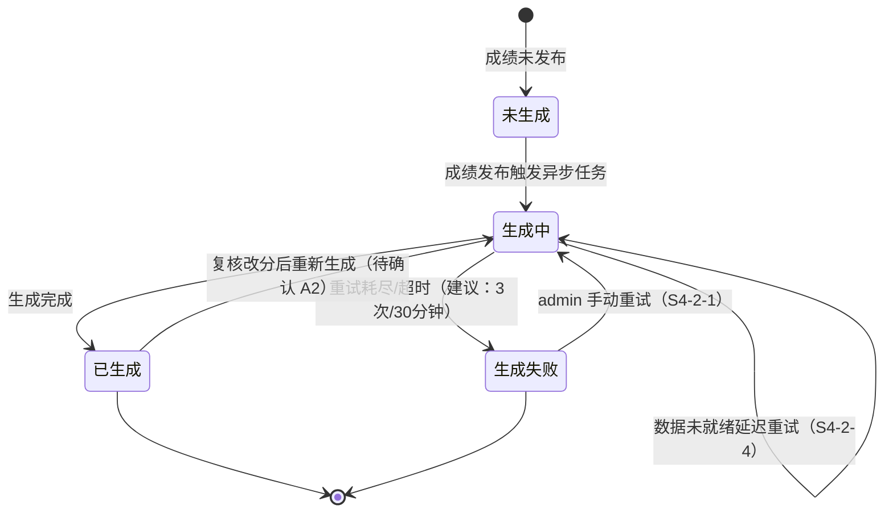
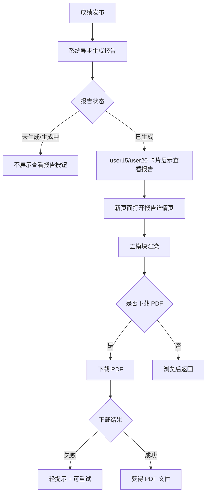
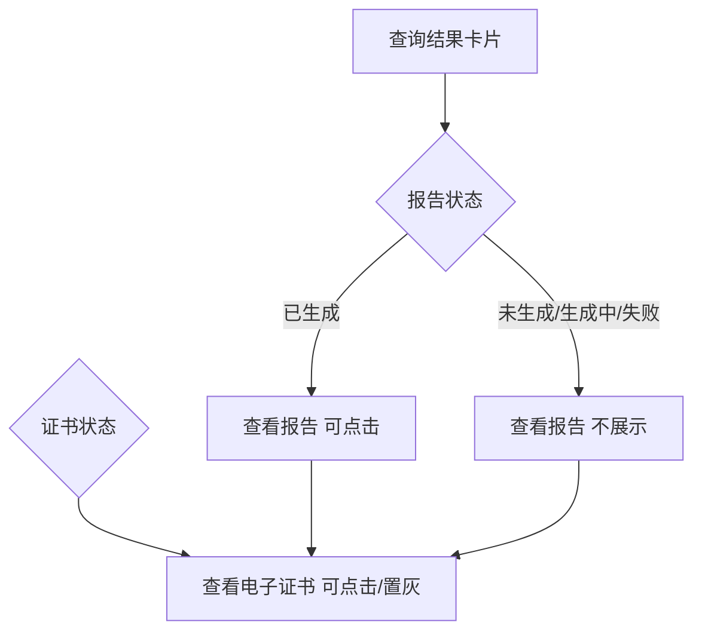

# AISE 个人报告 PRD（2red 规范版）

> 本文档按「2RED Product Monster PRD」规范重写，内容规则与《PRD.md》（20260806 整合版）完全一致，仅调整文档结构与表达规范。
> 依据：《业务需求梳理.md》（20260728）、《报告样式设计参考.md》、《20260512 证书签发流程 PRD》、AISE&爱测评平台能力梳理（索引文档）
> 范围声明：题库建设（题目录入相关）与证书导出已拆分，分别由独立 PRD 覆盖，本文档不包含（出处：业务需求梳理.md 需求总览注）。

---

## 0. PRD 类型判定

| 判定项 | 结论 |
|--------|------|
| PRD 类型 | 🏗 功能型（新功能上线：个人考级报告生成 + 用户端查看/下载） |
| 判定依据 | 新页面（报告详情页）+ 两处既有页面改造（user/15、user/20）+ 服务端异步生成链路；无策略/算法调整，无 Bug 修复，无系统重构 |
| 结构侧重 | 收益预估、验收标准、用户场景、辅助材料 必须；埋点实验 可简化 |
| 简化项 | 埋点实验（§7）仅给建议性埋点清单，不做实验设计（非策略型） |

---

## 1. 项目背景与收益预估

### 1.1 需求简介

一句话：考试成绩发布后，系统为每位有正式总分的考生自动生成一份「个人考级报告」（含等级、成长区间、知识点掌握、具体表现、下阶段建议五个模块），考生/家长可在用户端查看并下载为 PDF（出处：业务需求梳理.md 需求总览、2.2.3）。

### 1.2 业务诉求

- 现状痛点：考生考完只能看到分数，无法理解「这个分数意味着什么、下一步该学什么」（出处：业务需求梳理.md 需求总览——报告含等级/成长区间/知识点/表现/建议，即从"看分数"升级为"看路径"）。
- 覆盖缺口：证书只覆盖通过考生，未通过考生无任何成果物；报告覆盖**所有**有正式总分的考生（含未通过，呈现「待提升」），补齐未通过考生的服务闭环（出处：业务需求梳理.md 2.1）。

### 1.3 收益预估（金字塔结构）

| 收益层级 | 内容 | 量化口径 | 依据等级 |
|---------|------|---------|---------|
| 1️⃣ 用户收益 | 家长/考生无需自行解读分数，即可获得五模块结构化的学习诊断与下一步建议 | 报告覆盖率 = 有正式总分考生中成功生成报告的比例，目标 100%（假设值，待上线验证） | 假设值，待验证 |
| 2️⃣ 业务收益 | 未通过考生也有成果物与课程建议，带动复报/续课咨询 | 建议指标：报告查看率（查看报告考生数 ÷ 报告生成数）、报告内「课程学习建议」模块触达后的咨询转化（假设值，待埋点验证） | 假设值，待验证 |
| 3️⃣ 商业收益 | 下一阶段建议中的「课程学习建议」成为课程销售数据抓手 | 建议指标：查看「下一阶段建议」模块后进入课程咨询页的转化率（假设值，待埋点验证） | 假设值，待验证 |
| 4️⃣ 不做风险 | 成绩查询体验落后于同类考级平台（普遍提供成绩报告/学情诊断），未通过考生无触达抓手，用户流失 | 定性风险，无竞品数据来源 | 经验判断（E 级），仅作辅助 |

> 说明：以上量化指标原文未提供，均为**假设值**，需在埋点（§7）落地后采集真实基线；本 PRD 不编造历史基线数据。

---

## 2. 业务流程简述

主流程（用户视角）：

1. 考试成绩发布，系统自动异步生成个人报告（无需用户操作）。
2. 考生在「我的活动」（user/15）看到已参与的考试卡片；或登录/查询「成绩与证书」独立页（user/20）。
3. 报告已生成的卡片出现「查看报告」入口，点击在新页面打开报告详情页。
4. 详情页自上而下渲染五个模块：标题栏 → 考级结果概览 → 知识点掌握情况 → 考级具体表现 → 下一阶段建议。
5. 用户可下载报告为 PDF。

边界：成绩未发布或报告生成中的卡片**不展示**「查看报告」入口（出处：业务需求梳理.md 2.2.1）。

---

## 3. 版本管理

### 3.1 PRD 文档修订记录

| 版本号 | 日期 | 修订人 | 修订内容 |
|--------|------|--------|---------|
| V1.0 | 20260728 | 产品 | 依据《业务需求梳理.md》转写：报告内容逻辑、样式还原、生成时机与入口、边界异常四章初稿 |
| V1.1 | 20260806 | 产品 | 评审修订：样式前提更正、生成失败状态机、证书达标线待确认、按钮矩阵补行、量化验收项 V1-V5 等 |
| V1.2 | 20260806 | 产品 | S1-S4 整合为 PRD.md；新增需求总览、附录 A（待确认 34 项）、附录 B（依据清单） |
| V2.0 | 20260806 | 产品 | 按 2red 规范重写为本文档（结构：共享层 §0-§4、§7-§9 + 模块层 §5-§6）；内容规则与 V1.2 一致，无删改 |

### 3.2 产品版本信息

| 项目 | 内容 |
|------|------|
| 所属平台 | AISE 考级平台（user 端用户应用 + 服务端生成链路 + admin 消息中心） |
| PRD 评审版本 | V2.0（本文档） |
| 目标上线版本 | 待定（待技术评审排期） |
| 依赖模块及基线 | 题目录入（题目「知识点」字段，独立 PRD）、证书签发（成绩发布触发点、证书状态链路）、admin 消息中心（异步任务/失败重试） |
| 本期范围 | 报告生成链路、报告详情页（新增）、user/15 + user/20 入口（改造）、PDF 下载 |
| 后续范围 | 成绩复核改分后的报告重新生成（待确认 A2）、报告保留策略（待确认 A10） |

---

## 4. 系统关联与依赖

### 4.1 依赖模块列表

| 依赖模块 | 关系 | 依赖内容 | 出处 |
|---------|------|---------|------|
| 题目录入（独立 PRD） | 前置数据依赖 | 每道题目需带「知识点」字段（一级/二级/三级）；三级入库、前端不展示；题目标签 ≠ 知识点，不得回退 | 业务需求梳理.md 1.4.1 补充说明 #1 |
| 证书签发（20260512 PRD） | 触发点共用 | 成绩发布后与证书签发共用同一触发点；证书状态链路「等待成绩→生成中→待签发→已签发」（逻辑校验） | 业务需求梳理.md 2.1；证书 PRD 3.9.2 |
| admin 消息中心 | 失败重试与文件管理 | 异步任务失败记录、手动重试、导出文件管理（建议复用） | 索引文档 admin「系统支撑：消息中心」 |
| user/15 我的活动 | 改造（非新建） | 已生成报告的考试卡片加「查看报告」按钮 | 业务需求梳理.md 2.2.1 |
| user/20 成绩与证书独立页 | 改造（非新建） | 已生成报告的卡片加「查看报告」，与「查看电子证书」并存 | 业务需求梳理.md 2.2.2 |

### 4.2 数据流说明

```
考试系统（批改完成、正式总分发布）
  → 触发「个人报告生成」事件（与电子证书签发共用触发点）
    → 异步生成任务（按考生批量）
      → 读取三类依赖数据：正式总分 / 题目知识点字段 / 学生作答
        → 生成报告内容 → 报告状态置「已生成」
          → user/15、user/20 卡片展示「查看报告」→ 详情页渲染 → PDF 下载
```

（出处：业务需求梳理.md 2.1；三类数据齐备性逻辑校验见 §5.3.2）

### 4.3 接口定义（业务视角，不涉及底层实现）

| 接口 | 入参 | 出参/行为 | 同步/异步 | 备注 |
|------|------|----------|----------|------|
| 报告生成（触发） | 考试标识、考生标识（批量） | 生成任务入队 | 异步 | 触发点与证书签发共用；选型待技术评审（A20） |
| 报告状态查询 | 考试标识 + 考生标识 或 报告标识 | 报告状态（未生成/生成中/已生成/生成失败） | 同步 | 驱动入口按钮展示 |
| 报告详情查询 | 报告标识（或考试标识+考生标识） | 五模块报告内容 | 同步 | URL 约定待技术评审（A16） |
| 报告下载 | 报告标识 | PDF 文件 | 同步/异步 | 实现方案二选一，待技术评审（Q13/A16） |

### 4.4 耦合度评估

- 与证书签发的耦合点仅为「共用触发点」：报告生成不依赖签章环节，生成完成即可查看；证书需签发完成（生成→第三方签章→已签发）才可查看。两者共用触发点、各自独立异步流水线（出处：业务需求梳理.md 2.1；逻辑校验：证书 PRD 3.9.2）。若证书侧触发点调整，报告侧同步调整即可，无强耦合。
- 与题目录入的耦合为数据依赖（知识点字段）：字段缺失时报告侧有降级策略（§5.3.1 边界 S4-1-2），不会阻塞主流程。

---

## 5. 详细功能说明

本 PRD 共 3 个功能模块：

| 编号 | 模块 | 类型 | 位置 |
|------|------|------|------|
| 5.1 | 报告详情页 | 新增 | user 端新页面 |
| 5.2 | 用户端入口 | 改造 | user/15 我的活动、user/20 成绩与证书独立页 |
| 5.3 | 报告生成链路 | 新增（服务端） | 成绩发布后异步触发 |

---

### 5.1 功能一：报告详情页（新增）

#### 5.1.1 页面定位与打开方式

- **位置**：从 user/15 或 user/20 点击「查看报告」，在新页面（新标签页）打开（出处：业务需求梳理.md 2.2.1/2.2.2）。
- **返回路径**：详情页提供返回按钮，回到来源页（user/15 或 user/20）（索引文档 user 端导航惯例）。
- **多考生家庭账号**：同一账号下多个考生时，报告归属与切换继承现有考生切换机制（索引文档 user/15）；若平台无考生级切换机制则归属/切换逻辑**需另行确认**（A8）。
- **访问权限**：user/20 为公开查询制（姓名+手机号），详情页访问沿用查询会话校验；报告标识不存在/已删除 → 页面不存在提示；越权访问 → 无权访问提示（详见 §5.1.7 错误态）。

#### 5.1.2 标题栏

- **目标**：展示考生本次考级的基本身份信息与通过状态。
- **展示字段**：

| 字段 | 内容 | 规则/边界 | 出处 |
|------|------|----------|------|
| 级别 | 如「程序设计四级」 | 一级～八级；「程序设计 + 中文数字级别」格式为推导自示例的展示规则（推导） | 业务需求梳理.md 1.2 |
| 学生姓名 | 考生姓名 | 取值来源原文未定义 → **需另行确认**（暂定取报名/查询信息中的姓名，A7） | 业务需求梳理.md 1.2（源文档该栏为空） |
| 考试年月 | 如「2026年6月」 | 「YYYY年M月」格式为推导自示例的展示规则（推导），取考试实际年月 | 业务需求梳理.md 1.2 |
| 通过/未通过状态 | 「通过」「未通过」 | 按正式总分判定：score < 60 未通过；score ≥ 60 通过（含 60 分整） | 业务需求梳理.md 1.2、1.3.1 |

- **数据口径**：score 为考试系统正式发布总分，不取整、不四舍五入、不重新汇总（业务需求梳理.md 1.3.1）。

#### 5.1.3 考级结果概览

- **目标**：一句话让用户知道"考了多少分、处于什么水平、在成长路径的哪个阶段"。
- **组成**：等级总览映射 + 成长区间定位图（小提琴图）+ 一句话总结。

**等级总览映射表**（出处：业务需求梳理.md 1.3.1）：

| 正式总分 score | 通过状态 | 报告等级 | 所处成长区间 |
|---------------|---------|---------|------------|
| 0 ≤ score < 30 | 未通过 | 待提升 | 初步形成 |
| 30 ≤ score < 60 | 未通过 | 待提升 | 稳步接近 |
| 60 ≤ score < 70 | 通过 | 合格 | 目标达成 |
| 70 ≤ score < 80 | 通过 | 良好 | 熟练掌握 |
| 80 ≤ score ≤ 100 | 通过 | 优秀 | 高阶表现 |

- 边界含等号：score=30.0 → 未通过/稳步接近；score=60.0 → 通过/合格；score=70.0 → 通过/良好；score=80.0 → 通过/优秀；score=100.0 → 通过/优秀（推导）。
- 报告等级共 4 档（待提升/合格/良好/优秀），「待提升」覆盖两个分数区间、均为未通过。
- 异常数据：score 超出 [0,100] 或非数值 → 拦截处理，见 §5.3.1 边界 S4-1-1（需另行确认 A11）。

**成长区间定位图（小提琴图）参数**（出处：业务需求梳理.md 1.3.2）：

| 参数 | 规格 |
|------|------|
| 五段图形宽度 | 30% / 30% / 20% / 10% / 10%（合计 100%） |
| 五个阶段（从左到右） | 初步形成、稳步接近、目标达成、熟练掌握、高阶表现 |
| 图形含义 | 仅表示五个阶段，不表示人数或真实样本分布 |
| 轴线类型 | 类别轴（轴刻度为五个阶段名），不是连续分数轴 |
| 标记位置 | 固定放在对应阶段中心，不随阶段内具体分数移动 |
| 五个中心位置 | 15% / 45% / 70% / 85% / 95%（满分取 100%） |

- 实现口径：考生分数仅用于判定所处阶段，判定结果映射到该阶段固定中心标记（相对百分比定位），与具体分数无关（推导）。

**一句话总结**（出处：业务需求梳理.md 1.3.3，固定文案、不拼接）：

| 报告等级 | 文案 |
|---------|------|
| 待提升 | 综合本次考级表现，本级基础正在逐步形成，建议继续巩固核心任务。 |
| 合格 | 综合本次考级表现，已达到本级基本要求，可继续巩固并拓展。 |
| 良好 | 综合本次考级表现，已较稳定达到本级要求，可进一步提升综合应用。 |
| 优秀 | 综合本次考级表现，已高质量完成本级主要任务，可继续挑战更复杂的综合任务。 |

#### 5.1.4 知识点掌握情况

- **目标**：按知识树结构展示各知识点掌握状态，指明"哪里弱"。
- **知识标签体系**：各级别有独立知识树，结构为「一级知识模块 → 二级知识点 → 三级标签」；报告掌握情况及考级表现的高光&错题均依赖题目「知识点」字段（出处：业务需求梳理.md 1.4.1 + 补充说明 #1）。
  - 关键规则：**题目标签 ≠ 知识点**；题目需带「知识点」字段（一/二/三级），三级标签需入库、前端不展示；后台实现由独立题目录入 PRD 覆盖；报告侧不得回退使用题目标签。
  - 四级（PL1）示例知识树（12 行，完整清单见业务需求梳理.md 1.4.1）：Python运算（比较运算/布尔值/算术运算）、流程控制（条件分支/循环/IPO编程）、常用标准库（模块导入）、编程基础（变量/数据类型转换/数据类型/input()语句/print()语句）。
  - 其他级别知识树完整清单原文未提供 → 人工补充（A4）。
- **掌握度判定**（出处：业务需求梳理.md 1.4.2）：

| 知识点作答掌握率 | 掌握状态 |
|----------------|---------|
| < 60% | 重点提升 |
| ≥ 60% | 稳定掌握 |

- 掌握率公式：该知识点关联题目的得分之和 ÷ 该知识点关联题目的满分值之和。
- 聚合粒度取二级知识点（推导依据：三级标签前端不展示、展示粒度为一/二级 → 二级为公共粒度）。
- 分母口径：仅统计带「知识点」字段的题目，缺失题目不入分子/分母（不拉低掌握率；详见 §5.3.1 边界 S4-1-2）。
- 边界含等号：掌握率 = 60% 判定为「稳定掌握」；浮点计算不取整。
- UI 展示映射：「稳定掌握」→ 状态标签「稳定」；「重点提升」→「重点提升」（出处：样式参考.md 5.3；色值待采样核验 Q8/Q9）。
- 除零边界（某二级知识点无关联题目）→「暂无数据」灰态或整行隐藏，二选一需另行确认（A9，详见 §5.3.1 边界 S4-1-3）。
- **展示排序**（出处：业务需求梳理.md 1.4.3）：一级知识模块按知识树顺序；二级知识点先展示「重点提升」再展示「稳定掌握」；同状态内按知识树顺序。

#### 5.1.5 考级具体表现

- **目标**：展示本次考试的具体题目表现——满分考生高光展示、非满分考生展示错题。
- **两套展示逻辑**（出处：业务需求梳理.md 1.5.1，全部以 PRD 原文为准，口头规则不采用——1.5.3）：

| 规则项 | 满分画像（总分 = 100） | 非满分画像（总分 < 100） |
|--------|---------------------|----------------------|
| 触发条件 | 总分等于 100 | 总分小于 100 |
| 展示题目数 | 1 道 | 2 道 |
| 题目选取 | 首道满分的编程题 | 首道错误的客观题 + 首道扣分的编程题 |
| 排序 | / | 按题号展示，客观题先于编程题；客观题全对则仅展示编程题 |
| 展示答案 | 只展示学生作答，不展示正确答案 | 展示学生作答与正确答案 |
| 作答点评 | 本题目作答达到要求，完整完成任务。太棒了！ | 建议重点提升【题目二级标签知识点】。 |

- 名词定义（推导）：「满分编程题」= 该题得分 = 满分值的编程题；「扣分的编程题」= 该题得分 < 满分值的编程题；「错误的客观题」= 得分未达满分（含 0 分）的客观题；「首道」按题号升序取题号最小者。
- 非满分点评文案中【】内填充该题目二级知识点名称。
- **编程题截断**：学生作答代码行数 > 5 行时保留前 5 行截断；≤ 5 行完整展示（出处：业务需求梳理.md 1.5.2）。
- 取题落空边界（无满分编程题/无扣分编程题）→ 降级策略见 §5.3.1 边界 S4-1-5（需另行确认 A12）。

#### 5.1.6 下一阶段建议

- **目标**：按级别 × 通过状态输出考级衔接建议与课程学习建议（出处：业务需求梳理.md 1.6）。
- **规则**：考级衔接区分级别（一～八级）与通过/未通过状态，各出两套建议；课程学习建议也按级别区分。
- **原文覆盖情况**：业务需求梳理.md 1.6 仅提供 7 个级别（一级/二级/四级/五级/六级/七级/八级）× 2 状态 = 14 组文案；**三级原文缺失，需人工补充**（A5）；所有级别「未通过」行「课程学习建议」列原文为空 → 人工配置（A6），配置前展示为空/不展示该列。
- **文案库（逐字保留原文）**：

| 级别 | 状态 | 考级衔接 | 课程学习建议 |
|------|------|---------|------------|
| 一级 | 通过 | 建议继续学习变量、循环和条件判断，尝试编写较复杂的逻辑程序，衔接二级。 | 建议提升程序逻辑设计与表达能力，逐步完成更完整的编程任务。 |
| 一级 | 未通过 | 建议先巩固一级，继续学习变量、循环和条件判断，尝试编写较复杂的逻辑程序。 | （原文为空，需人工配置） |
| 二级 | 通过 | 建议继续学习数据类型及顺序、分支和循环结构，逐步过渡到代码编程，衔接四级。 | 建议进阶学习代码编程，巩固基础编程语法。 |
| 二级 | 未通过 | 建议先巩固二级，继续学习数据类型及顺序、分支和循环结构，尝试进行代码编程。 | （原文为空，需人工配置） |
| 三级 | 通过 | （原文缺失，需人工补充） | （原文缺失，需人工补充） |
| 三级 | 未通过 | （原文缺失，需人工补充） | （原文缺失，需人工补充） |
| 四级 | 通过 | 建议继续学习列表、字典及循环分支嵌套，构建更复杂的程序逻辑，衔接五级。 | 建议通过更完整的项目练习，提升复杂逻辑设计和问题解决能力。 |
| 四级 | 未通过 | 建议先巩固四级，继续学习列表、字典及循环分支嵌套，练习构建复杂程序逻辑。 | （原文为空，需人工配置） |
| 五级 | 通过 | 建议继续学习函数定义与整除取余，尝试用程序解决数学问题，衔接六级。 | 建议提升多文件编程能力，增强模块协作与项目组织能力。 |
| 五级 | 未通过 | 建议先巩固五级，继续学习函数定义与整除取余，尝试用程序解决数学问题。 | （原文为空，需人工配置） |
| 六级 | 通过 | 建议继续学习核心算法与数据分析，使用枚举、模拟等方法解决实际问题，衔接七级。 | 建议提升数据分析能力，增强数据处理与问题洞察能力。 |
| 六级 | 未通过 | 建议先巩固六级，继续学习核心算法与数据分析，练习用枚举、模拟等方法解决实际问题。 | （原文为空，需人工配置） |
| 七级 | 通过 | 建议继续学习经典高阶算法，尝试用算法解决综合项目问题，衔接八级。 | 建议进一步提升算法设计与综合应用能力，为数据结构和高阶算法学习做好准备。 |
| 七级 | 未通过 | 建议先巩固七级，继续学习经典高阶算法，尝试用算法解决综合项目问题。 | （原文为空，需人工配置） |
| 八级 | 通过 | 已完成当前程序设计考级等级序列，可进一步衔接C++与高阶算法学习。 | 建议进一步学习C++、数据结构与高阶算法，提升算法设计和综合问题求解能力。 |
| 八级 | 未通过 | 建议先巩固八级，继续学习数据结构与高阶算法，提升综合问题求解能力。 | （原文为空，需人工配置） |

- 实现口径：文案为固定常量表，键 =（级别，通过状态）；逐字使用原文案，不修改、不拼接；考级衔接中的目标级别为文案固定内容，不做动态计算（推导自业务需求梳理.md 1.6）。

#### 5.1.7 加载态 / 错误态 / 无数据

- **首屏加载**：详情页打开时展示骨架屏或页面级加载中（样式按 §5.1.8 验收标准字号约束）；加载失败展示错误态（见下）。
- **错误态**：
  - 报告内容查询失败：页面提示「报告加载失败」+ 重试入口（建议文案，需另行确认）。
  - 报告标识不存在/已删除（深链接失效、刷新、直接输 URL）：页面不存在提示「报告不存在或已删除」+ 返回入口引导（建议文案，A16）。
  - 越权访问他人报告：无权访问提示「无权查看该报告」，或重定向至查询页（建议，参考导出证书包 PRD 越权 403 边界思路）。
- **无数据态**：
  - 某二级知识点无关联题目：「暂无数据」灰态展示，仍按知识树顺序占位（建议；与整行隐藏二选一需另行确认，A9）。
  - 题目缺知识点字段且全部缺失：知识点模块保留模块骨架，内容区展示「知识点数据暂缺」占位（建议文案，A9）。
  - 满分画像无满分编程题：具体表现模块保留骨架，内容区「暂无满分编程题记录」占位（建议文案，A12）。
  - 编程题未作答：代码块区域「未作答」占位（建议，A13）。
- **超时**：弱网/慢网下页面数据请求超时（建议 8 秒无响应触发超时提示「加载失败，请检查网络后重试」，假设值，待技术评审）。

#### 5.1.8 样式还原规格

- **设计基准**：报告页面设计、布局、配色尽量与《AISE考级报告需求说明v1.0》PDF 内个人报告样式一致（出处：业务需求梳理.md 2.3）；以 page2_img1.jpeg / page2_img2.jpeg 两张手机端长截图为主要视觉基准。
- **全局配色板**（出处：报告样式设计参考.md 第二节，全部为真实提取，无编造值）：

| 编号 | 用途 | 色值（含变体） | 使用场景 |
|------|------|--------------|---------|
| C1 | 主文字（深藏青） | #0e1935、#0f1835、#0f1a35 | 报告正文、段落文字 |
| C2 | 标题/强调深蓝 | #212845、#242c58、#222946 | 模块标题、卡片标题 |
| C3 | 品牌紫 | #8777d3、#705fd2 | 报告大标题、品牌强调 |
| C4 | 浅紫 | #aaa8e1、#ababe1、#c2bbe1、#a79dda | 标签底色、卡片强调底 |
| C5 | 亮蓝（按钮/链接） | #2555e7、#2957e7、#496de7、#1890fe | 按钮、链接、可交互高亮 |
| C6 | 浅蓝（辅助/图表） | #a5cbd9、#a3c8d6、#aeb5cb、#b5c8d3、#9aa7e3 | 图表辅助色、分隔线 |
| C7 | 高亮粉红（错题/警示） | #f0646b、#f1666d、#f26369、#f2656b、#f39ca0、#f59fa4、#e66d6b | 错题、重点提升状态 |
| C8 | 次要文字/描边 | #606471、#a6a7af、#a4a5a6 | 辅助说明、描边 |
| C9 | 页面背景 | 白 #f7f7f8、#f8f8f9；浅灰 #e9e9ea | 浅灰页面底 + 白色卡片 |
| C10 | 代码块 | 深底 #1d1d1e、#1f1f20；文字 #e9e9e9、#f9f9f9；高亮 #1d90fa、#5faff0 | 编程题深色代码块 |

- **五模块与样式对应**（出处：报告样式设计参考.md 5.1/5.3）：

| 模块 | 样式要点 | 主要配色 |
|------|---------|---------|
| 标题栏 | 头部信息区：副标题 + 紫色大标题 + 学生卡（圆角卡片）。**与业务需求 1.2 字段结构存在分歧 → Q1 待确认** | C3、C1 |
| 考级结果概览 | 评定结果区两行胶囊标签（本次等级绿高亮、同级参照橙高亮）+ 灰色总结条；小提琴图紫→青渐变填充、紫色圆点标记固定阶段中心。**橙/绿双语义提醒**：本区橙=「熟练掌握」、绿=「良好」，与知识点区状态标签语义不同（Q8/Q9 采样时一并核验） | 状态绿/橙（待采样）、C4/C6、C8 |
| 知识点掌握情况 | 树状列表 + 右侧状态标签（绿「稳定」/橙「重点提升」） | 状态绿/橙（待采样）、C1 |
| 考级具体表现 | 深色代码块 + 选项按钮矩阵（你的作答/参考答案标注） | C10、C7 |
| 下一阶段建议 | 位于长截图后半段，样式待补充确认（Q12） | 待核验 |

- **验收标准（可读性下限）**（出处：业务需求梳理.md 1.7）：

| 指标 | 标准 |
|------|------|
| 移动端基准视口 | 390 × 844 |
| 正文和题目内容 | 不低于 15px |
| 辅助标签 | 不低于 12px |
| 核心标题 | 20-24px |

- **量化验收项（建议值，待技术评审 A17）**：V1 关键色值偏差 ΔE ≤ 3（CIEDE2000）；V2 字号下限逐模块抽检；V3 五模块骨架完整度（顺序与数量不允许重排/省略）；V4 关键组件还原（代码块深色主题、小提琴图渐变、状态标签）逐项对照长截图；V5 390×844 视口无页面级横向滚动、模块间距不压缩至不可读。
- **样式待确认清单**：圆角/阴影/图标/间距/渐变方向/字体族/状态绿橙精确值/代码高亮规则/代码块底色分歧等 → 见附录 A 的 Q1-Q14（全部约定「按图核验/待采样/待技术评审」，不预设数值）。

#### 5.1.9 PDF 下载

- **能力要求**：详情页支持将个人报告下载为 PDF（出处：业务需求梳理.md 2.2.3）。
- **实现方式**：未指定 → 方案对比见 §5.1.9.1，**待技术评审**（Q13/A16），本 PRD 不拍板。
- **下载交互**：
  - 下载中：按钮加载态、防重复提交（建议）。
  - 下载失败：轻提示「下载失败，请检查网络后重试」+ 按钮可重复点击重试（建议文案）；服务端异常自动重试 1 次（建议）。
  - 文件缺失/过期：提示「报告文件已过期，请重新生成或联系客服」（建议），或引导回详情页重新触发。
  - 完整异常场景见 §5.3.1 边界 S4-3-1。
- **下载文件名（建议，待技术评审）**：`AISE个人报告_级别_姓名_考试年月.pdf`。

##### 5.1.9.1 PDF 实现方案对比（待技术评审）

| 方案 | 实现方式 | 优点 | 缺点/风险 | 建议适用 |
|------|---------|------|----------|---------|
| 方案 A：前端打印/截图 | 页面打印样式 + 浏览器另存为 PDF；或前端合成 | 成本低；与页面样式天然一致；无需后端资源 | 分页控制弱、长报告易截断；依赖浏览器打印行为、跨端差异大；移动端体验差 | Web 端快速上线 |
| 方案 B：后端生成 | 服务端渲染报告 → 无头浏览器/PDF 引擎生成，用户端直接下载 | 输出稳定一致、分页可控；Web/移动端均可直接下载；可与证书 PDF 链路复用技术栈 | 成本较高；需维护模板；中文字体嵌入需处理 | 推荐候选，仍需技术评审 |

> 结论：两方案均可行，权衡点为开发成本、输出一致性、移动端体验、证书链路技术栈复用，选型**待技术评审确认**。

---

### 5.2 功能二：用户端入口（改造）

#### 5.2.1 user/15 我的活动（改造）

- **位置**：user 端「我的活动」页面，考试卡片操作区（与准考证/模拟测评/正式测评入口同区，具体布局由设计稿定）。
- **目标**：已出报告的考试卡片提供「查看报告」入口。
- **规则**：

| 项 | 规则 | 出处 |
|----|------|------|
| 「查看报告」按钮 | 报告状态 = 已生成 的考试卡片新增该按钮 | 业务需求梳理.md 2.2.1 |
| 点击行为 | 新页面打开报告详情页 | 业务需求梳理.md 2.2.1 |
| 不展示条件 | 成绩未发布或报告生成中的卡片**不展示**该按钮 | 业务需求梳理.md 2.2.1 |
| 与既有入口关系 | 与准考证弹窗、模拟测评、正式测评入口并存，不替代 | 索引文档 user/15 |

#### 5.2.2 user/20 成绩与证书独立页（改造）

- **位置**：user 端「成绩与证书」独立页，查询结果卡片。
- **目标**：在既有证书查询能力上叠加「查看报告」入口。
- **规则**：

| 项 | 规则 | 出处 |
|----|------|------|
| 现有能力保留 | 姓名+手机号查询考试列表（证书编号选填） | 业务需求梳理.md 2.2.2；证书 PRD 3.9/3.10（逻辑校验） |
| 「查看报告」按钮 | 已出报告的卡片新增，与「查看电子证书」按钮**并存** | 业务需求梳理.md 2.2.2 |
| 点击行为 | 新页面打开报告详情页 | 业务需求梳理.md 2.2.2 |
| 按钮文案 | 报告侧固定「查看报告」；证书侧固定「查看电子证书」（证书 PRD 3.9.2，逻辑校验） | 业务需求梳理.md 2.2.x；证书 PRD 3.9.2 |

#### 5.2.3 按钮并存关系矩阵（user/20）

> 前提：矩阵中证书「成绩未达标/达标」暂按「证书达标线 = 60 分」假设；实际达标判定走证书 PRD 3.3.2 字段映射配置「证书分数线规则」，可配置、未必等于 60 分，**需另行确认**（A1）。

| 报告状态 | 证书状态 | 「查看报告」 | 「查看电子证书」 |
|---------|---------|------------|----------------|
| 已生成 | 已签发 | 可点击 | 可点击 |
| 已生成 | 待签发 | 可点击 | 「等待签发」置灰 |
| 已生成 | 生成中 | 可点击 | 「证书生成中」置灰 |
| 生成中 | 生成中 | 不展示 | 「证书生成中」置灰 |
| 生成中 | 待签发 | 不展示 | 「等待签发」置灰 |
| 生成中 | 已签发 | 不展示 | 可点击 |
| 生成中 | 成绩未达标 | 不展示 | 「未获得证书」置灰 |
| 未生成（成绩未发布） | 等待成绩 | 不展示 | 「等待成绩发布」置灰 |
| 已生成（未通过考生） | 成绩未达标 | 可点击（报告等级「待提升」） | 「未获得证书」置灰 |
| 生成失败（等同未生成） | 已签发 | 不展示 | 可点击 |

- 说明：报告与证书覆盖范围不同（报告覆盖所有有成绩考生、证书仅覆盖达标考生），两按钮状态相互独立；「未通过但已出报告」为业务需求明确要求的差异场景（业务需求梳理.md 2.1）。
- 生成失败为服务端任务态、等同「未生成」（§5.3.1 边界 S4-2-1），其与其余证书状态（待签发/生成中/成绩未达标）组合的按钮展示，等同「未生成」对应行——报告侧不展示，证书侧按证书自身状态独立展示。
- 置灰文案（「等待签发」「证书生成中」「等待成绩发布」「未获得证书」）均引自证书 PRD 3.9.2（逻辑校验）。

---

### 5.3 功能三：报告生成链路（服务端）

#### 5.3.1 触发时机与触发条件

| 项 | 内容 | 出处 |
|----|------|------|
| 触发时机 | 与电子证书签发同一时机，成绩发布后自动触发生成 | 业务需求梳理.md 2.1 |
| 触发条件 | 考试批改完成且正式总分已发布 | 业务需求梳理.md 2.1 |
| 触发方式 | 系统自动触发，无需人工操作 | 业务需求梳理.md 2.1 |
| 覆盖范围 | **所有**已批改且有正式总分的考生（含未通过，报告呈现「待提升」）；证书仅覆盖达标考生——同一时机、覆盖范围不同 | 业务需求梳理.md 2.1 |

- **触发点校验（逻辑校验）**：证书状态链路「等待成绩 → 生成中 → 待签发 → 已签发」，证书在成绩发布后进入生成队列（证书 PRD 3.9.2）；报告依赖的三类数据（正式总分、题目知识点字段、学生作答）在批改完成、成绩发布后全部齐备（业务需求梳理.md 2.1 与 1.3.1/1.4.1/1.5.1）→ 共用触发点可行。
- **与证书差异**：报告生成不依赖电子签章环节，生成完成即可查看；证书需签发完成（生成 PDF → 第三方签章 → 已签发）才可查看/下载。两者共用触发点、各自独立异步流水线。

#### 5.3.2 异步生成机制与状态机

- **生成方式**：异步任务生成（参考证书签发机制——每个用户证书为一条异步任务、消息队列消费、签发中心有全局启停开关，逻辑校验：证书 PRD 2.3）；失败重试与导出文件管理建议复用 admin 消息中心能力。
- **架构选型说明**：异步队列为**建议架构**（参考证书签发 PRD 2.3），最终选型**待技术评审确认**（A20）。

**报告状态机**：

| 状态 | 触发条件 | 用户端表现 | 对应证书状态（逻辑校验） |
|------|---------|-----------|------------------------|
| 未生成 | 成绩未发布 | 不展示「查看报告」按钮 | 等待成绩 |
| 生成中 | 成绩已发布、异步任务生成中 | 不展示「查看报告」按钮 | 生成中 |
| 已生成 | 异步生成完成 | 展示「查看报告」按钮，可进入详情页 | 待签发 / 已签发 |
| 生成失败（服务端任务态，不新增用户端状态） | 重试耗尽/超时置失败（建议：指数退避 + 重试上限 3 次 + 单任务超时 30 分钟，A19） | 等同「未生成」：不展示按钮；失败原因与手动重试仅 admin 端可见 | 证书侧失败走自身重试链路 |

- 用户端可见状态仅三态（未生成/生成中/已生成），生成链路失败、重试中等服务端任务状态不新增用户端可见状态（S4.0.2 口径）。

#### 5.3.3 边界与异常场景

> 处理策略优先级：拦截 > 降级 > 重试 > 提示；同一场景可组合使用。所有「建议」值（重试次数、超时时长、保留期、文案）为默认建议，最终以需求确认/技术评审结论为准。

**数据异常类**：

| 编号 | 异常场景 | 触发条件 | 处理策略 | 依据/标注 |
|------|---------|---------|---------|----------|
| S4-1-1 | 正式总分越界/非数值 | score < 0 或 > 100；或 null/NaN/Infinity/非数字 | **拦截**：生成任务入口数据校验，越界 → 该考生报告任务置失败不生成；admin 提示「正式总分越界」；**不采用钳制修正**（与「不取整不重新汇总」口径冲突）；用户端等同未生成 | S1 1.3.1 已标注；非数值校验与拦截策略为建议（A11） |
| S4-1-2 | 题目缺「知识点」字段 | 部分/全部题目未配置知识点 | **降级**：缺失题目不入任何知识点聚合（不拉低掌握率）；全部缺失时知识点模块保留骨架、展示「知识点数据暂缺」；admin 告警推动补录；**红线：不得回退题目标签** | S1 1.4.1 补充说明 #1；文案为建议（A9） |
| S4-1-3 | 某二级知识点无关联题目（除零） | 该知识点无关联题目或关联题目均缺字段 | **降级**：按知识树顺序占位展示「暂无数据」灰态，不进入掌握状态排序竞争；admin 统计缺题清单；整行隐藏为备选（二选一需另行确认） | S1 1.4.2 已标注；形态为建议（A9） |
| S4-1-4 | 学生作答缺失 | 客观题未选、编程题未提交/空代码 | **降级**：未作答客观题按 0 分参与「错误的客观题」取题；未作答编程题按 0 分参与「扣分的编程题」取题，代码块展示「未作答」；满分画像下不存在 0 分作答组合（否则总分 < 100），出现即属 score 异常走 S4-1-1 | S1 1.5.1 名词定义（推导）；占位形态需另行确认（A13） |
| S4-1-5 | 取题落空 | 满分画像无满分编程题；非满分画像无扣分编程题 | **降级**：非满分仅展示首道错误客观题（对称规则建议）；满分展示「暂无满分编程题记录」占位，模块骨架保留；admin 标记核查 | S1 1.5.1 已标注；形态为建议（A12） |
| S4-1-6 | 题目满分值为 0/缺失 | 满分值未配置或为 0 | **降级**：视同无有效数据，不参与掌握率聚合与满分/扣分判定（与 S4-1-2 口径一致）；admin 标记异常 | 推导自 S1 1.5.1；口径为建议（A14） |

**生成链路类**：

| 编号 | 异常场景 | 触发条件 | 处理策略 | 依据/标注 |
|------|---------|---------|---------|----------|
| S4-2-1 | 生成任务失败/超时 | 数据读取失败、渲染异常、服务异常、超时未完成 | **重试**：指数退避 + 上限 3 次（建议，A19）；单任务超时 30 分钟置失败（建议）；失败记录回写 admin 消息中心、可手动重试（建议）；用户端等同未生成、不新增失败态；连续失败 admin 人工介入 | S3.1.4/3.1.5；证书 PRD 2.3（逻辑校验）；参数为建议 |
| S4-2-2 | 批量队列积压 | 成绩集中发布、大批量入队 | **拦截（入口约束）**：报告未「已生成」前一律不展示按钮（S3.1.5）；是否增加「报告生成中」灰态占位为建议增强项（确认前不实现，A15）；容量兜底见 S4-4-1 | S3.1.5、S3.2.2 |
| S4-2-3 | 部分生成 | 同场考试个别考生失败 | **隔离**：按考生逐条独立任务，个别失败不影响其他；**不回滚**已成功报告；失败考生走 S4-2-1 重试，成功后入口自动出现；admin 支持按考试筛选批量重试（建议） | S3.1.3/3.1.4 |
| S4-2-4 | 未批改完成就触发 | 成绩发布事件提前/重复到达 | **拦截**：触发条件固定「批改完成且正式总分已发布」；消费者执行前做数据齐备性校验（建议），不齐备 → 延迟重试、不产出残缺报告、不置失败 | S3.1.1/3.1.2；防御校验为建议 |

**用户端/体验类**：

| 编号 | 异常场景 | 触发条件 | 处理策略 | 依据/标注 |
|------|---------|---------|---------|----------|
| S4-3-1 | PDF 下载失败 | 网络中断、服务端异常、文件缺失/过期 | **提示**：轻提示「下载失败，请检查网络后重试」（建议）；**重试**：按钮可重复点击、服务端异常自动重试 1 次（建议）；**降级**：文件缺失/过期提示重新生成或联系客服；生命周期见 S4-4-3 | S3.3.4；Q13 待评审；文案为建议 |
| S4-3-2 | 移动端长报告渲染 | 390×844 视口渲染长页面 | **约束**：字号下限硬性（正文 ≥15px、辅助 ≥12px、标题 20-24px）；整页纵向滚动、无页面级横向滚动（建议）；代码块超长行允许块内横向滚动或折行（建议）；小提琴图按百分比定位自适应；模块间距不压缩至不可读 | S1 1.7；S2.5；适配细节为建议 |
| S4-3-3 | 未通过考生「有报告无证书」 | user/20 查询未通过考生 | **既有定义**：按按钮并存矩阵执行——「查看报告」可点击 + 「查看电子证书」置灰「未获得证书」；**不额外增加弹窗**（建议） | S3.2.4、S3.1.3 |
| S4-3-4 | 深链接失效/越权 | reportId 不存在/已删除；越权访问 | **拦截**：报告不存在/已删除 → 「报告不存在或已删除」提示 + 返回引导；越权 → 「无权查看该报告」或重定向查询页（建议）；URL 约定待技术评审（A16） | S3.3.1；形态为建议 |
| S4-3-5 | 成绩复核改分 | 报告已生成后正式总分变更 | **需另行确认**（A2）：建议快照口径（不自动重生成）+ 参考证书「重签」机制提供「重新生成」能力（复用同一报告标识、产物覆盖）；重生成期间入口是否暂不展示需另行确认 | 证书重签机制（逻辑校验）；导出证书包 PRD 快照/复用标识（参考） |

**并发/容量类**：

| 编号 | 异常场景 | 触发条件 | 处理策略 | 依据/标注 |
|------|---------|---------|---------|----------|
| S4-4-1 | 大批量同时生成 | 单场考试数千考生同时入队 | **削峰**：异步队列生产-消费解耦（天然削峰）；**限流**：消费者按批拉取+限流（建议）；**全局开关**：参考签发中心全局启停开关（建议）；**监控**：队列积压深度/最长等待告警（建议）；单任务超时兜底见 S4-2-1 | 证书 PRD 2.3（逻辑校验）；参数为建议 |
| S4-4-2 | 重复触发 | 事件重复投递、重试重放 | **幂等（建议）**：以（考试标识 + 考生标识）为唯一键去重；已生成状态忽略重复触发；重试/重新生成复用同一报告标识、产物覆盖 | S3.1.5；幂等键为建议 |
| S4-4-3 | 存储清理 | 报告产物长期积累 | **参考基线**：导出证书包 PRD F9 文件生命周期——保留期到期清理 + 状态置过期 + 延迟物理删除（保留期 7 天为导出包假设值）；**报告侧建议（需另行确认 A10）**：报告为长期可查询产物，建议保留 1 年或与成绩/证书数据生命周期一致；结构化数据与渲染产物分离保存，产物清理后可由数据重新生成（方案 B 场景）；已清理访问按 S4-3-4 处理 | 导出证书包 PRD F9（参考）；报告侧保留期为建议 |

---

## 6. 流程与状态图表

### 6.1 报告生成状态机



> 用户端可见仅 未生成/生成中/已生成 三态；「生成失败」为服务端任务态（S4-2-1）。

### 6.2 用户查看报告流程



### 6.3 user/20 按钮并存决策



> 完整 10 行并存矩阵见 §5.2.3；证书侧置灰文案（等待签发/证书生成中/等待成绩发布/未获得证书）引自证书 PRD 3.9.2（逻辑校验）。

---

## 7. 数据埋点与实验设计

> 本 PRD 为功能型，实验设计非必须；埋点用于支撑 §1.3 收益预估的量化验证（假设值 → 真实基线）。

### 7.1 埋点设计（建议，待埋点规范评审）

| 事件 | 触发条件 | 上报字段 |
|------|---------|---------|
| report_view_show | 报告详情页曝光 | 报告标识、级别、通过状态、报告等级、来源入口（user/15 / user/20） |
| report_entry_click | 点击「查看报告」按钮 | 报告标识、来源入口 |
| report_module_view | 五个模块中任一模块滚动至可见（重点：下一阶段建议模块） | 报告标识、模块序号 |
| report_download_click | 点击下载 PDF | 报告标识 |
| report_download_success | 下载成功 | 报告标识、耗时 |
| report_download_fail | 下载失败 | 报告标识、失败原因 |
| report_generate_fail | 报告生成失败（服务端） | 考试标识、失败原因、重试次数 |

> 以上埋点事件、字段为**建议**，具体事件命名与上报规范待平台埋点规范评审确认；收益基线（§1.3）采集周期建议上线后 2 周。

---

## 8. 验收标准

| # | 测试场景 | 前置条件 | 操作 | 期望结果 | 判定 |
|---|---------|---------|------|---------|------|
| 1 | 主流程：报告生成到查看 | 成绩已发布、数据齐备 | 等待异步生成完成，进入 user/15 | 卡片出现「查看报告」；点击新页面打开详情页；五模块自上而下完整渲染 | 按钮出现、页面正常、五模块顺序与 §5.1 一致 |
| 2 | 等级映射边界 | score=60.0 / 70.0 / 80.0 / 100.0 | 生成报告查看概览区 | 通过/合格、通过/良好、通过/优秀、通过/优秀 | 与映射表逐项一致（含等号） |
| 3 | 未通过考生 | score=45.0 | 生成报告 | 未通过状态、报告等级「待提升」、成长区间「稳步接近」；user/20 中「查看报告」可点击、「查看电子证书」置灰「未获得证书」 | 与映射表及 §5.2.3 矩阵一致 |
| 4 | 掌握度判定 | 知识点关联题得分率 60% / 59.9% | 查看知识点模块 | 60% →「稳定」、59.9% →「重点提升」；二级排序先重点提升后稳定掌握 | 与 §5.1.4 规则一致 |
| 5 | 满分画像 | score=100、存在满分编程题 | 查看具体表现模块 | 仅展示 1 道首道满分编程题，只展示学生作答，点评固定文案 | 与 §5.1.5 两套逻辑一致 |
| 6 | 非满分画像 | score=85、有错客观题+扣分编程题 | 查看具体表现模块 | 展示首错客观题 + 首扣分编程题，客观题在前；含正确答案；点评含二级知识点 | 与 §5.1.5 一致 |
| 7 | 代码截断 | 作答代码 > 5 行 | 查看编程题 | 仅展示前 5 行后截断 | 与 §5.1.5 截断规则一致 |
| 8 | score 越界拦截 | score=101（数据异常） | 触发生成 | 该考生报告不生成，admin 消息中心标记「正式总分越界」，用户端无入口 | 拦截生效（S4-1-1） |
| 9 | 缺知识点字段 | 部分题目无知识点字段 | 生成报告 | 缺失题目不入掌握率聚合；有字段题目正常计算；不得展示题目标签 | 降级生效（S4-1-2） |
| 10 | 生成失败重试 | 模拟消费者异常 3 次以上 | 触发生成 | 前 3 次自动重试（指数退避），耗尽置「生成失败」；admin 可见原因并可手动重试；用户端始终无按钮 | 重试/失败链路符合 S4-2-1 |
| 11 | 生成中不展示入口 | 成绩已发布、生成中 | 查看 user/15、user/20 | 两处均不展示「查看报告」 | 与状态机一致 |
| 12 | PDF 下载成功 | 报告已生成 | 点击下载 | 下载文件，文件名「AISE个人报告_级别_姓名_考试年月.pdf」 | 文件可打开、命名正确 |
| 13 | PDF 下载失败 | 模拟网络中断 | 点击下载 | 轻提示「下载失败，请检查网络后重试」，按钮可重试 | 提示与重试符合 S4-3-1 |
| 14 | 深链接失效 | 报告标识不存在 | 直接访问详情页 URL | 「报告不存在或已删除」提示 + 返回引导 | 404 兜底生效（S4-3-4） |
| 15 | 移动端渲染 | 390×844 视口 | 打开详情页 | 无页面级横向滚动；正文 ≥15px、辅助 ≥12px、标题 20-24px；五模块完整 | 满足 §5.1.8 验收标准 |
| 16 | 样式还原度 | 报告已生成 | 对照 page2_img1/2 走查 | 五模块结构与配色与基准图一致；关键色差 ΔE ≤ 3（V1）；代码块深色主题（C10） | 满足 §5.1.8 V1-V5（待技术评审定稿） |
| 17 | 按钮并存全矩阵 | 报告/证书各状态组合 | 遍历 §5.2.3 矩阵 10 行 | 按钮展示与置灰文案与矩阵一致 | 逐行核验通过 |

> 覆盖范围：功能主流程 ✅（#1-#7）；异常分支 ✅（#8-#14）；移动端/样式 ✅（#15-#16）；回归影响 ✅（#17 矩阵 + 既有证书查询能力保留）。

---

## 9. 辅助材料清单

| 审查项 | 材料 | 位置 |
|--------|------|------|
| 🖼 UI 参考图 | 报告样式参考图（10 张）：page2_img1.jpeg（1200×4891）、page2_img2.jpeg（1568×5091）为主界面基准；page3_img3、page4_img1/2、page5_img1 图表组件；page5_img2/3 代码块；page1-7_render.png 对照 | PRD/20260728 个人报告与题库建设/images/ |
| 📄 需求源文档 | 业务需求梳理.md（20260728，282 行） | 同目录 |
| 📄 样式提取数据 | 报告样式设计参考.md（PyMuPDF+PIL 真实提取） | 同目录 |
| 📄 上游需求 | AISE考级报告需求说明v1.0 (1).pdf（7 页） | 同目录 |
| 📄 逻辑校验来源 | 20260512 证书签发流程 PRD | PRD/20260512 5 月需求/ |
| 📐 页面树参考 | AISE&爱测评平台能力梳理.md（user 端 user/15、user/20） | Functional_Specs/ |
| 🧩 状态图 | 本 PRD §6 三张 Mermaid 图（生成状态机/查看流程/按钮决策） | 本文档内嵌 |

---

## 附录 A：待确认事项汇总

> 全文档所有「需另行确认 / 待确认 / 待采样 / 待技术评审 / 需人工补充 / 人工配置」事项统一汇总。样式语义级沿用 Q1-Q14；其余按 A1-A20。确认结论落地后回填本表。

| 编号 | 类型 | 事项 | 出处章节 | 处理约定 |
|------|------|------|---------|---------|
| Q1 | 样式语义级 | 头部信息区结构分歧：业务需求「标题栏」四字段 vs 样式参考「头部信息区」学生卡（头像/姓名/奖牌/年龄/学校） | §5.1.2、§5.1.8 | 待需求确认：业务字段为数据必选项；学生卡视觉元素按图核验后由产品确认是否纳入；实现前冻结结构 |
| Q2 | 样式语义级 | 圆角半径数值（学生卡等圆角卡片） | §5.1.8 | 按图核验：不预设数值，实现时对照 page2_img1/2 采样 |
| Q3 | 样式语义级 | 阴影样式（有无/深浅/方向） | §5.1.8 | 按图核验：实现时对照长截图 |
| Q4 | 样式语义级 | 图标形态（卡通吉祥物头像、奖牌等） | §5.1.8 | 按图核验 + 待资产确认：需要设计资产或占位方案 |
| Q5 | 样式语义级 | 卡片间距/模块间距数值 | §5.1.8 | 按图核验：实现时对照 page2_img1/2 采样 |
| Q6 | 样式语义级 | 小提琴图渐变方向（紫→青） | §5.1.8 | 按图核验：以 page3_img3/page4_img1 为准 |
| Q7 | 样式语义级 | 报告 UI 字体族（PDF 文字层字体非报告 UI 字体） | §5.1.8 | 待采样 + 待技术评审：实现按系统字体栈（苹方/思源黑体）提交评审 |
| Q8 | 样式语义级 | 状态绿精确色值（稳定/良好）+ 双语义核验（M2 评定区「良好」绿 vs M3 状态标签「稳定」绿是否同色） | §5.1.8 | 待采样 + 语义核验：有视觉模型会话中从 page2_img1/2 精确采样定稿 |
| Q9 | 样式语义级 | 状态橙精确色值（重点提升/待提升）+ 双语义核验（M2「熟练掌握」橙 vs M3「重点提升」橙是否同色） | §5.1.8 | 待采样 + 语义核验：采样定稿，两处语义不同是否允许同色一并确认 |
| Q10 | 样式语义级 | 代码高亮完整规则（关键字/字符串/注释等） | §5.1.8 | 待采样 + 按图核验：先实现「关键字高亮 #1d90fa」最小规则，完整规则对照 page5_img2/3 补全 |
| Q11 | 样式语义级 | 图表组件语义（page4_img2、page5_img1、page5_img4 疑似按钮/图表用途） | §5.1.8 | 按图核验：确认用途后决定是否纳入本报告页面 |
| Q12 | 样式语义级 | 下一阶段建议模块（M5）样式 | §5.1.8 | 待采样：有视觉模型会话中补充分析 page2_img1/2 后定稿 |
| Q13 | 样式/技术评审级 | PDF 下载实现方案（前端打印 vs 后端渲染） | §5.1.9.1 | 待技术评审：二选一，样式还原度作为选型约束 |
| Q14 | 样式语义级 | 代码块底色分歧（vision 近似 #232342 vs PIL 精确 #1d1d1e/#1f1f20） | §5.1.8 | 以 PIL 精确值 #1d1d1e/#1f1f20 为准（C10），实现时对照 page5_img2/3 核验 |
| A1 | 规则确认级 | 证书达标线：证书 PRD 3.3.2 字段映射配置「证书分数线规则」可配置、未必等于 60 分；§5.2.3 矩阵暂按「达标线=60」假设 | §5.2.3 | 最终以证书分数线规则配置为准；矩阵结论随配置回填 |
| A2 | 规则确认级 | 成绩复核改分后已生成报告是否重新生成 | §5.3.3（S4-3-5） | 建议：快照口径（不自动重生成）+ 提供「重新生成」能力（参考证书重签）；重生成期间入口是否暂不展示需另行确认 |
| A3 | 规则确认级 | 补考/重考对报告的影响（覆盖原报告？历史保留？） | §5.3.3（S4-4-3） | 建议沿用快照口径：新成绩触发重新生成；历史保留策略见 A10 |
| A4 | 规则确认级 | 知识树人工补充：其他级别（非四级）知识树完整清单原文未提供 | §5.1.4 | 人工补充；补充前相关级别知识点模块依赖补充结果 |
| A5 | 规则确认级 | 三级「下一阶段建议」文案（考级衔接+课程建议）原文缺失 | §5.1.6 | 人工补充，不编造规则 |
| A6 | 规则确认级 | 所有级别「未通过」行「课程学习建议」列原文为空 | §5.1.6 | 人工配置后合入；配置前展示为空/不展示该列 |
| A7 | 规则确认级 | 学生姓名取值来源（源文档该栏为空） | §5.1.2 | 暂定取报名/查询信息中的姓名（建议口径），待需求确认后冻结 |
| A8 | 规则确认级 | 家庭账号/多考生报告归属与切换 | §5.1.1 | 继承现有考生切换机制；若平台无考生级切换机制则需另行确认 |
| A9 | 规则确认级 | 未打标题目掌握率处理（缺字段 S4-1-2 / 除零 S4-1-3） | §5.3.3 | 缺失不入聚合；无关联题目「暂无数据」vs 整行隐藏二选一需另行确认；不得回退题目标签 |
| A10 | 规则确认级 | 报告存储保留期与存储位置 | §5.3.3（S4-4-3） | 建议保留 1 年或与成绩/证书生命周期一致（需另行确认）；存储位置待确认 |
| A11 | 规则确认级 | score 越界/非数值处理流程 | §5.3.3（S4-1-1） | 建议：入口拦截 + admin 提示，不采用钳制修正；需另行确认 |
| A12 | 规则确认级 | 满分/非满分取题落空降级形态 | §5.3.3（S4-1-5） | 建议：非满分仅展示首错客观题（对称规则）、满分「暂无满分编程题记录」占位；文案与是否整模块隐藏需另行确认 |
| A13 | 规则确认级 | 未作答题目占位形态 | §5.3.3（S4-1-4） | 建议：代码块「未作答」占位（样式沿用 C10）；需另行确认 |
| A14 | 规则确认级 | 题目满分值为 0/缺失处理 | §5.3.3（S4-1-6） | 建议：视同无有效数据不参与聚合与判定（与 S4-1-2 口径一致）；需另行确认 |
| A15 | 规则确认级 | user/20 是否增加「报告生成中」灰态占位文案（原文仅规定不展示按钮） | §5.3.3（S4-2-2） | 建议增强项，确认前不实现 |
| A16 | 技术评审级 | 报告详情页 URL 约定与 404/403 兜底形态 | §5.1.1、§5.1.7 | 建议值（reportId 或 examId+userId），待技术评审确认 |
| A17 | 技术评审级 | 量化验收项 V1-V5 阈值与抽检方式（ΔE ≤ 3 等） | §5.1.8 | 建议值，验收执行方式与阈值定稿待技术评审 |
| A18 | 技术评审级 | PDF 下载文件名规则 | §5.1.9 | 建议 `AISE个人报告_级别_姓名_考试年月.pdf`，待技术评审 |
| A19 | 技术评审级 | 生成链路重试参数：指数退避 + 上限 3 次 + 单任务超时 30 分钟 | §5.3.2 | 建议值（参考导出证书包 PRD 口径），待技术评审 |
| A20 | 技术评审级 | 生成架构选型（异步队列为建议架构） | §5.3.2、§5.3.3（S4-4-1） | 待技术评审；限流参数、全局开关、积压告警随架构定稿 |

---

## 附录 B：依据清单

| 依据 | 出处（相对路径） | 用途 | 引用章节 |
|------|-----------------|------|---------|
| 业务需求梳理.md（20260728） | [业务需求梳理](<./业务需求梳理.md>) | 需求总览；全部规则、数字、文案的转写来源（1.1-1.7、2.1-2.3、待确认事项 #1/#2/#3） | §1-§9 |
| 报告样式设计参考.md | [报告样式设计参考](<./报告样式设计参考.md>) | 第一节 样式图索引；第二节 全局配色板；第三节 PDF 文字层说明；第四节 报告页面结构；第五节 UI 视觉核验（5.1 结构/5.2 配色/5.3 组件）；第六节 复刻建议 | §5.1.8、§9 |
| AISE考级报告需求说明v1.0 (1).pdf（7 页） | 同目录 PDF | 样式上游依据 | §9 |
| 20260512 证书签发流程 PRD | [20260512 证书签发流程 PRD](<../20260512 5 月需求/20260512 证书签发流程 prd.md>) | 逻辑校验：证书状态链路（3.9.2）、证书分数线规则（3.3.2）、消息队列机制（2.3）、user/20 查询能力（3.9/3.10） | §4、§5.2、§5.3 |
| 20260512 证书签发原始需求.md | `../20260512 5 月需求/20260512 证书签发原始需求.md` | 逻辑校验：异步签发失败重试机制、签发中心「重签」操作 | §5.3.3 |
| AISE&爱测评平台能力梳理（索引文档） | [AISE&爱测评平台能力梳理](<../../Functional_Specs/AISE&爱测评平台能力梳理.md>) | user/15、user/20 现有页面能力；admin 消息中心异步任务能力 | §4、§5.2 |
| 20260805 导出证书包改造 S1（V1/V3） | [S1_导出任务服务端改造_方案V1.md](<../20260805 导出证书包改造/S1_导出任务服务端改造_方案V1.md>)、[S1_导出任务服务端改造_方案V3.md](<../20260805 导出证书包改造/S1_导出任务服务端改造_方案V3.md>) | 参考口径：F9 文件生命周期、失败重试上限 3 次、超时 30 分钟、快照一致性、复用任务标识、越权 403 | §5.3.3 |
| images/ 样式参考图 | `[images/](<./images/>)`（10 张） | 样式还原视觉基准 | §5.1.8、§9 |
