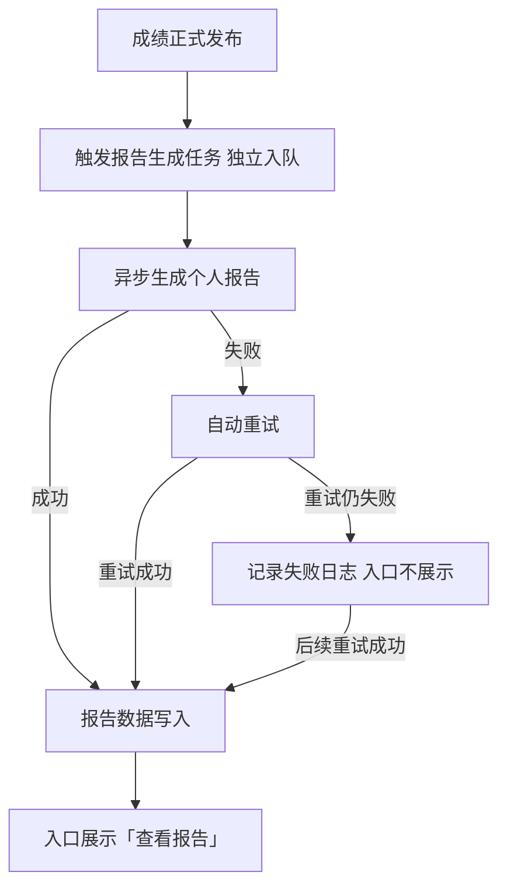
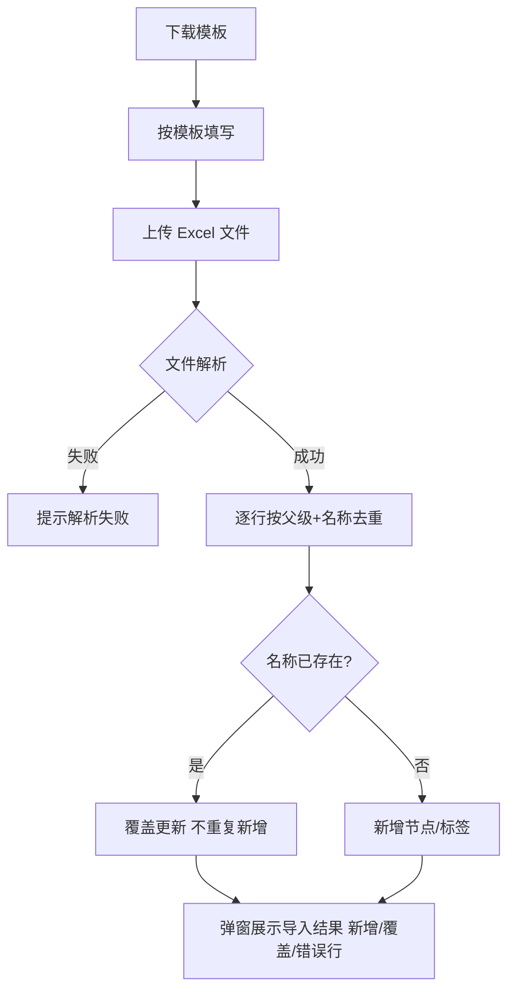

# 个人考级报告、用户端入口与知识标签管理 PRD

> 依据：《业务需求梳理.md》（20260728，唯一原始需求）+ 《方案概要.md》（产品大师工作区V2，已确认方案）+ 2026-08-07 用户补充需求（知识标签管理批量导入导出与清空标签）

## 变更记录

| 版本 | 编辑时间 | 修改/编辑内容 | 变动参与人 |
|------|----------|---------------|-----------|
| V1.0 | 2026-08-07 | 初稿：个人报告页、用户端入口、报告生成机制、知识标签管理批量导入导出与清空标签 | 产品 |
| V1.1 | 2026-08-07 | 响应评审：非满分点评文案删「该」字与原始需求对齐；补「树上有本场无题」知识点不展示规则；补课程学习建议单项缺失降级规则；390 与消息队列措辞弱化；导入补已存在复用与断档行规则；失败重试上限列入待确认 | 产品 + 评审 |
| V1.2 | 2026-08-07 | 明确操作区正式版结构：仅考生信息摘要与下载报告按钮，考生切换为 Demo 演示功能正式版不实现；验收补操作区结构条目 | 产品 |

## 涉及模块与相关方

| 涉及的模块或相关方 | 负责人 | 备注（依赖项/关注点） |
|--------------------|--------|----------------------|
| 用户端报告页（user/29） | 产品 | 新增页面，样式以《报告样式设计参考.md》与视觉基准图为准 |
| 我的活动（user/15） | 产品 | 改造：新增「查看报告」入口 |
| 成绩与证书查询（user/19、user/20） | 产品 | 改造：新增「查看报告」入口，与「查看电子证书」并存 |
| 知识标签管理（admin/31） | 产品 | 改造：批量导入导出、树节点清空标签 |
| 考试系统 | 研发 | 提供正式总分、题目知识点、学生作答、题目满分值 |
| 报告生成任务 | 研发 | 成绩发布事件触发，异步生成；触发挂接点待与证书侧对齐 |
| 运营 | 运营 | 补充三级考级衔接文案、各级别知识树完整清单 |

---

## 0. PRD 类型判定

本 PRD 为**功能型**：新功能上线（个人报告 + 入口 + 知识标签管理批量能力），含收益预估、验收标准、辅助材料。不涉及策略埋点与实验设计。

## 1. 项目背景与收益预估

**需求简介**：成绩发布后自动为每位已批改考生生成一份个人报告，把总分映射为等级与成长区间、把题目作答汇总为知识点掌握度、给出下一阶段学习建议；在「我的活动」「成绩与证书」提供报告入口；配套完善知识标签管理的批量导入导出与清空能力，支撑知识树建设。

**业务诉求**：考级平台目前只有电子证书，考生查完成绩后看不到自己的知识掌握情况，不知道下一步该学什么。报告不是证明文件，是给考生的学习反馈。

**预期收益**：

- **用户收益**：每位考生（含未通过）在查完成绩后都能看到「哪些知识点已稳定掌握、哪些需要重点提升、下一步学什么」，学习路径明确；未通过考生获得巩固建议而非只有「不合格」结论。
- **业务收益**：报告覆盖所有已批改且有正式总分的考生（含未通过），把「查完成绩只有分数」升级为「分数 + 学习反馈」，提升考级体系对家长和考生的价值感；知识标签批量导入导出使运营建设知识树的效率提升（去重增量导入，避免重复劳动）。
- **不做风险**：考生查完成绩即流失，续报/衔接下一级的动力不足；知识树全靠人工逐条维护，知识点覆盖不全导致报告掌握度数据缺失。

## 2. 业务流程简述

考生在考试批改完成、成绩正式发布后，系统自动为考生生成个人报告。考生从「我的活动」或「成绩与证书」查询结果进入报告页，查看等级结论、成长区间、知识点掌握情况、错题复盘与下一阶段建议，并可下载 PDF 版本保存。

运营侧在知识标签管理中维护知识树：下载模板 → 按模板批量导入（去重增量）→ 需要时按筛选批量导出；对整棵子树可一键清空标签后重新导入。

### 2.1 功能全景图（时间线）

```
阶段:  成绩发布 ────────→ 报告生成 ────────→ 用户查看 ────────→ 下载保存
        │                  │                  │                  │
报告生成 │  成绩事件触发     异步任务生成       生成完成写库       服务端渲染
（后台） │  （独立入队）      覆盖全部考生        失败自动重试        PDF 供保存
────────┼──────────────────┼──────────────────┼──────────────────┼────────
我的活动 │                                        ┌─────────────┐  │
（user/15）                                   │ 考试卡片新增  │  │
        │                                    │ 「查看报告」  │  │
────────┼──────────────────┼──────────────────┴─────────────┘  │
成绩查询 │                                        ┌─────────────┐  │
（user/19/20）                               │ 结果卡片新增  │  │
        │                                    │ 「查看报告」  │  │
────────┼──────────────────┼──────────────────┴─────────────┘  │
报告页  │                    │     标题栏 → 结果概览 → 知识点  │
（user/29）             │     掌握情况 → 考级具体表现 →     │
        │                    │     下一阶段建议（长条报告）    │
────────┼──────────────────┼──────────────────────────────────┼──────
运营侧  │  下载模板 → 批量导入（去重增量）→ 树节点清空标签 → 批量导出（按筛选）
（admin/31）
```

## 3. 版本管理

### 3.1 文档修订

见文首「变更记录」。

### 3.2 产品版本信息

AISE 随需求发版，不做版本锁定。本期范围为：个人报告页（新增）、用户端两个入口改造、「我的活动」改造、知识标签管理批量能力（改造）。后续范围：运营侧重试界面、三级考级衔接文案补齐后的展示。

## 4. 系统关联与依赖

### 4.1 数据依赖

| 数据                | 来源                           | 用途                 |
| ----------------- | ---------------------------- | ------------------ |
| 正式总分              | 考试系统发布成绩                     | 等级映射、通过判定、满分/非满分判定 |
| 题目知识点（一级/二级/三级标签） | 题目录入（独立 PRD 建设），知识树清单由运营人工补充 | 掌握度统计、错题点评的知识点引用   |
| 题目作答（选项/代码）       | 考试系统                         | 考级具体表现展示           |
| 题目满分值             | 考试系统                         | 掌握率计算              |
| 级别、姓名、考试年月        | 报名/考试数据                      | 标题栏、建议文案           |

### 4.2 依赖模块

- **证书签发流程**：报告触发时机与成绩发布事件对齐，但不复用证书申请链路（见 5.3）。电子证书相关能力（签发中心）本期不涉及。
- **题目录入（独立 PRD）**：提供题目知识点标签数据，本期只消费不建设。
- **异步任务机制**：报告生成复用平台异步任务机制，与证书签发的异步模式一致。

## 5. 详细功能说明

### 5.1 个人报告页（user/29，新增）

#### 5.1.1 页面整体与布局

**位置**：从「我的活动」「成绩与证书」查询结果的「查看报告」入口进入，在新页面打开。

**目标**：向考生展示一场考级考试的完整学习反馈，涵盖等级结论、知识点掌握、错题复盘与学习建议。

**功能描述**：

- 报告内容从上到下五个模块：标题栏 → 考级结果概览 → 知识点掌握情况 → 考级具体表现 → 下一阶段建议。
- 页面采用动态布局：
  - 宽屏（PC 浏览器）：左右分栏，左侧为长条报告（五模块纵向排列），右侧为操作区，操作区固定不随报告滚动。
  - 窄屏 / 移动端：上下堆叠，操作区置于报告上方，下方为长条报告，可纵向滚动浏览。
- 操作区为正式版固定结构，包含两部分：当前考生信息摘要（姓名、级别、考试年月、总分与报告等级）与「下载 PDF 报告」按钮。操作区无其他操作项；Demo 原型中的考生切换为演示工具（用于演示满分/非满分/未通过/知识点未配置四种报告形态），正式版不实现。
- 页面同时适配 PC 与手机浏览器，移动端适配口径见验收标准。
- 页面支持两种进入方式，从进入方式带出考生信息：
  - 登录态：从「我的活动」进入，直接展示当前登录考生对应考试的报告。
  - 查询态：从「成绩与证书」查询结果进入，展示查询命中的考生报告，报告通过考试记录标识定位，标识不可被转发盗用；查询态姓名完整展示，不脱敏。
- 页面样式、布局、配色以《AISE考级报告需求说明v1.0》PDF 内个人报告样式为准，执行依据为《报告样式设计参考.md》的色值与结构描述及视觉基准图（见辅助材料）。

**异常与边界**：

- 报告数据未就绪（加载中）：页面展示加载状态，不出现空白页。
- 报告生成失败或数据缺失：展示友好错误提示与「重新加载」操作；报告尚未生成完成时提示稍后查看。
- 报告页不承载生成逻辑，生成与否由入口侧控制。

#### 5.1.2 标题栏

**功能描述**：

- 展示级别（如「程序设计四级」）、考生姓名、考试年月（如「2026年6月」）、通过/未通过状态。
- 通过状态按正式总分判定：正式总分 ≥ 60 分为通过，60 分以下为未通过。
- 状态标签样式以设计基准为准，本 PRD 不指定颜色与形状。

#### 5.1.3 考级结果概览

本模块自上而下三部分：

**（1）报告等级**

- 直接使用考试系统正式发布总分，不取整、不四舍五入、不重新汇总。
- 等级映射表如下（原始需求原文照录）：

| 正式总分 | 通过状态 | 报告等级 | 所处成长区间 |
|---------|---------|---------|------------|
| 0 ≤ 总分 < 30 | 未通过 | 待提升 | 初步形成 |
| 30 ≤ 总分 < 60 | 未通过 | 待提升 | 稳步接近 |
| 60 ≤ 总分 < 70 | 通过 | 合格 | 目标达成 |
| 70 ≤ 总分 < 80 | 通过 | 良好 | 熟练掌握 |
| 80 ≤ 总分 ≤ 100 | 通过 | 优秀 | 高阶表现 |

- 报告等级共四个：待提升 / 合格 / 良好 / 优秀（待提升对应未通过）。

**（2）成长区间定位图**

- 五段定位图，五个阶段从左到右：初步形成、稳步接近、目标达成、熟练掌握、高阶表现，五段宽度按 30% / 30% / 20% / 10% / 10% 不等宽分布。
- 图形只表示五个阶段，不表示人数或真实分布；轴线是类别轴，不是连续分数轴。
- 当前考生的标记点固定放在对应阶段的正中心（五个阶段中心位置分别为 15% / 45% / 70% / 85% / 95%，满分取 100%），不随阶段内具体分数移动。
- 图下用文字说明考生所处阶段。

**（3）一句话总结**

按报告等级展示固定文案（逐字照录原始需求，禁止改写）：

- 待提升：综合本次考级表现，本级基础正在逐步形成，建议继续巩固核心任务。
- 合格：综合本次考级表现，已达到本级基本要求，可继续巩固并拓展。
- 良好：综合本次考级表现，已较稳定达到本级要求，可进一步提升综合应用。
- 优秀：综合本次考级表现，已高质量完成本级主要任务，可继续挑战更复杂的综合任务。

#### 5.1.4 知识点掌握情况

**功能描述**：

- 按知识树展示：一级知识模块 → 二级知识点；一级知识模块仅展示模块名作为分组标题，不附加掌握状态标签，掌握状态标签只出现在每个二级知识点右侧（稳定掌握 / 重点提升）。
- 模块标题行仅展示「知识点掌握情况」标题，标题右侧不展示任何内容（不展示知识树名称、级别说明等文案）。
- **掌握度判定**：掌握率 = 该知识点关联题目的得分之和 ÷ 该知识点关联题目的满分值之和；掌握率 ≥ 60% 为「稳定掌握」，< 60% 为「重点提升」。
- **排序规则**：一级知识模块按知识树顺序展示；模块内部的二级知识点先展示「重点提升」，再展示「稳定掌握」；同一状态内按知识树顺序展示。
- **数据依赖**：报告依赖每道题目的「知识点」字段（一级/二级/三级标签，三级标签入库但不展示）。各级别知识树完整清单依赖运营人工补充；题目录入侧的知识点选择由独立 PRD 覆盖。

**异常与边界**：

- 考生没有任何题目关联知识点时（如整场考试题目均未配置知识点），本模块显示「暂无知识点掌握数据」占位说明，其余模块正常展示。
- 知识树中存在但本场考试无任何关联题目的二级知识点不展示（掌握率分母为 0，不参与排序与展示）。

#### 5.1.5 考级具体表现

按总分是否满分分两套展示逻辑：

**满分画像（总分 = 100）**：

- 展示 1 道题——首道满分的编程题。
- 只展示学生作答，不展示正确答案。
- 点评为固定文案「本题目作答达到要求，完整完成任务。太棒了！」。

**非满分画像（总分 < 100）**：

- 展示首道错误的客观题 + 首道扣分的编程题。
- 客观题展示题干、学生选项与正确选项（含「你的作答」「正确答案」标注）；编程题展示学生作答代码。
- 两道题按题号排序，客观题在前。
- 点评为「建议重点提升【题目二级标签知识点】。」。

**缺一展一原则**：

- 客观题与编程题各自独立判定：客观题有错则展示客观题，编程题有扣分则展示编程题，两者缺一就只展示存在的部分。
- 客观题全对时只展示编程题；编程题无扣分时只展示客观题。
- 两者均无（非满分但无错题可展示）时，该模块整体不展示。
- 满分场景按规则找不到首道满分编程题时，该模块同样不展示，不留空卡片。

**题目呈现**：

- 客观题以题干 + 学生选项 + 正确选项的形式展示。
- 编程题以深色代码块展示学生作答代码；作答代码行数较多时统一保留前 5 行后截断，截断处显示省略提示。

#### 5.1.6 下一阶段建议

按级别 × 通过状态交叉展示，包含两部分：

**考级衔接**：一级、二级、四级、五级、六级、七级、八级共 7 个级别，通过/未通过各一句，文案逐字照录原始需求 1.6 表格原文，禁止改写、禁止润色：

- 一级通过：建议继续学习变量、循环和条件判断，尝试编写较复杂的逻辑程序，衔接二级。
- 一级未通过：建议先巩固一级，继续学习变量、循环和条件判断，尝试编写较复杂的逻辑程序。
- 二级通过：建议继续学习数据类型及顺序、分支和循环结构，逐步过渡到代码编程，衔接四级。
- 二级未通过：建议先巩固二级，继续学习数据类型及顺序、分支和循环结构，尝试进行代码编程。
- 四级通过：建议继续学习列表、字典及循环分支嵌套，构建更复杂的程序逻辑，衔接五级。
- 四级未通过：建议先巩固四级，继续学习列表、字典及循环分支嵌套，练习构建复杂程序逻辑。
- 五级通过：建议继续学习函数定义与整除取余，尝试用程序解决数学问题，衔接六级。
- 五级未通过：建议先巩固五级，继续学习函数定义与整除取余，尝试用程序解决数学问题。
- 六级通过：建议继续学习核心算法与数据分析，使用枚举、模拟等方法解决实际问题，衔接七级。
- 六级未通过：建议先巩固六级，继续学习核心算法与数据分析，练习用枚举、模拟等方法解决实际问题。
- 七级通过：建议继续学习经典高阶算法，尝试用算法解决综合项目问题，衔接八级。
- 七级未通过：建议先巩固七级，继续学习经典高阶算法，尝试用算法解决综合项目问题。
- 八级通过：已完成当前程序设计考级等级序列，可进一步衔接C++与高阶算法学习。
- 八级未通过：建议先巩固八级，继续学习数据结构与高阶算法，提升综合问题求解能力。

**课程学习建议**：

- 仅通过状态展示；未通过状态该部分整块不展示（原始需求表格该列为空）。
- 各级别通过状态文案逐字照录原始需求 1.6 表格（一级「建议提升程序逻辑设计与表达能力，逐步完成更完整的编程任务。」、二级「建议进阶学习代码编程，巩固基础编程语法。」、四级「建议通过更完整的项目练习，提升复杂逻辑设计和问题解决能力。」、五级「建议提升多文件编程能力，增强模块协作与项目组织能力。」、六级「建议提升数据分析能力，增强数据处理与问题洞察能力。」、七级「建议进一步提升算法设计与综合应用能力，为数据结构和高阶算法学习做好准备。」、八级「建议进一步学习C++、数据结构与高阶算法，提升算法设计和综合问题求解能力。」）。

**文案缺口**：

- 原始需求未提供三级考级衔接文案（开考时无文案可用），由运营补充。考级衔接文案未配置时，该模块不展示，其余模块正常展示。
- 任一级别通过状态的课程学习建议未配置时，该级别通过状态仅展示考级衔接部分，不展示课程学习建议。

#### 5.1.7 加载与出错状态

- **加载中**：报告数据未就绪时页面展示加载状态，不出现空白页。
- **出错**：报告生成失败或数据缺失时，展示友好错误提示与「重新加载」操作；若报告未生成完成，提示稍后查看。

#### 5.1.8 PDF 下载

**功能描述**：

- 操作区提供「下载 PDF 报告」按钮，下载对象为当前报告的考生（登录态为当前登录考生，查询态为查询命中的考生）。
- 点击后由服务端将当前报告渲染为 PDF 供保存，PDF 样式与线上报告页一致。
- 生成期间按钮置灰并提示「生成中」；生成失败提示可重试。
- 不涉及电子签章（与电子证书的签章流程无关）。

**异常与边界**：

- 报告尚未生成完成时，入口侧不展示按钮（见 5.2），报告页内不出现「无 PDF 可下载」的空操作。

### 5.2 用户端入口改造

#### 5.2.1 「我的活动」（user/15，改造）

**功能描述**：

- 现状：考试卡片操作区有「查看准考证」「模拟测评」「正式测评/进入测评/你已交卷」等按钮。
- 改造：成绩已发布且报告已生成完成的卡片，在操作区新增「查看报告」按钮；成绩未发布或报告生成中的卡片不展示该按钮。
- 按钮样式与同操作区其他按钮一致，点击后在新页面打开该考试对应考生的报告。

#### 5.2.2 「成绩与证书」查询页（user/19、user/20，改造）

**功能描述**：

- 现状：输入姓名、手机号（可选证书编号）查询考试列表；结果卡片有 5 种状态：已签发（查看电子证书）、待签发、证书生成中、未获得证书（成绩未达标）、等待成绩。其中「未获得证书」的考生恰恰有报告无证书，是最需要「查看报告」入口的场景。
- 改造：查询结果中已出个人报告的卡片，在「查看电子证书」按钮旁新增「查看报告」按钮，两者并存；报告未生成的卡片只展示原状态，不展示报告按钮。
- 点击后在新页面打开该考生的报告。
- user/19 与 user/20 为同一查询能力的两版页面，同步改造。

#### 5.2.3 入口按钮展示规则汇总

| 报告状态 | 「我的活动」 | 「成绩与证书」查询页 |
|---------|------------|-------------------|
| 成绩未发布 / 批改中 | 不展示 | 不展示（原「等待成绩」状态不变） |
| 报告生成中 | 不展示 | 不展示 |
| 报告生成完成 | 展示「查看报告」 | 展示「查看报告」（与「查看电子证书」并存） |
| 报告生成失败（重试中） | 不展示 | 不展示 |

### 5.3 报告生成机制

**功能描述**：

- **触发时机**：成绩发布事件触发。报告任务独立入队，不与证书申请接口耦合——证书由申请触发且仅覆盖成绩达标考生；报告覆盖所有已批改且有正式总分的考生（含未通过）。若挂在证书申请上，未达标考生（不申请证书）将永远没有报告，与覆盖范围要求矛盾。
- **生成方式**：异步任务生成（复用平台异步任务机制，与证书签发的异步模式一致），每个考生一份报告任务，生成完成写入报告数据。
- **覆盖范围**：所有已批改且有正式总分的考生均生成（含未通过，报告呈现「待提升」等级）；证书仅覆盖成绩达标考生，两者覆盖范围不同。
- **失败处理**：生成失败自动重试，重试仍失败则记录失败日志。此为报告自有机制，不依赖签发中心；本期不提供运营侧重试界面（后续需求）；失败期间入口不展示「查看报告」，重试成功后自动恢复展示；不向考生暴露失败过程。

**待确认事项**：具体触发挂接方式（成绩发布事件监听点）与证书侧对齐后确定。

### 5.4 知识标签管理：批量导入导出（admin/31，改造）

#### 5.4.1 下载导入模板

**功能描述**：

- 知识标签管理页提供「下载模板」操作，下载 Excel 模板文件（.xlsx）。
- 模板列：级别 / 模块 / 知识点 / 标签名称，共四列。
- 模板内包含两行示例数据，供运营参照填写。

#### 5.4.2 批量导入（去重增量修改）

**功能描述**：

- 运营按模板填写后上传 Excel 文件（.xlsx）批量导入标签数据。
- 导入按「父级 + 名称」逐级去重，增量修改：
  - 级别：父级为空，按名称去重；不存在则新增级别，已存在则复用。
  - 模块：父级为所属级别，按名称去重；不存在则新增模块，已存在则复用。
  - 知识点：父级为所属模块，按名称去重；不存在则新增知识点，已存在则复用。
  - 三级标签：父级为所属知识点，按名称去重；已存在则覆盖更新（不重复新增），不存在则追加。
- 导入完成后弹窗展示结果：新增的级别/模块/知识点/三级标签数量、重复覆盖数量、未导入的错误行明细（如级别为空的无效行）。

**异常与边界**：

- 上传文件非模板格式或解析失败：提示文件解析失败，请确认上传的是模板格式的 .xlsx 文件。
- 级别为空的整行：不入库，导入结果中提示该行被跳过。
- 中间层级断档的行（如模块为空但知识点/标签有值）：该行不入库，导入结果中提示被跳过。
- 重复导入同一文件：不产生重复数据（幂等），结果提示无新增。
- 无标签的中间层级（如只导入到模块层）：允许，生成空的知识点/标签层级。

#### 5.4.3 批量导出（先筛选再导出）

**功能描述**：

- 运营可批量导出知识标签数据为 Excel 文件（.xlsx），导出内容与导入模板同结构（级别 / 模块 / 知识点 / 标签名称）。
- 导出以页面当前筛选条件为准：
  - 无筛选时导出全部数据。
  - 有筛选时导出筛选结果；筛选语义与页面左侧树一致——任一层级匹配关键词，其下层级全部导出（如模块名匹配则导出该模块下所有知识点与标签）。
- 筛选条件下无数据时提示无可导出数据。

### 5.5 知识标签管理：树节点批量清空标签（admin/31，改造）

**功能描述**：

- 现状：三级标签只能逐条删除（标签表格内行操作）。
- 改造：左侧树的每个节点（级别、模块、知识点）提供「清空标签」操作，一键删除该节点下全部三级标签，配合批量导入实现「清空后重导」的运营流程。
- 清空范围：
  - 级别节点：清空该级别下所有模块、知识点下的全部三级标签。
  - 模块节点：清空该模块下所有知识点下的全部三级标签。
  - 知识点节点：清空该知识点下的全部三级标签。
- 清空只删除标签，级别/模块/知识点结构保留。
- 该节点下无标签时，点击提示「无标签可清空」，不弹确认框。

**二次确认**：

- 点击清空操作后弹出确认框，标题为「确认清空」，正文展示节点名称与将清空的标签数量（如「确定清空『Python运算』下的全部 4 个三级标签吗？」），并提示「仅删除标签，级别、模块、知识点结构保留，此操作不可恢复」。
- 确认按钮文案为「清空」；取消则不执行任何删除。
- 原「删除」确认框（单条标签/节点删除）保留，不受影响。

**异常与边界**：

- 清空后右侧标签表格与树节点计数同步刷新为空态。
- 清空操作与逐条删除、批量导入共用同一份标签数据，操作结果即时生效。

## 6. 流程与状态图表

### 6.1 报告生成流程



### 6.2 知识标签批量导入流程



## 7. 数据埋点与实验设计

本 PRD 为功能型，不涉及策略调整与实验，无埋点与实验设计。

## 8. 验收标准

### 8.1 个人报告页

| # | 测试场景 | 前置条件 | 操作 | 期望结果 | 判定 |
|---|---------|---------|------|---------|------|
| 1 | 五模块渲染 | 报告已生成 | 打开报告页 | 标题栏、考级结果概览、知识点掌握情况、考级具体表现、下一阶段建议五个模块自上而下完整展示 | 五模块齐全且顺序正确 |
| 2 | 等级映射-边界 | 总分 29 / 30 / 59 / 60 / 69 / 70 / 79 / 80 / 100 | 查看报告 | 等级与成长区间按映射表正确对应（0-30 待提升/初步形成，30-60 待提升/稳步接近，60-70 合格/目标达成，70-80 良好/熟练掌握，80-100 优秀/高阶表现） | 边界值全部正确 |
| 3 | 成长区间定位 | 非满分考生 | 查看报告 | 五段宽度 30/30/20/10/10，标记点位于对应阶段中心（15/45/70/85/95），满分标记在 100% 处 | 宽度与标记位置正确 |
| 4 | 掌握度判定 | 知识点关联题目得分 60% 与 59% | 查看报告 | ≥60% 显示「稳定掌握」，<60% 显示「重点提升」 | 阈值判定正确 |
| 5 | 掌握度排序 | 模块内存在重点提升与稳定掌握 | 查看报告 | 模块内先展示「重点提升」再展示「稳定掌握」，同状态按知识树顺序 | 排序正确 |
| 6 | 满分画像 | 总分 100 | 查看报告 | 展示首道满分编程题，只展示作答不展示答案，点评为「本题目作答达到要求，完整完成任务。太棒了！」 | 展示内容与点评逐字正确 |
| 7 | 非满分-缺一展一 | 客观题有错、编程题无扣分 | 查看报告 | 只展示首错客观题（题干+学生选项+正确选项标注） | 不展示编程题 |
| 8 | 非满分-缺一展一 | 客观题全对、编程题有扣分 | 查看报告 | 只展示首扣分编程题 | 不展示客观题 |
| 9 | 非满分-双题 | 客观题有错且编程题有扣分 | 查看报告 | 两题都展示，按题号排序客观题在前，点评「建议重点提升【二级标签知识点】。」 | 展示顺序与点评正确 |
| 10 | 非满分-无错题 | 总分 <100 且无任何错题 | 查看报告 | 该模块整体不展示，不留空卡片 | 模块隐藏 |
| 11 | 编程题截断 | 作答代码超过 5 行 | 查看报告 | 仅展示前 5 行，截断处显示省略提示 | 截断正确 |
| 12 | 建议文案 | 各级别通过/未通过 | 查看报告 | 考级衔接与课程学习建议逐字照录原始需求 1.6；未通过不展示课程学习建议 | 文案逐字一致 |
| 13 | 三级文案缺口 | 三级考生报告 | 查看报告 | 建议模块不展示（文案未配置），其余模块正常 | 无空白卡片 |
| 14 | 知识点空态 | 整场考试题目未配置知识点 | 查看报告 | 该模块显示「暂无知识点掌握数据」占位，其余模块正常 | 占位正确 |
| 15 | 加载态 | 报告数据未就绪 | 打开报告页 | 展示加载状态，无空白页 | 加载态可见 |
| 16 | 错误态 | 报告生成失败 | 打开报告页 | 展示友好错误提示与「重新加载」操作 | 提示与重试可用 |
| 17 | 操作区结构 | 报告已生成 | 打开报告页 | 操作区仅含考生信息摘要（姓名/级别/考试年月/总分/等级）与「下载 PDF 报告」按钮，无考生切换等其他操作 | 结构与正式版定义一致 |
| 18 | 动态布局-窄屏 | 移动端/窄屏 | 打开报告页 | 操作区在上、报告在下，纵向滚动 | 布局正确 |
| 19 | 字号验收 | 移动端 390 宽度 | 打开报告页 | 正文和题目内容不低于 15px、辅助标签不低于 12px、核心标题 20-24px | 字号达标 |
| 20 | PDF 下载 | 报告已生成 | 点击「下载 PDF 报告」 | 生成期间按钮置灰提示生成中，成功后下载 PDF，失败提示可重试 | 全流程正确 |
| 21 | PDF 样式 | 打开下载的 PDF | 下载并打开 | PDF 样式与线上报告页一致（标题栏/概览/知识点/表现/建议完整） | 样式一致 |

### 8.2 用户端入口

| # | 测试场景 | 前置条件 | 操作 | 期望结果 | 判定 |
|---|---------|---------|------|---------|------|
| 22 | 入口-已生成 | 成绩已发布且报告生成完成 | 打开我的活动/成绩查询 | 展示「查看报告」按钮；成绩查询页与「查看电子证书」并存 | 按钮展示 |
| 23 | 入口-未发布 | 成绩未发布 | 打开页面 | 不展示报告按钮，原状态展示不变 | 按钮隐藏 |
| 24 | 入口-生成中 | 报告生成中 | 打开页面 | 不展示报告按钮 | 按钮隐藏 |
| 25 | 入口-失败重试中 | 报告生成失败 | 打开页面 | 不展示报告按钮，重试成功后自动恢复 | 按钮隐藏/恢复 |
| 26 | 入口跳转 | 报告已生成 | 点击「查看报告」 | 新页面打开对应考生报告，登录态展示本人、查询态展示命中考生（姓名完整不脱敏） | 跳转与数据正确 |

### 8.3 报告生成机制

| # | 测试场景 | 前置条件 | 操作 | 期望结果 | 判定 |
|---|---------|---------|------|---------|------|
| 27 | 触发与覆盖 | 成绩正式发布 | 触发成绩发布事件 | 所有已批改且有正式总分的考生（含未通过）均生成报告，与证书申请无关 | 覆盖范围正确 |
| 28 | 失败重试 | 生成任务失败 | 观察任务状态 | 自动重试；重试仍失败记录日志，入口不展示；重试成功后恢复 | 重试与恢复正确 |

### 8.4 知识标签管理

| # | 测试场景 | 前置条件 | 操作 | 期望结果 | 判定 |
|---|---------|---------|------|---------|------|
| 29 | 下载模板 | 打开知识标签管理页 | 点击「下载模板」 | 下载 .xlsx 模板，四列（级别/模块/知识点/标签名称）含示例行 | 模板正确 |
| 30 | 导入-去重增量 | 模板含已存在与新增数据 | 上传导入 | 已存在按父级+名称覆盖不重复新增，新增数据追加；弹窗展示新增/覆盖统计 | 去重与统计正确 |
| 31 | 导入-错误行 | 模板含级别为空的无效行 | 上传导入 | 无效行不入库，结果弹窗提示该行被跳过 | 错误行提示 |
| 32 | 导入-幂等 | 同文件导入两次 | 再次上传同一文件 | 无重复数据，结果提示无新增 | 幂等 |
| 33 | 导入-格式错误 | 上传非模板文件 | 上传 | 提示文件解析失败 | 提示正确 |
| 34 | 导出-全部 | 无筛选条件 | 点击「批量导出」 | 导出全部知识标签为 .xlsx（同模板结构） | 数据完整 |
| 35 | 导出-筛选 | 输入筛选关键词 | 先筛选再导出 | 任一层级匹配关键词其下层级全量导出；无结果时提示无可导出数据 | 筛选正确 |
| 36 | 清空标签-级别 | 级别下有多个模块标签 | 点击级别节点清空 | 二次确认弹窗显示节点名与标签数量，确认后该级别下全部标签清空，结构保留 | 清空正确 |
| 37 | 清空标签-二次确认 | 任意节点 | 点击清空后取消 | 取消不执行删除，标签保留 | 确认逻辑正确 |
| 38 | 清空标签-无标签 | 节点下无标签 | 点击清空 | 提示无标签可清空，不弹确认框 | 提示正确 |
| 39 | 清空标签-逐条删除不受影响 | 原删除功能 | 删除单个标签 | 原逐条删除流程不变 | 回归正常 |

## 9. 辅助材料清单

| 审查项 | 材料 | 位置 |
|--------|------|------|
| 样式基准 | 报告样式设计参考.md（色值与结构描述） | 本任务目录 |
| 视觉基准图 | images/ 下 page2_img1.jpeg、page2_img2.jpeg（报告主界面长截图）、page3-5 组件图 | 本任务目录 |
| HTML 原型 | 29_考级报告.html、15_我的活动.html、19_成绩与证书查询.html、20_成绩与证书_独立页.html、31_知识标签管理.html | html/user/ 与 html/admin/ |
| PDF 样例 | 考级报告_李明/王芳/张伟/陈晨.pdf（4 种报告形态） | html/user/pdf/ |
| 竞品分析 | 本期无乘客交互类竞品对照需求，不适用 | — |

## 10. 待确认事项

| # | 事项 | 说明 | 状态 |
|---|------|------|------|
| 1 | 报告触发挂接点 | 成绩发布事件监听点与证书侧对齐 | 待确认 |
| 2 | 三级考级衔接/课程建议文案 | 运营补充后展示 | 待运营补充 |
| 3 | 各级别知识树完整清单 | 运营人工补充，报告数据源 | 待运营补充 |
| 4 | 报告生成失败重试上限与运营告警 | 自动重试次数上限、是否告警运营，与触发挂接点一并对齐 | 待确认 |
