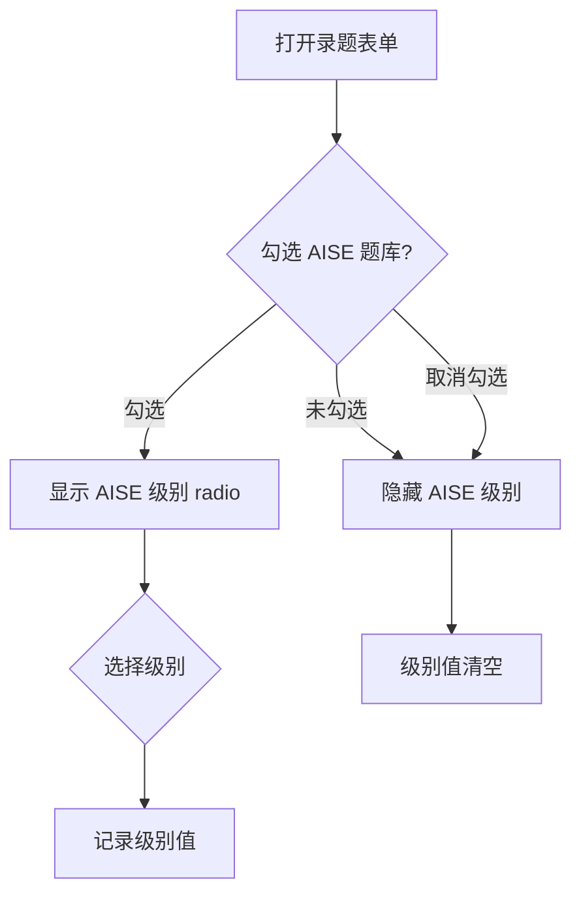
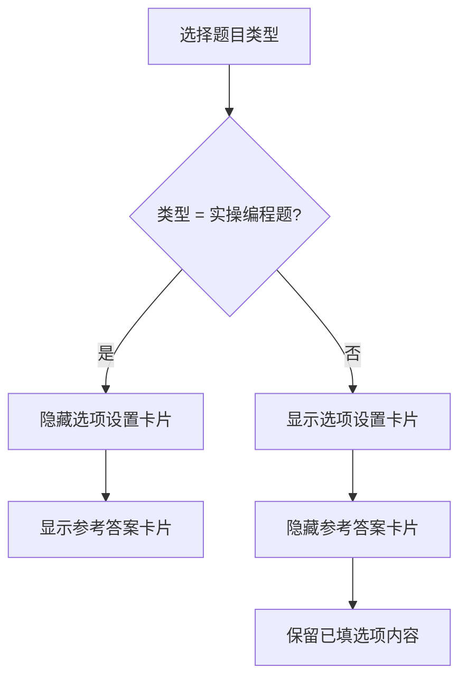

# AISE 题目录入增强 PRD

## 1. 项目背景

### 1.1 需求简介

AISE 题库体系需要支持按「所属题库」区分题目来源，并在 AISE 题库下按级别（一级~八级）组织题目。当前录题表单缺少题库归属、级别、题目标题等字段，列表页筛选维度不足，编程 OJ 题型也无法上传参考答案。

本次增强在现有录题表单和列表页基础上，新增上述字段和筛选维度，不改变现有功能。

### 1.2 业务诉求

- 运营需要将题目归属到不同题库（默认题库 / 我的题库 / AISE 题库），同一道题可同时属于多个题库
- AISE 题库的题目需要按级别（一~八级）组织，便于按级别筛题和组卷
- 运营录入题目时需要给题目加一个简短标题，方便在列表和报告中识别
- 编程 OJ 题型需要上传参考答案，在考生报告页展示前 5 行供对照

## 2. 业务流程简述

运营登录 admin 后台 → 进入题库管理列表页 → 点击「录入题目」或编辑已有题目 → 在录题表单中填写基础属性（题库归属、级别、题目标题、题目类型、难度、知识点标签）→ 填写题干内容 → 选择题型对应区域（选项/参考答案）→ 填写答案解析 → 保存。

列表页支持按标题+题干预览搜索，按题库和级别筛选。

## 3. 详细功能说明

### 3.1 所属题库

- **位置**：录题/编辑表单「基础属性」卡片内，题目类型上方
- **目标**：将题目归属到一个或多个题库

**界面元素**：
- 三个 checkbox 平级排列：「默认题库」「我的题库」「AISE 题库」
- 可同时勾选多个——同一道题可以同时属于默认题库和 AISE 题库
- 至少勾选一个，否则保存时提示「请至少选择一个所属题库」

**交互规则**：
- 默认状态：三个 checkbox 均未勾选
- 勾选「AISE 题库」后，下方出现「AISE 级别」字段（见 3.2）
- 取消勾选「AISE 题库」后，「AISE 级别」字段隐藏，已选级别清空
- 编辑已有题目时，回显该题目已关联的题库（对应 checkbox 打勾）

### 3.2 AISE 级别

- **位置**：所属题库下方，仅在勾选「AISE 题库」时出现
- **目标**：定义题目在 AISE 题库中的难度级别

**界面元素**：
- 单选组（radio button），8 个选项：一级、二级、三级、四级、五级、六级、七级、八级
- 水平排列，在一行或多行内换行展示

**交互规则**：
- 勾选「AISE 题库」后出现，默认不选中任何级别
- 单选，选择后不可取消（只能切换，不能清空回未选中状态）
- 保存时若勾选了「AISE 题库」但未选级别，提示「请选择 AISE 级别」
- 取消勾选「AISE 题库」时，级别选择清空，字段隐藏

### 3.3 题目编号

- **位置**：不出现于表单。后端在保存时自动生成，前端在列表页和题目详情页只读展示
- **目标**：为每道题目生成唯一、可读的编码，保证同一题库/级别内序号不重不乱

**生成规则**：

| 题库 | 编号格式 | 示例 | 说明 |
|------|---------|------|------|
| 默认题库 | `DF-{题目ID}` | DF-10086 | 题目ID为系统自增主键 |
| 我的题库 | `MY-{创建者ID}-{题目ID}` | MY-1001-10240 | 创建者标识+题目ID联合确保唯一 |
| AISE 题库 | `A{级别}-{序号}` | A1-001, A1-002, A8-156 | 级别为 1~8，序号为该级别下的自然递增（4位，不足补零） |

**约束**：
- 同一题目关联多个题库时，各有一组独立编号，互不冲突
- 编号在题目首次保存时生成，之后不可修改
- 编辑已有题目时，若新增题库归属（如原来只有默认题库，现在也关联到 AISE 题库），仅为新题库生成编号，已有编号不变
- 若从题库移除题目，对应编号不再使用（不回收）

### 3.4 题目标题

- **位置**：录题/编辑表单中，知识点标签下方、题干内容上方
- **目标**：为题目提供一个简短的识别标题，方便运营在列表中快速定位

**界面元素**：
- 单行文本输入框
- placeholder：「例如：1.程序输出判断」
- 非必填

**交互规则**：
- 输入内容无字符限制（由后端按需截断）
- 填写后，在题目管理列表页的卡片中展示该标题（替换当前仅展示题干的逻辑：有标题则优先展示标题，题干作为副标题/预览）
- 列表页搜索框同时搜索标题和题干，不区分标题字段和题干字段

**列表展示规则**（题目管理列表页卡片）：
- 有标题时：卡片主文字展示标题，题干作为副文本以灰色小字展示（截断至一行）
- 无标题时：沿用现有逻辑，主文字展示题干前一段
- 搜索匹配高亮：无论匹配的是标题还是题干，均在对应文字处高亮

### 3.5 列表页筛选增强

- **位置**：题目管理列表页筛选搜索区域
- **目标**：增加题库维度和级别维度的筛选能力

**搜索框行为调整**：
- 原有 placeholder「搜索题干关键词...」→「搜索标题或题干关键词...」
- 搜索范围：标题 + 题干全文（OR 逻辑，匹配任意一个即命中）

**新增筛选下拉**：
- 「全部题库」：全部 / 默认题库 / 我的题库 / AISE 题库
- 「全部级别」：全部 / 一级 ~ 八级

**筛选联动**：
- 当「全部题库」选择非「全部」时，列表仅展示归属该题库的题目
- 当「全部级别」选择非「全部」时，列表仅展示该级别的题目（仅对 AISE 题库题目生效）
- 两个筛选可组合使用
- 「重置筛选」按钮将所有筛选器恢复默认值，搜索框清空

**注意**：「全部级别」下拉始终可用，不随「全部题库」选「AISE 题库」而禁用。原因：题目可能同时属于多个题库，单看题库筛选不足以判断是否适用级别筛选。

### 3.6 编程 OJ 参考答案上传

- **位置**：录题/编辑表单中，「选项设置」卡片下方（题目类型切换控制显隐）
- **目标**：为实操编程题上传参考答案文件，在考生报告页展示前 5 行供对照

**题目类型切换规则**：
- 题目类型 ≠「实操编程题」：显示「选项设置」卡片，隐藏「参考答案」卡片
- 题目类型 =「实操编程题」：隐藏「选项设置」卡片，显示「参考答案」卡片。已在选项区填写的内容不清除（切回非编程题时恢复）

**参考答案卡片内容**：
- 参考答案文件上传区：
  - 点击区域或拖拽触发文件选择
  - 支持文件类型：.py / .java / .cpp / .js / .c / .go / .ts
  - 选择文件后，显示文件名和文件大小（格式：`{文件名} | {大小}`，绿色标签样式）
- 参考答案预览区：
  - 深色代码编辑器风格预展示
  - 上传文件后自动提取前 5 行展示
  - 未上传时显示占位文字：「上传文件后将在此显示前 5 行内容」

**边界场景**：
- 编辑已有编程题时，回显已上传的文件名（不重新展示文件内容预览，仅显示文件名）
- 重新上传文件覆盖旧文件
- 文件大小限制由后端控制（前端不做硬限制，后端按项目配置截断）

**报告页展示规则**（不在本次 Demo 范围，仅定义规则）：
- 考生个人报告/答题结果页中，编程题区域展示「参考答案预览」标题 + 前 5 行代码
- 标注「（仅供参考，非评分标准）」提示文字

## 4. 流程与状态图表

### 4.1 录题表单 — 题库归属与级别联动

### 4.2 题目类型与内容区切换

## 5. 系统影响与依赖

### 5.1 数据库变更

- 题目表新增字段：题库归属（多值，关联表或 JSON）、AISE 级别（1-8，可空）、题目标题（文本，可空）
- 新增题目编号表或字段：按题库类型分列或统一存储
- 编程题新增参考答案文件存储（文件路径或内容字段）

### 5.2 接口影响

- 题目保存/更新接口：接收新增字段
- 题目列表查询接口：支持题库、级别筛选参数
- 题目搜索接口：搜索范围扩展至标题+题干

### 5.3 前端影响

- admin 端：08_题目管理_列表.html、09_题目管理_详情.html（本次 Demo 已改）
- 无 user 端影响

## 6. 验收标准

- [ ] 录题表单「基础属性」卡片内，题目类型上方有「所属题库」三个 checkbox
- [ ] 勾选「AISE 题库」后，出现「AISE 级别」一~八级 radio 组
- [ ] 取消勾选「AISE 题库」后，级别字段隐藏、选择清空
- [ ] 「知识点标签」和「题干内容」之间有「题目标题」输入框，非必填
- [ ] 题目类型选择「实操编程题」后，选项设置隐藏、参考答案卡片出现
- [ ] 参考答案上传区支持文件选择，选择后显示文件名/大小，预览前 5 行
- [ ] 切回非编程题型后，选项设置恢复、参考答案隐藏
- [ ] 列表页搜索框搜索标题+题干
- [ ] 列表页新增「全部题库」「全部级别」筛选下拉
- [ ] 「重置筛选」恢复全部默认值
- [ ] 试题篮、只看已选、生成试卷等现有功能不变
- [ ] 编辑已有题目时，新增字段正确回显

## 7. 不做事项

| 事项 | 说明 |
|------|------|
| Markdown 批量上传 | 产品批注「先不做」，后续单独出需求 |
| 级别筛选与题库筛选的联动禁用 | 基础版本先不做联动，始终可用 |
| 题目编号在表单中可编辑 | 编号由后端自动生成，前端只读 |
| 考生报告页的实际改造 | 本次 PRD 定义了规则，Demo 和开发留到后续需求 |
