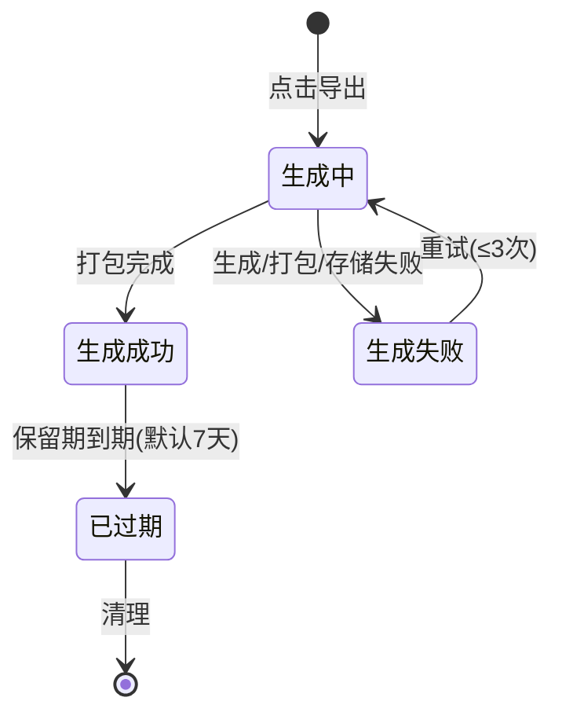
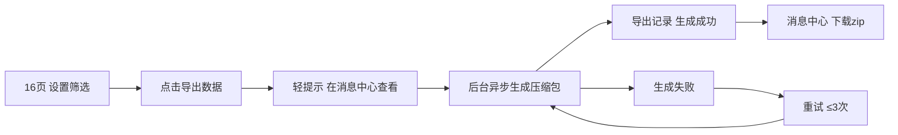

# AISE 学生证书管理导出证书包 PRD

> **依据**：《业务需求梳理.md》（20260805 导出证书包改造）—— 全部规则、数字、文案的转写来源；《20260512 证书签发流程 PRD》—— 证书状态链路、PDF 资产来源；AISE&爱测评平台能力梳理（索引文档）—— 页面口径。详见附录 B。
> **整理日期**：20260806
> **范围声明**：覆盖 admin 端「16_学生证书管理」导出功能 + 「19_消息中心」导出记录。不含：列表查询/重置逻辑、增量导出、定时导出、分卷压缩、PDF 重生成（重签属签发链路职责）。

---

## 0. PRD 类型判定

| 类型 | 判定理由 |
|------|---------|
| 🏗 功能型 | 现有「导出数据」功能增强（导出内容从纯表格升级为「表格+证书压缩包」），非策略调整、非缺陷修复 |

---

## 1. 项目背景与收益预估

### 1.1 需求简介

后台「学生证书管理」的「导出数据」目前只导出表格、不带证书文件。本次改为导出一个压缩包：包内是原来的表格 + 表格中所有已签发学生的证书 PDF 文件。

### 1.2 业务诉求

- 运营需要把「名单 + 证书」一并归档/分发/与寄送清单核对，现状只能导出表格，证书需逐个在签发中心下载，效率低、易漏
- 名单中未签发/无证书的学生需要能说清原因（可溯源），现状导出无此信息

### 1.3 收益预估

> **预期收益**：一次导出拿到「名单 + 全部已签发证书 + 缺证书说明」，替代逐个下载，归档/分发效率大幅提升；缺证书原因随包可查，减少线下核对成本。

### 1.4 用户锁定决策（4 条，不得违反）

1. 导出范围：按当前筛选条件**全量**导出（跨页，非仅当前页/勾选行）
2. 证书 PDF 只打包**已签发**的；表格 Excel 保留筛选**全量行**；压缩包内附「缺证书说明.txt」列明未打包学生及原因
3. 按钮保持「导出数据」原名、不改文案；仍走异步链路（点击 → 轻提示 → 消息中心下载）
4. 纯后台功能改进，无硬件依赖、无外部系统集成（证书 PDF 为平台内已生成资产）

---

## 2. 业务流程简述

在「16_学生证书管理」设置筛选条件 → 点击「导出数据」→ 轻提示「正在导出，请稍后在『消息中心』查看下载」→ 后台按筛选条件全量生成压缩包（名单 Excel + 已签发证书 PDF + 缺证书说明）→ 用户在「19_消息中心 → 导出记录」查看进度并下载压缩包；失败可重试，文件 7 天（默认）后过期清理。

---

## 3. 版本管理

### 3.1 PRD 版本记录

| 版本号 | 日期 | 修订内容 |
|--------|------|---------|
| V1.0 | 20260806 | 初稿（产品大师整合，技术风格） |
| V1.1 | 20260806 | 按 2RED PRD 标准重写：补充类型判定/收益预估/版本管理/验收标准，正文业务化、精简现状与废话，技术细节收敛至附录 A |

### 3.2 产品版本信息

| 项目 | 内容 |
|------|------|
| 所属平台 | AISE admin 端（运营后台） |
| 涉及页面 | 16_学生证书管理、19_消息中心 |
| 本期范围 | 导出证书包（服务端异步任务）+ 16 页导出按钮改造 + 19 页导出记录适配 |
| 依赖模块 | 电子证书签发链路（提供证书 PDF）、消息中心（导出记录展示） |
| 后续范围 | 增量导出、定时导出、分卷压缩、取消/中止任务（预留） |

---

## 4. 系统关联与依赖

| 依赖模块 | 关系 | 说明 |
|---------|------|------|
| 电子证书签发链路 | 数据来源 | 证书「已签发」时保存证书编号与 PDF 地址，导出任务据此收集 PDF（20260512 证书签发 PRD） |
| 消息中心 | 出口 | 导出任务结果在「导出记录」Tab 展示与下载（页面已有 生成中/成功/已过期 样式，缺「失败」样式） |
| 存储 | 资源 | 导出文件计入存储占用（现状演示配额 1GB，口径待技术评审重估） |

数据流：证书签发链路产出 PDF 资产 → 导出任务按筛选条件收集并打包 → 导出记录落库 → 消息中心展示/下载。

---

## 5. 详细功能说明

### 5.1 功能一：导出证书包（服务端异步任务）

- **位置**：admin 端「16_学生证书管理」页「导出数据」按钮触发的后台任务
- **目标**：按当前筛选条件全量导出压缩包（名单 + 已签发证书 PDF + 缺证书说明），任务可追溯、可重试、到期清理

#### 5.1.1 导出范围与内容

- 导出范围为点击导出时的筛选条件（空条件 = 全部学生），全量查询、不限制条数
- 压缩包内容三件套，结构如下：

```
学生证书包_20260805_共5682人_3200份.zip
├── 学生证书列表.xlsx        （名单，筛选全量行，必含）
├── 缺证书说明.txt           （说明文件，每次导出都会生成）
└── 证书PDF/
    └── 张小明_CERT202608050001.pdf   （已签发学生的证书，命名：姓名_证书编号）
```

- 压缩包文件名含日期、总人数、证书份数，便于直接识别批次规模
- 证书 PDF 命名用「姓名_证书编号」，证书编号系统唯一，同名学生不冲突；姓名中的非法文件名字符替换为下划线
- 一个证书都没有时不生成空的「证书PDF/」文件夹

#### 5.1.2 名单 Excel（学生证书列表.xlsx）

- 列结构 = 页面表格列去除「照片」「操作」，追加 3 列：**证书编号**（与 PDF 一一对应）、**证书PDF文件名**（已打包行填文件名，未打包留空）、**未打包原因**（仅未打包行填）
- 行数 = 筛选结果全量行（未签发/签发失败的学生也保留，电子证书状态列一目了然）
- 手机号、身份证号默认脱敏（138\*\*\*\*1234 形式）；导出明文需二次确认

#### 5.1.3 缺证书说明.txt

每次导出都生成，分三种情况：

- 全部打包成功：注明「全部 N 行证书均已打包，无缺失」
- 筛选结果为空：注明「筛选条件下无数据」
- 有学生没证书：逐行列明（序号 / 姓名 / 证书编号 / 电子证书状态 / 未打包原因）

缺证书原因共 7 类：电子证书未签发（等待成绩/生成中/待签发）、签发失败、未配置、PDF 文件缺失（存储异常）、PDF 文件损坏、证书编号缺失（数据异常）、其他。

#### 5.1.4 任务状态与操作

导出任务四个状态，状态流转见第 6 章：

- **生成中**：不可下载
- **生成成功**：可下载压缩包
- **生成失败**：显示失败原因，可重试（同一任务最多重试 3 次，重试沿用原筛选条件）
- **已过期**：不可下载（文件保留 7 天后过期清理，逻辑过期立即拒下载、稍后物理删除，避免下载与清理冲突）

下载/重试权限：仅任务发起人或管理员可操作，其他人无权限。

#### 5.1.5 边界与异常

- 筛选结果为空 → 任务正常完成，压缩包只含名单（表头）+ 缺证书说明（注明无数据）
- 全部学生未签发 → 压缩包含名单全量行 + 缺证书说明（逐行原因），无证书文件夹，任务正常完成
- 已签发但 PDF 缺失/损坏 → 该学生跳过打包并记入缺证书说明，不影响其他学生（任务仍成功，缺证书数>0）
- 导出期间有新证书签发/状态变化 → 以任务创建时刻的快照为准，不追加入包；需最新可重新导出
- 一个学生多张证书（多模块/级别） → 名单按「学生×证书」逐行，每行独立编号、独立 PDF，与压缩包一一对应
- 超大批量（万人级） → 不拒绝，创建时提示预计大小/耗时，任务照常执行；超大任务超时时间自动放宽（预估小于 2GB 时 30 分钟，大于等于 2GB 时 60 分钟，参数化）
- 任务失败（名单生成/打包/存储写入失败） → 标记失败并显示原因，可重试，不产生半成品可下载文件
- 多人同时导出 → 各自独立任务互不影响；同一人重复点击 = 创建多个任务（允许）
- 存储空间不足 → 创建时校验，不足直接拒绝并提示联系管理员
- 中文/特殊字符文件名 → 非法字符替换为下划线，压缩包内 UTF-8 编码（Windows 解压兼容性待验证）

### 5.2 功能二：16_学生证书管理页导出交互

- **位置**：16_学生证书管理 页右上「导出数据」按钮
- **目标**：点击即发起真实导出任务，交互与现状一致（按钮名、提示文案均不改）

交互规则：

- 点击「导出数据」→ 按钮进入加载中并禁用（防重复点击）→ 轻提示「正在导出，请稍后在『消息中心』查看下载」（**文案保持现状原文**）
- 筛选条件：收集页面当前筛选区全部条件（空条件 = 全量导出），以点击时刻为准
- 筛选结果很大时，追加一条信息性提示（预计大小/耗时），不弹确认框、不拦截导出
- 存储空间不足 → 提示「存储配额不足，请联系管理员」
- 网络/其他异常 → 提示「网络异常，请稍后重试」，按钮恢复
- 导出进行中重复点击无效（按钮禁用）；连续发起多次导出允许（各为独立任务）

### 5.3 功能三：19_消息中心导出记录

- **位置**：19_消息中心 → 「导出记录」Tab
- **目标**：完整展示导出任务四态，支持下载、重试、搜索、加载更多、自动刷新

展示规则：

- 任务内容列：主标题「导出学生证书包」+ 副标题显示本次筛选条件摘要（如「姓名=张；电子证书状态=已签发」，无筛选条件时显示「全量导出」）
- 文件名列：成功 → 文件名 + 大小 + 统计（「N 行 / M 份 / 缺 K」，有缺证书时橙色突出）；失败 → 红色失败原因；生成中 → 「计算中...」
- 状态四态 + 未知兜底：生成中（蓝）/ 生成成功（绿）/ **生成失败（红，本次新增样式）** / 已过期（灰）/ 未知（灰，操作禁用）

交互规则：

- 下载：仅「生成成功」可下载；下载中按钮短暂禁用防连点；文件生成中/已过期/已清理时给出明确提示
- 重试：仅「生成失败」可重试；重试后任务回到生成中；已达 3 次上限时按钮禁用并提示
- 搜索：搜索框按文件名/任务类型过滤，输入防抖后刷新列表
- 加载更多：按钮追加下一页，没有更多时置灰
- 自动刷新：列表存在「生成中」任务时定时刷新（几秒一次），全部完成后停止；切走/切回页面自动暂停/恢复
- 存储占用：预留真实存储接口联动，接口未就绪前保留现状静态文案

---

## 6. 流程与状态图表

导出任务状态机：



导出主流程：



---

## 7. 数据埋点与实验设计

本期为后台运营功能，无用户端埋点与实验需求，本节不适用。（若后续要统计导出使用率，可补充「导出发起/成功/失败」三类事件，另行评估。）

---

## 8. 验收标准

| # | 测试场景 | 前置条件 | 操作 | 期望结果 | 判定 |
|---|---------|---------|------|---------|------|
| 1 | 正常导出 | 筛选出若干学生，含已签发/未签发 | 点击「导出数据」 | 轻提示原文案；消息中心出现任务并变「生成成功」 | 下载压缩包解压后：名单行数=筛选结果数；证书PDF/ 含全部已签发证书；文件名符合「姓名_证书编号」；缺证书说明.txt 列明未签发学生及原因 |
| 2 | 空结果导出 | 筛选条件无匹配学生 | 点击「导出数据」 | 任务成功；压缩包含名单（表头）+ 缺证书说明（注明无数据） | 压缩包可正常解压，内容与预期一致 |
| 3 | 全部未签发 | 筛选结果均未签发证书 | 点击「导出数据」 | 任务成功；无「证书PDF/」文件夹 | 压缩包含名单全量行 + 缺证书说明（全部原因），无空文件夹 |
| 4 | 部分缺证书 | 部分学生已签发但 PDF 缺失 | 点击「导出数据」 | 任务成功；缺失学生不打包 | 缺证书数>0；缺证书说明列出该学生及原因（PDF 缺失）；其他证书完整 |
| 5 | 导出失败重试 | 人为触发打包失败 | 任务失败后点「重试」 | 任务回到生成中并最终成功 | 重试成功；重试沿用原筛选条件；产物可下载 |
| 6 | 重试超限 | 同一任务失败 3 次 | 第 4 次点「重试」 | 按钮禁用或提示已达上限 | 无法再重试，提示文案明确 |
| 7 | 文件过期 | 文件超过保留期 | 打开消息中心该任务 | 显示「文件已过期」，不可下载 | 下载按钮不可点，提示明确 |
| 8 | 越权访问 | 非任务发起人、非管理员 | 访问他人任务下载/重试 | 提示无权限 | 无权限提示，操作被拒绝 |
| 9 | 大批量导出 | 筛选结果超大批量（预估超大） | 点击「导出数据」 | 信息性提示预计大小/耗时，不拦截 | 提示出现，任务照常创建并完成 |
| 10 | 存储空间不足 | 存储余量不足 | 点击「导出数据」 | 提示「存储配额不足，请联系管理员」 | 不创建任务，提示明确 |
| 11 | 回归：16 页按钮 | 改造后 | 查看「导出数据」按钮 | 按钮名「导出数据」、轻提示文案均与现状一致 | 文案逐字一致 |
| 12 | 回归：消息中心其他功能 | 改造后 | 切换「系统通知」Tab、查看已读标记 | 系统通知、全部已读、存储占用展示不受影响 | 与改造前行为一致 |

---

## 9. 辅助材料

| 材料 | 说明 | 位置 |
|------|------|------|
| HTML 原型 | 改造后的页面 demo（16 页导出交互、19 页导出记录四态/下载/重试） | [16_学生证书管理.html](<../../html/admin/16_学生证书管理.html>) / [19_消息中心.html](<../../html/admin/19_消息中心.html>) |

---

## 附录 A：待确认事项

| # | 事项 | 建议默认 |
|---|------|---------|
| 1 | 服务端技术栈 / 异步队列 / Excel 与压缩库 | 与 AISE 现有后端一致（待实现侧确认） |
| 2 | 证书 PDF 存储位置与访问方式 | 未知，待确认 |
| 3 | 名单手机号/身份证脱敏口径 | 默认脱敏（138\*\*\*\*1234）；明文需二次确认（以合规口径为准） |
| 4 | 导出文件保留期 | 7 天 |
| 5 | 单证书 PDF 平均大小（P0 实测项） | 1.25 MB（估算值），实测后回填阈值参数 |
| 6 | 大批量提示阈值 / 任务超时 | 预估 2GB 或 1 万份提示；超时 30/60 分钟联动 |
| 7 | 存储配额口径与大小（现状演示 1GB） | 技术评审重估；重估前放宽校验（仅余量极小才拒绝） |
| 8 | 成绩发布后证书是否自动生成 | PRD 明文为申请 API 触发，需实现侧确认实际触发方式 |
| 9 | 消息中心存储占用数据来源接口 | 预留 `GET /api/admin/storage/usage`；未就绪前保留静态文案 |

> 开发联调口径（不阻塞本期业务范围）：搜索匹配范围、筛选摘要中模块/级别/渠道名称映射、轮询间隔与分页条数、列表排序、接口认证方式、创建接口超时——随开发联调对齐。

---

## 附录 B：依据清单

| # | 依据 | 出处 | 用途 |
|---|------|------|------|
| 1 | 「导出数据」按钮、导出逻辑（纯前端演示）、页面表格列与筛选控件、页面总量级「共 5,682 条记录」 | [16_学生证书管理.html](<../../html/admin/16_学生证书管理.html>) | 现状锁定（按钮名、文案、列结构、筛选条件） |
| 2 | 「导出记录」Tab 列结构、状态行样式（生成中/生成成功/已过期，缺生成失败）、下载演示逻辑、存储占用文案 | [19_消息中心.html](<../../html/admin/19_消息中心.html>) | 消息中心适配 |
| 3 | 电子签发状态链路、已签发保存证书编号与 PDF 地址、用户证书对象（一用户可多证书）、签发中心可下载 PDF、成绩未达标无证书 | [20260512 证书签发流程 prd.md](<../20260512 5 月需求/20260512 证书签发流程 prd.md>) | 证书数据来源与 PDF 资产依据 |
| 4 | 「证书导出已拆分，由独立 PRD 覆盖」声明（本需求补缺口） | [20260728 业务需求梳理.md](<../20260728 个人报告与题库建设/业务需求梳理.md>) | PRD 缺口依据 |
| 5 | 16/19 页功能概述（索引已同步导出证书包能力描述） | [AISE&爱测评平台能力梳理.md](<../../Functional_Specs/AISE&爱测评平台能力梳理.md>) | 页面口径核对 |
