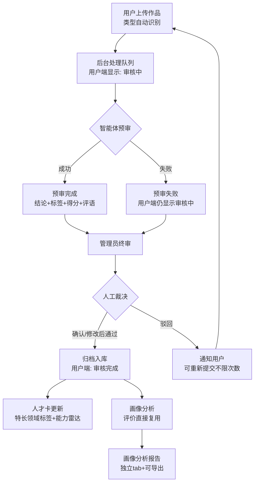

# 人才库智能体（AI人才大脑1.0）PRD

> 版本 V1.1 ｜ 日期 2026-08-22 ｜ 编制依据：[业务需求梳理 V1.2](业务需求梳理.md)（18 条决策已全部闭环）＋ [07-10 会议纪要](<纪要_07-10 AI人才大脑1.0建设.md>)
> V1.1 修订：新增第 4 章「智能体提示词与输出契约」（三个智能体的提示词原文、输入组装规则、输出契约、可调项），原流程图/验收标准顺延为第 5/6 章。

## 1. 背景与收益

### 1.1 需求简介

在人才库现有基础功能（人才入库、信息审核、查询）之上，新增智能体能力：由智能体对用户上传的作品与简历材料做预审、对人才数据做画像分析，解决"从无到有"问题，上线后持续迭代。

### 1.2 业务诉求与收益

人才库所有材料目前依赖管理员逐条人工审核，作品类材料量大后审核是瓶颈；人才卡「特长领域」「综合分析」长期静态展示，平台缺少人工智能属性；AISE 沉淀的逐题答题与测评数据未被挖掘。本次上线后：智能体预审替代人工初审、提升审核效率；人才卡特长领域标签与能力雷达动态化、画像分析报告可对外提供，测评服务从"给出分数"升级为"给出诊断与建议"，形成差异化竞争力。收益为定性判断、待上线后验证，不构成收益承诺。

## 2. 业务流程

### 2.1 作品审核与入库

1. 用户登录人才库，上传作品（代码/图片/PDF，类型由系统按文件自动识别），填写作品名称与描述（选填）。
2. 提交后作品进入后台处理队列，用户端状态显示「审核中」，连续上传不受条数限制。
3. 智能体预审：阅读并分析作品，输出准入结论、标签、得分与评语。预审结果仅后台可见，不对用户展示。
4. 管理员终审：查看预审结论与作品原文，选择确认通过、驳回、或修改标签/得分/评语后通过；人工可推翻智能体结论，所有裁决留痕。
5. 通过的作品归档入库，用户端状态变为「审核完成」；被驳回的作品显示「未通过」与原因，用户可修改后重新提交，不限次数。
6. 入库作品触发人才卡更新：特长领域展示动态标签，综合分析能力雷达更新。

### 2.2 简历材料审核

用户上传或修改人才卡三个材料模块（社会实践与人才培养记录、专利和软著、其他荣誉记录）的某一条时，该条目触发智能体预审；管理员在预审意见辅助下逐条终审，通过后录入人才卡对应模块。

### 2.3 画像分析与报告

已关联 AISE 的用户，其简历、作品评价、成绩、题目作答记录汇入人才档案；智能体据此生成个体水平评估与成长建议，更新人才卡，并生成个人画像分析报告（标题栏「画像分析」tab 进入，支持导出）。生成内容经质量审核后对外提供。

## 3. 详细功能说明

### 3.1 作品上传

- **位置**：人才库「作品上传」入口。
- **字段**：作品名称（必填）；作品文件（必填，≤10MB）；作品描述（选填）。
- **类型自动识别**：系统按文件扩展名自动判定作品类型，无需用户手动选择。支持代码（.py/.js/.java/.c/.cpp/.html/.css/.txt/.md）、图片（.png/.jpg/.jpeg/.webp）、PDF 三类；不支持的格式提示不支持并拒绝提交。
- **用户端状态极简**：只显示「审核中」→「审核完成」；未通过时显示「未通过」+驳回原因。预审排队、预审中、预审完成、预审失败等中间态仅在后台可见，预审失败对用户仍显示「审核中」。
- **异常处理**：
  - 文件超过 10MB 或格式不支持，提示后拒绝提交；
  - 提交失败可重试，不影响其他作品。

### 3.2 智能体预审

- **两级逻辑**：先判断单作品质量是否可入库（准入判断），再深度理解作品内容（用于归档与后续画像分析）。
- **按类型差异化阅读**：

| 作品类型 | 阅读方式 | 预审关注点 |
|---------|---------|-----------|
| 代码 | 阅读源代码结构、逻辑与注释 | 完整性（能否运行/是否残缺）、原创性迹象、功能实现程度 |
| 图片 | 视觉理解画面内容 | 内容质量、与描述一致性、明显不当内容 |
| PDF | 解析文本与版面 | 内容完整性、结构质量、明显不当内容 |

- **预审输出**：准入结论（建议通过/建议驳回）＋ 结论理由（驳回必附）＋ 标签 ＋ 得分（100 分制）＋ 评语 ＋ 作品理解摘要。预审结论仅供后台人工参考，不向用户展示。
- **标签规则**：标签必须是人工智能教育方向的能力标签（如程序设计、生成式人工智能、算法思维、创意设计、逻辑思维），禁止出现文件格式、作品名称、文件名及"未命名"等占位词；系统对智能体输出标签做强制过滤，去重后最多保留 4 个。
- **数量线与质量线**：智能体只判断单作品质量；"以作品数量为依据"的入库数量门槛由人工终审与业务侧把守，智能体不输出数量判定。
- **处理方式**：提交后进入后台处理，不阻塞用户操作；预审时效由研发确定。
- **降级处理**：智能体处理失败时，条目后台状态置为「预审失败」，人工可直接终审（退化为纯人工审核），后台提供重新预审入口。

### 3.3 人工终审与作品归档

- **位置**：后台「审核工作台」。
- **待审队列**：展示作品名称、提交人、类型、提交时间、预审状态（预审中/预审完成/预审失败）、智能体结论摘要。
- **作品详情**：原文预览（代码/图片/PDF）；智能体结论完整展示（结论、理由、标签、得分、评语、理解摘要）；人工操作——确认通过、驳回（必填原因）、修改后通过（可编辑标签/得分/评语，编辑后入库内容以人工版本为准）。
- **标签默认采纳**：人工未修改标签直接通过时，默认采纳智能体生成的标签。
- **留痕**：智能体结论、人工裁决、修改前后内容、审核人、时间全部记录，可审计溯源。
- **归档结果**：通过的作品进入人才档案；标签写入人才卡特长领域；作品评价（标签/得分/评语）与理解摘要入库备用——**仅入库、前台不展示**，画像分析时直接取用，无需重复分析作品。

### 3.4 简历材料智能体审核

- **范围**：人才卡三个上传模块，**按条目触发**——上传或修改哪一条，就审哪一条。

| 模块 | 字段 | 审核维度 |
|------|------|---------|
| 社会实践与人才培养记录 | 活动名称（必填）、时间（必填）、获得荣誉（必填） | 规范性、一致性、敏感信息 |
| 专利和软著 | 专利/软著名称（必填） | 规范性、一致性、敏感信息 |
| 其他荣誉记录 | 获得荣誉（必填）、时间（必填） | 规范性、一致性、敏感信息 |

- **审核维度定义**：规范性——必填项完整、时间格式符合规范（如"2025年8月"、月份 1-12）；一致性——与档案已有数据矛盾检查（时间晚于当前等）；敏感信息——内容中出现证件号、手机号等敏感信息时提示。
- **能力边界**：智能体无法验证材料真实性（不依赖外部数据源），真实性由人工终审兜底。
- **流程**：条目提交 → 该条目触发智能体预审 → 管理员查看预审意见逐条通过/驳回 → 通过后录入人才卡对应模块。

### 3.5 标签与作品评价

- **标签动态生成**：由智能体根据作品内容生成，数量与内容不预设；**不归一化**——一期标签独立生成，不映射预设标签池；待人才库标签体系成熟后，由智能体做匹配替换（列入后续范围）。
- **作品评价形态**：标签 ＋ 得分（100 分制）＋ 评语。评价仅入库、后台可见，前台不展示。

### 3.6 个人画像分析报告

- **数据来源**：简历（三模块材料＋基本信息）、作品评价与理解摘要、AISE 成绩（测评记录）、题目作答（逐题答题记录）。
- **报告内容**：个体水平评估——知识点掌握程度、错误归因（未掌握/粗心/概念混淆）、跨考试能力追踪与短板定位；成长建议——优先补齐关键短板、难度递进、定期巩固，并给出练习方向建议（不含培训课程）。
- **口径复用**：知识点掌握度口径与个人报告一致（得分和÷满分和，<60% 重点提升、≥60% 稳定掌握），不另定义。
- **样式与入口**：样式沿用个人报告样式体系，内容为该用户的画像分析；独立页面，人才库标题栏新增「画像分析」tab 进入；支持导出；生成内容经质量审核后对外提供。
- **空态**：未关联 AISE 的用户展示"暂未关联 AISE 测评数据，如已参加 AISE 考试请联系管理员"。

### 3.7 人才卡更新

人才卡**结构不变**，数据分析只更新两块内容：

- 「特长领域」：由静态模板改为动态标签；
- 「综合分析」：能力雷达（认知层/应用层/创新层/责任层）更新为动态分析结果。

作品评价与理解摘要不在前台展示，仅后台可见。

## 4. 智能体提示词与输出契约

> 本章是智能体能力的核心配置。以下提示词为 **V1 初版**，运营/教研老师可根据实际审核与报告效果**直接修改提示词文本**调优效果；提示词应支持配置化调整、无需研发发版（配置方式由研发实现）。各节「可调项」给出建议调整方向。**建议运营保留一批固定的测试作品与用户数据作为回归集，每次调整提示词后跑同一批对比效果。**

### 4.1 总则

- 智能体共三个：作品审核智能体、简历材料审核智能体、画像分析智能体。三套提示词各自独立、可单独调整，互不影响。
- 每个提示词由「角色与任务（固定指令）」＋「输入数据（按作品/用户动态拼装）」组成；运营调整时只改固定指令部分，动态输入由系统自动填入。
- 智能体输出均为**固定字段结构**（输出契约），前台展示与入库字段依赖该结构——调整输出字段时需同步检查前台展示与数据入库。
- 无大模型可用时的演示兜底（Mock 模式）不经过提示词，仅用于演示链路，不影响线上真实模式。

### 4.2 作品审核智能体

#### 4.2.1 角色与任务（提示词原文）

```
你是人工智能人才库的作品审核智能体。请只输出 JSON（不要其他文字），字段：{"conclusion":"通过或驳回","reason":"一句话理由","tags":["标签1","标签2"],"score":0到100整数,"comment":"两句话评语","understanding":"对作品内容的理解摘要"}。tags 必须是人工智能教育方向的能力标签（如：程序设计、生成式人工智能、算法思维、创意设计、逻辑思维），禁止使用文件格式（如PDF）、作品名称或文件名。
```

#### 4.2.2 输入组装规则（系统自动填入，运营无需处理）

| 作品类型 | 系统填入内容 |
|---------|-------------|
| 代码 | "作品类型：代码；作品名：XX。作者描述：XX。代码内容如下：```代码原文（截断至 8000 字符）```" |
| 图片 | "请分析这幅图片作品（作品名：XX）。判断其作为中小学生人工智能学习成果的质量是否可以入库，并从画面内容生成 2-4 个特长标签。作者描述：XX。"＋ 图片本身（走视觉理解模型） |
| PDF | "作品类型：PDF；作品名：XX。作者描述：XX。"（PDF 正文解析由研发实现后拼接进输入） |

#### 4.2.3 输出契约

| 字段 | 必填 | 说明 |
|------|------|------|
| conclusion | 是 | 准入结论：通过 / 驳回 |
| reason | 驳回时必填 | 一句话理由，供人工终审参考 |
| tags | 是 | 能力标签 2-4 个（规则见 4.2.4） |
| score | 是 | 0-100 整数得分 |
| comment | 是 | 两句话评语 |
| understanding | 是 | 对作品内容的理解摘要（入库后供画像分析直接复用，避免重复分析） |

#### 4.2.4 标签规则

- 只允许人工智能教育方向的能力标签；提示词中的示例词（程序设计、生成式人工智能、算法思维、创意设计、逻辑思维）可按教学体系增删。
- 系统对输出标签强制过滤：剔除文件格式词（如 PDF、PNG）、作品名称、文件名、"未命名"等占位词；去重；单标签 2-12 字；最多保留 4 个。

#### 4.2.5 可调项

- **示例标签词**：随考纲/教学体系更新增删；
- **评分尺度**：嫌分普遍偏高/偏低时，在提示词中补充评分锚点（如"60 分＝基本完成但质量一般；80 分＝完整且质量良好"）；
- **审核严格度**：需从严时追加要求（如"原创性存疑时建议驳回"），需从宽时说明；
- **评语语气与长度**：按目标读者（家长/学生）调整。

### 4.3 简历材料审核智能体

#### 4.3.1 角色与任务（提示词原文）

```
你是人才库简历材料审核智能体。仅检查：规范性（必填完整、时间格式如"2025年8月"）、一致性（与档案矛盾）、敏感信息（证件号/手机号）。无法验证真实性。请只输出 JSON：{"conclusion":"通过或驳回","issues":["问题1"],"comment":"一句话意见"}
```

#### 4.3.2 输入组装规则（系统自动填入）

系统将条目字段组装为文本填入，如：

```
材料字段：{"活动名称":"原创S营","时间":"2025年8月","获得荣誉":"合格结业"}
```

#### 4.3.3 输出契约

| 字段 | 必填 | 说明 |
|------|------|------|
| conclusion | 是 | 通过 / 驳回 |
| issues | 驳回时列出 | 具体问题清单（供人工终审参考） |
| comment | 是 | 一句话审核意见 |

#### 4.3.4 可调项

- **检查维度**：可增删，如增加"活动名称与荣誉匹配度"检查；
- **时间格式规范**：随业务规则调整（如允许"2025.8"写法）；
- **敏感信息范围**：增删需拦截的信息类型。

### 4.4 画像分析智能体

#### 4.4.1 角色与任务（提示词原文）

```
你是人工智能人才库的画像分析智能体。基于给定数据生成个人画像分析，只输出 JSON：{"summary":"150字内的总体画像","strengths":["优势1"],"weaknesses":["短板1"],"suggestions":["建议1","建议2"]}
```

#### 4.4.2 输入组装规则（画像数据清单）

| 数据 | 内容 |
|------|------|
| 测评记录 | 模块 / 等级 / 日期 |
| 知识点统计 | 知识点 / 掌握度 / 错误类型（未掌握/粗心/概念混淆） |
| 能力雷达 | 认知层 / 应用层 / 创新层 / 责任层 四维分值 |
| 特长标签 | 入库作品聚合的能力标签 |
| 已入库作品评价 | 作品名 / 标签 / 得分 / 评语 |
| 简历材料 | 审核通过的三个模块条目 |

#### 4.4.3 输出契约

| 字段 | 必填 | 说明 |
|------|------|------|
| summary | 是 | 150 字内总体画像（展示于「画像概览」） |
| strengths | 是 | 能力优势列表（展示于「能力优势」） |
| weaknesses | 是 | 能力短板列表（展示于「能力短板」） |
| suggestions | 是 | 建议列表（展示于「下一阶段建议」，不含培训课程推销） |

#### 4.4.4 可调项

- summary 字数上限（现 150 字）；
- 优势/短板/建议的条数；
- 建议风格：如要求"按优先级排序"或"每条建议附练习方向"；
- 成长建议原则（补齐关键短板→难度递进→定期巩固）如需调整，与业务规则章节 3.6 同步修改。

## 5. 流程图



## 6. 验收标准

| # | 测试场景 | 前置条件 | 操作 | 期望结果 | 判定 |
|---|---------|---------|------|---------|------|
| 1 | 作品上传-正常流程 | 用户已登录 | 选择合法文件（类型自动识别），填写名称并提交 | 提交成功，条目状态显示「审核中」 | 状态正确 |
| 2 | 作品上传-格式不支持 | 上传界面 | 选择不支持的文件格式 | 提示"以下文件格式不支持：xxx"，文件不加入 | 提示正确 |
| 3 | 作品上传-超限 | 上传界面 | 选择超过 10MB 的文件 | 提示"文件大小不能超过 10MB"，文件不加入 | 提示正确 |
| 4 | 智能体预审-完成 | 已提交作品 | 等待预审完成 | 后台可见：准入结论+理由+标签+得分+评语+理解摘要；用户端仍显示「审核中」 | 结论结构完整、状态隔离 |
| 5 | 标签清洗 | 智能体输出含格式词/作品名 | 查看预审标签 | 格式词、作品名、"未命名"等被过滤，仅剩能力标签（≤4 个） | 清洗生效 |
| 6 | 预审失败降级 | 智能体处理失败 | 提交作品 | 后台置「预审失败」，用户端仍显示「审核中」；人工可正常终审，提供重新预审入口 | 降级可用、状态隔离 |
| 7 | 人工终审-确认通过 | 作品预审完成 | 后台点击「确认通过」 | 作品归档入库，用户端变「审核完成」，人才卡特长领域更新标签、能力雷达更新 | 归档与展示正确 |
| 8 | 人工终审-修改后通过 | 作品预审完成 | 后台编辑标签/得分/评语后通过 | 入库内容为人工修改后版本，修改留痕 | 修改留痕 |
| 9 | 人工终审-标签默认采纳 | 作品预审完成 | 不改标签直接通过 | 入库标签为智能体生成标签 | 采纳正确 |
| 10 | 人工终审-驳回与重提 | 作品预审完成 | 后台填写原因驳回；用户重新提交 | 用户端显示「未通过」+原因，可重新提交且不限次数 | 状态流转正确 |
| 11 | 简历材料预审 | 用户上传或修改三模块某条目 | 提交该条目 | 仅该条目触发预审，后台展示预审意见（规范性/一致性/敏感信息），人工逐条通过/驳回不受影响 | 按条目触发正确 |
| 12 | 画像分析-已关联用户 | 用户已关联 AISE 且有测评数据 | 点击标题栏「画像分析」tab | 进入独立报告页，样式沿用个人报告、内容为画像分析；支持导出 | 入口、样式与口径一致 |
| 13 | 画像分析-未关联用户 | 用户未关联 AISE | 查看画像分析报告 | 展示"暂未关联 AISE 测评数据，如已参加 AISE 考试请联系管理员" | 空态正确 |
| 14 | 人才卡-结构不变 | 有入库作品 | 查看人才卡 | 仅特长领域标签与综合分析雷达更新，其余模块结构不变；作品评价不出现在前台 | 更新范围正确 |
| 15 | 提示词可调整 | 运营修改某智能体提示词文本 | 保存后再次触发该智能体 | 新提示词生效，其余智能体行为不受影响；输出仍符合输出契约 | 配置化生效 |
| 16 | 合规留痕 | 任意审核操作后 | 查看审核记录 | 智能体结论、人工裁决、修改前后内容、审核人、时间均留痕可查 | 留痕完整 |

## 待确认事项

无遗留待确认——需求梳理阶段的 12 项待确认已通过 18 条决策全部闭环（见 [业务需求梳理 V1.2](业务需求梳理.md)「已确认决策」与「附录 A」）。上线节奏相关事项（算法备案 3-6 个月、等保同步、内测先行）沿用 07-10 会议纪要口径。提示词调优为常态运营工作，不属待确认事项。
