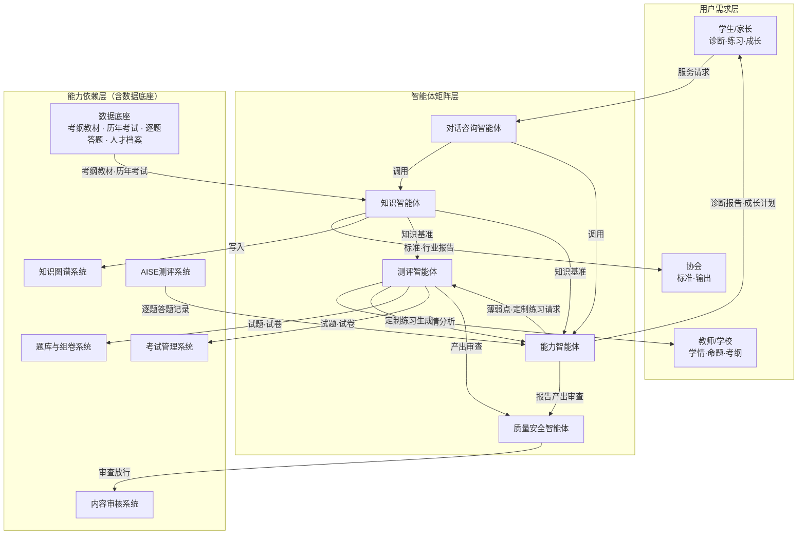

# 人工智能人才库——智能体矩阵产品规划方案

## 一、定位总述

人才库是协会面向中小学生的人工智能测评与成长平台。智能体矩阵围绕"考试测评"这一主线，覆盖知识体系、出题组卷、能力诊断、成长规划、用户服务全链路，全部基于平台自有考试数据运行，不依赖外部数据源。

## 二、现状与问题分析

### 2.1 政策背景：中小学人工智能教育仍处起步阶段

- 2022年《义务教育信息科技课程标准》正式设立信息科技独立课程，人工智能为其中模块之一
- 2024年11月，教育部办公厅印发通知部署中小学人工智能教育，明确分学段目标：小学低年级侧重感知体验，小学高年级与初中侧重理解应用，高中侧重项目创作；实施方式以鼓励各地各校将人工智能教育纳入课后服务、研学实践为主
- 2026年4月，教育部等五部门印发《"人工智能+教育"行动计划》（教科信〔2026〕1号），提出到2030年人工智能与教育深度融合格局基本形成，推动人工智能教育全面纳入地方课程体系，持续完善《中小学人工智能通识教育指南》

小结：国家层面正由"探索试点"向"全面推进"过渡，距离2030年发展目标尚有相当距离。课程体系、评价标准均处于建设期，尚无公认且统一执行的学习计划与考纲。

### 2.2 校内教学缺乏统一安排：各地自主探索、标准不一

- 教育部采取基地模式推进：2024年2月公布首批184个中小学人工智能教育基地，2025年12月公布第二批，采取先试点、后推广的推进路径，体系化课程在绝大多数学校尚未落地
- 各地自主开展差异化探索：河南建设500所人工智能教育实验校，广西、重庆等地开展试点建设，课程形态（独立课、课后服务、研学、社团）与内容深度各不相同
- 信息科技课程每周仅1课时（3-8年级），课时有限，难以支撑完整的人工智能知识体系

小结：学生学习内容、学业标准与考核评价缺乏公认依据，教、考、评三个环节均缺少统一标准。

### 2.3 学生能力分布离散：城乡与家庭背景差异显著

- 城乡数字鸿沟客观存在。据CNNIC《第57次中国互联网络发展状况统计报告》（截至2025年12月），全国互联网普及率为80.1%，农村地区为69.5%，相差10.6个百分点；生成式人工智能用户规模达6.02亿、普及率42.8%，使用人群集中于城市及数字条件较好的家庭
- 人工智能教育高度依赖设备、网络与家庭数字环境。一线城市及互联网、科技行业从业者家庭的子女自幼接触智能设备、编程与人工智能工具；家庭缺乏数字环境的儿童接触时间晚、认知起点低
- 城乡差距已获主管部门明确承认：教育部通知要求"做好城乡统筹，加大对农村和边远地区学校的支持力度，利用网络平台实现城乡学校人工智能教育相关课程互联互通，城乡结对帮扶"；行动计划要求"支持农村、边远地区学校利用国家平台开好人工智能课程"

小结：同班学生的人工智能认知与能力水平差异可能达数个年级之差，统一进度的教学难以兼顾不同基础的学生群体。

### 2.4 关键问题提炼与智能体映射

| 关键问题 | 对应智能体 |
|---|---|
| 问题一：知识体系、学习大纲与考纲缺乏公认标准，教学与考核均缺少依据 | 知识智能体：构建学科知识图谱，评估知识点价值，落地教学大纲与考纲 |
| 问题二：命题与组卷的专业性、质量保障缺乏统一标准 | 测评智能体：依据考纲自动命题组卷，控制难度分布，实施质量把关 |
| 问题三：学生能力水平难以量化，能力差距缺乏可视化呈现，家长与教师无法掌握成长过程 | 能力智能体：逐题数据分析，能力诊断，生成成长档案与评价报告 |
| 问题四：学生能力分布离散，统一进度教学难以适配，个性化需求突出 | 能力智能体与测评智能体联动：定位薄弱点，生成定制化练习与符合学习规律的成长计划 |
| 问题五：家长与教师缺乏辅导抓手，难以给予针对性支持 | 对话咨询智能体：报告解读、答疑与建议，作为统一服务入口 |

## 三、智能体矩阵

整体架构自上而下分为用户需求层、智能体矩阵层、能力依赖层（含数据底座）三层，箭头表示各模块间的数据流与调用关系：

各模块连接关系一览（文本版）：

| 模块 | 上游输入 | 下游输出 |
|---|---|---|
| 知识智能体 | 数据底座（考纲教材、历年考试数据） | 知识图谱系统；知识基准给测评智能体、能力智能体；标准与行业报告给协会 |
| 测评智能体 | 知识智能体（考纲图谱基准）；能力智能体（薄弱点、定制练习请求） | 试题试卷给题库组卷系统、考试管理系统；产出审查给质量安全智能体；命题组卷服务给教师/学校 |
| 能力智能体 | AISE测评系统（逐题答题记录）；知识智能体（知识基准） | 诊断报告、成长计划给学生/家长；定制练习请求给测评智能体；报告产出审查给质量安全智能体 |
| 对话咨询智能体 | 学生/家长/教师（提问） | 调用知识智能体、能力智能体应答 |
| 质量安全智能体 | 测评智能体（试题产出）、能力智能体（报告产出） | 审查后放行至内容审核系统 |

核心交互链路说明：

- 知识智能体作为底座，向测评智能体提供考纲与图谱基准，向能力智能体提供知识基准
- 测评智能体与能力智能体形成闭环：能力智能体诊断出薄弱点后向测评智能体发起定制练习请求，测评智能体生成针对性练习，练习数据回流后再次诊断
- 对话咨询智能体是面向用户的统一服务出口，内部调用知识、能力智能体应答
- 质量安全智能体对测评、能力智能体的全部生成内容实施入库前审查

### 1. 知识智能体——构建统一的知识体系

定位：全平台的知识底座，最终落地到教学大纲与考纲。

核心能力：
- 基于教材、考纲与历年考试数据构建学科知识图谱，覆盖知识点、知识点间关系、考纲要求、历年考频与难度
- 评估各知识点的重要程度与学生掌握分布，辅助专家修订教学大纲与考纲
- 为其他智能体提供统一的知识基准，命题与诊断均以该图谱为基准

学生价值：各知识点在考纲中的位置与重要程度清晰明确。
业务价值：考纲编纂由经验驱动转向数据驱动；知识图谱作为统一底座，保障各智能体共用同一标准。

### 2. 测评智能体——保障命题与组卷的专业性

定位：平台的出题引擎，解决命题与组卷的科学性问题。

核心能力：
- 单题生成：依据考纲知识点自动生成试题（题干、选项、解析），题型与难度可控
- 智能组卷：按知识点覆盖、难度分布、题型结构自动组卷，适配摸底考、阶段考、模拟考等不同场景
- 考试计划：结合教学进度与备考节奏，自动规划考试安排（时间、范围、难度目标）
- 时效性管理：考纲调整时自动更新试题，保障题库时效性

学生价值：试题贴合考纲、具有良好的区分度，考试安排科学规划。
业务价值：命题效率显著提升、题库持续扩充；命题组卷能力可面向学校与机构对外输出。

### 3. 能力智能体——实现对学生能力的精准洞察

定位：平台的诊断与成长规划引擎。

核心能力：
- 基于逐题答题记录，分析学生能力水平与知识点掌握程度，对错误类型归因（未掌握、粗心、概念混淆）
- 跨考试追踪能力变化，生成成长档案与评价报告
- 依据教育与学习规律制定成长计划：优先补齐关键短板、难度递进、定期巩固，并配套练习方向

学生价值：清晰了解自身水平、能力短板与下一步学习方向。
业务价值：测评服务由"给出分数"升级为"给出诊断"，成长报告为差异化服务与潜在付费点。

### 4. 对话咨询智能体——提供便捷的智能咨询服务

定位：前台交互入口，各智能体能力的统一出口。

核心能力：学生、家长、教师可随时提问——解读测评报告、查询知识点、咨询学习方法与考试安排，由知识智能体与能力智能体协同应答。

学生价值：随时随地获得报告解读与答疑服务。
业务价值：用户可直观感知平台人工智能能力，同时降低人工咨询成本。

### 5. 质量安全智能体——守住内容安全底线

定位：后台质量管控防线，平台公信力的保障。

核心能力：所有人工智能生成的试题与内容在入库前自动审查——准确性、难度标定合理性、K12内容合规性、敏感词过滤；检测异常作答行为（代考、抄袭信号）。

学生价值：所用试题与报告均经过严格审核。
业务价值：满足K12内容合规的刚性要求，降低人工审核成本。

## 四、协同关系

知识智能体作为底座提供知识图谱；测评智能体依据图谱命题，能力智能体依据图谱与答题数据进行诊断，对话智能体面向用户交付服务，质量安全智能体全程实施质量管控。

数据闭环：学生完成考试后，答题数据即回流平台——能力诊断更加精准，知识图谱考频权重持续更新，后续命题更贴合学生实际，平台能力随数据积累不断增强。

## 五、价值汇总

对学生：
- 考试有据：试题贴合考纲，考试安排科学规划
- 学习有向：诊断细化至知识点粒度，能力短板清晰明确
- 成长有径：依据学习规律制定成长计划，进步可量化呈现

对业务：
1. 人工智能能力贯穿考试测评各核心环节，充分体现人工智能项目的核心能力定位
2. 全部基于自有数据，规避外部数据合规风险
3. 答题数据形成竞争壁垒，数据资产难以复制
4. 商业化路径：面向学校、机构输出命题组卷服务，面向家长提供诊断成长报告增值服务，平台整体作为协会对外输出能力
5. 平台底座（权限、审计、导出、批量任务）充分复用既有方案的成熟设计

## 六、落地顺序

- 一期：测评智能体与能力智能体——最贴近现有考试业务，落地见效快，人工智能能力可演示
- 二期：知识智能体（知识图谱底座）与质量安全智能体（与测评智能体同步上线）
- 三期：对话咨询智能体与对外服务输出
