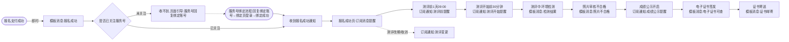
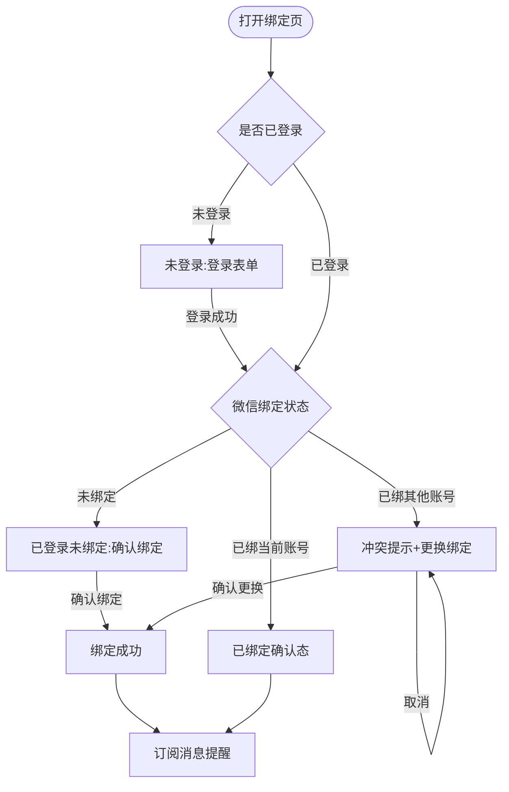

# 20260816 服务号消息通知 PRD

## 1. 项目背景

为 AISE 平台建设微信服务号消息触达体系：在已上线的微信支付关注引导基础上，将触达扩展为覆盖报名后全生命周期的 9 类消息（报名成功、环境检测、测评前提醒、测评开始提醒、照片不合格、成绩公示、电子证书可查、证书邮寄、测评变更），并补齐账号绑定缺口——未走微信支付渠道报名的用户可在服务号回复「绑定账号」自助绑定。目标：所有渠道报名用户关注并绑定后都能收到 9 个关键节点的微信通知，非微信支付渠道用户触达从 0 提升至与微信支付渠道一致，相关咨询工单量下降 30%（上线后 4 周校准）。

## 2. 业务流程简述

### 2.1 功能全景图

用户报名支付完成后，系统按生命周期在 9 个节点通过微信推送消息；报名成功页提供消息提醒订阅入口（微信内直接订阅，电脑端扫码引导），服务号内可通过回复「绑定账号」完成绑定并在绑定页订阅提醒。

图 1：报名后消息触达全链路（9 类消息与触发节点）

### 2.2 服务号绑定流程（补绑定缺口）

未绑定用户（支付宝/后台开通渠道报名、支付时未关注）在服务号会话回复「绑定账号」→ 收到带链接的回复 → 打开绑定页 → 登录 AISE 账号 → 确认绑定 → 绑定成功并可订阅消息提醒。

## 3. 详细功能说明

### 3.1 消息通知体系

9 类消息分两类通道：

- 模板消息：事件发生当时的即时通知，用户触发或业务动作完成后立即发送，要求用户已关注服务号。
- 订阅通知：用户主动订阅后按计划发送，用户必须完成订阅授权才可发送，未关注也能收到（发到微信「服务通知」）。

通道选择原则：即时类（报名成功、环境检测、照片不合格、电子证书、证书邮寄）走模板消息；提醒类（测评前、测评开始、成绩公示、测评变更）走订阅通知——提醒类消息发生在用户操作之后的较长时间点，必须由用户显式订阅形成接收预期。

#### 3.1.1 消息一：报名成功（模板消息）

- 触发时间点：支付回调确认成功时，覆盖三个渠道各自的触发点——微信支付回调、支付宝回调、后台直接开通保存。
- 必填文案字段：测评名称、考生姓名、准考证号、测评时间。
- 示例文案：「报名成功通知｜测评名称：少儿编程等级测评｜考生姓名：张三｜准考证号：EXM2026072759000008｜测评时间：2026年8月22日 14:00｜温馨提示：请提前下载准考证，准时参加测评」。

#### 3.1.2 消息二：环境检测通知（模板消息）

- 触发时间点：用户提交环境检测、结果生成时。通过和不通过都发。
- 必填文案字段：测评名称、检测结果、说明/指引。
- 示例文案：「环境检测通知｜测评名称：少儿编程等级测评｜检测结果：通过｜说明：设备环境满足测评要求」。
- 文案细节：不通过时，「说明」字段改为不合格项，「指引」字段为「请调整设备后重新检测」。

#### 3.1.3 消息三：测评前提醒（订阅通知）

- 触发时间点：测评开始前 1 天 09:00（北京时间，定时任务扫描发送）。
- 必填文案字段：测评名称、测评时间、注意事项。
- 示例文案：「测评提醒｜测评名称：少儿编程等级测评｜测评时间：2026年8月22日 14:00｜注意事项：请提前 30 分钟进入候考页面」。

#### 3.1.4 消息四：测评开始提醒（订阅通知）

- 触发时间点：测评开始前 30 分钟（定时任务扫描发送）。
- 必填文案字段：测评名称、开始时间、进入方式。
- 示例文案：「测评即将开始｜测评名称：少儿编程等级测评｜开始时间：14:00｜进入方式：点击详情进入候考页面」。

#### 3.1.5 消息五：照片不合格通知（模板消息）

- 触发时间点：审核员在用户信息审核页面判定「不合格」并保存时。
- 必填文案字段：测评名称、考生姓名、不合格原因、补交截止时间、补交方式。
- 示例文案：「照片审核通知｜测评名称：少儿编程等级测评｜考生姓名：张三｜审核结果：不合格｜原因：照片模糊｜补交截止：2026年8月18日｜补交方式：登录 AISE 平台重新上传」。
- 文案细节：补交截止时间由审核页录入；审核页无该字段时，文案改为「请尽快重新上传」，不承诺具体日期。

#### 3.1.6 消息六：成绩开始公示提醒（订阅通知）

- 触发时间点：管理端开启该测评成绩公示时，定时触发，公示期内扫描下发。
- 必填文案字段：测评名称、公示开始时间、查询方式。
- 示例文案：「成绩公示提醒｜测评名称：少儿编程等级测评｜公示开始时间：2026年9月1日 10:00｜查询方式：点击查看成绩」。

#### 3.1.7 消息七：查看电子版证书提醒（模板消息）

- 触发时间点：电子证书签发完成、开放下载时。
- 必填文案字段：证书名称、获取方式。
- 示例文案：「电子证书通知｜证书名称：少儿编程等级测评电子证书｜获取方式：点击查看并下载」。

#### 3.1.8 消息八：证书开始邮寄（模板消息）

- 触发时间点：管理端证书寄送录入物流单号时。
- 必填文案字段：证书名称、快递公司、快递单号、预计到达时间。
- 示例文案：「证书邮寄通知｜证书名称：少儿编程等级测评证书｜快递公司：顺丰速运｜快递单号：SF1234567890｜预计到达：2026年9月5日｜温馨提示：请保持电话畅通」。
- 文案细节：预计到达时间物流平台无数据时，改为「已发货，请注意查收」。

#### 3.1.9 消息九：测评变更通知（订阅通知）

- 触发时间点：管理端修改测评时间或取消测评并保存时。
- 必填文案字段：测评名称、变更类型（改期/取消）、变更后信息、说明。
- 示例文案：「测评变更通知｜测评名称：少儿编程等级测评｜变更类型：时间调整｜最新测评时间：2026年8月29日 14:00｜说明：原定时间变更，以最新时间为准」。
- 文案细节：取消时，「变更后信息」改为「本次测评已取消」，「说明」改为退费指引。

#### 3.1.10 发送总规则

- 发送前统一校验：报名记录有效（已支付、未退款、未取消），微信已绑定账号。
- 模板消息额外要求：该微信仍关注服务号。
- 订阅通知额外要求：该微信对该模板有未消耗的订阅授权。
- 幂等：每条消息以「消息类型 + 报名记录 + 触发批次」去重，重复触发只发一次。
- 发送失败（未关注、用户拒收、接口异常）：静默记录日志，不重试。
- 定时任务按北京时间执行。
- 历史消息不补发：绑定或订阅生效后只对后续触发生效，绑定成功页明示该口径。
- 所有文案为纯业务通知，不带营销内容。

#### 3.1.11 异常场景口径

- 退费/取消报名：退款流程同步失效该报名的全部待发任务和未消耗订阅授权，不再发送任何消息。
- 测评改期：提醒类定时任务按最新测评时间自动重排，已消耗授权的场次不重复扣减；测评变更通知即时下发；已发出的消息不可撤回，以发送时信息为准。
- 测评取消：待发任务全部失效，测评变更通知（取消）下发。
- 补考场次：按新场次处理（重新订阅、重新排任务），不单独设计。
- 审核改判（不合格改为合格）：微信消息不可撤回，以平台内最新状态为准，不补发更正消息。
- 测评变更通知与测评前/开始提醒同场次同时生效时：按各自触发点发送，互不抑制。

### 3.2 消息提醒订阅（消息三/四/六/九的发送前提）

#### 3.2.1 订阅入口（分端设计）

- 微信内打开报名成功页（微信支付渠道主路径）：页面直接展示订阅组件。
- 电脑端打开报名成功页（电脑支付、支付宝、后台开通渠道）：展示「微信扫码开启消息提醒」引导卡片（服务号二维码），用户扫码后在微信内打开订阅入口。
- 绑定页「已绑定」「绑定成功」两个状态：展示订阅组件，作为补订阅入口。
- 三处共用同一个订阅组件：测评前提醒、测评开始提醒、成绩公示提醒、测评变更通知，4 条并列勾选，默认全部勾选，用户可取消后确认。
- 引导文案：「开启消息提醒，不错过测评安排与成绩通知」。
- 订阅组件为微信官方组件，用户勾选后点击「允许」，拉起微信确认弹窗，点「允许」完成授权。
- 报名成功页底部提示：「未收到消息？在服务号回复「绑定账号」完成绑定」。

#### 3.2.2 订阅授权账本

- 账本模型：微信 × 模板 × 未消耗条数。用户每次完成授权，对应模板条数增加 1；系统发送一条，条数减少 1。
- 同一用户同一场景重复授权不累积（微信平台规则）；不同场次报名各自的订阅入口产生的授权按次累加。
- 多场次/多考生：每场报名都要在当次报名成功页重新订阅。家长账号下 2 名考生、报名 2 场，需要 4 次授权（每次报名成功页各订阅一次）。
- 授权不足：发送时账本无剩余，该条不发，行为与未订阅一致。
- 退款/取消报名：失效该报名相关的未消耗授权。

#### 3.2.3 订阅晚于触发点的补发

触发点之后新订阅的用户：账本有未消耗授权的，在触发窗口内扫描到时补发（测评开始前均可补发测评前提醒；公示期内可补发公示提醒），直至授权耗尽。

### 3.3 服务号账号绑定

#### 3.3.1 入口与流程

- 用户在服务号会话发送含「绑定」关键词的消息（如「绑定微信」「绑定账号」）。
- 服务号自动回复带链接的消息：「点击绑定 AISE 账号，接收报名、测评、成绩通知」。
- 用户点击链接，在微信内打开绑定页。
- 绑定关系确认后，该微信即与 AISE 账号建立绑定，后续消息按绑定关系发送。

#### 3.3.2 绑定页状态（五态）

- 未登录：展示登录表单，与用户端登录注册页一致（账号/身份证号 + 密码 + 图形验证码，保留「默认密码为身份证后6位」提示）。「没有账号？注册新账号」「忘记密码」跳转至用户端登录注册页对应功能。
- 已登录未绑定：展示当前登录账号摘要（姓名、手机号脱敏）与「确认绑定」按钮，下方说明绑定后可通过微信接收通知。
- 已绑定当前账号：展示「已绑定」确认态（绑定账号摘要、绑定时间），无需再操作；页面下方保留订阅组件，作为补订阅入口。
- 已绑其他账号：展示冲突提示「当前微信已绑定账号 138****1234」与当前登录账号摘要，提供「更换绑定」按钮；点击后弹窗确认「更换后，原账号将不再通过本微信接收通知，确认更换？」，确认后解绑原账号、绑定当前登录账号，进入绑定成功态；取消则停留在冲突提示态，维持原绑定。
- 绑定成功：展示「绑定成功」提示与绑定账号摘要、订阅组件、「历史消息不补发，后续通知将及时推送」说明。

#### 3.3.3 页面环境与安全

- 绑定页为微信内页面，移动端单列布局，适配微信内置浏览器打开；微信外打开时展示「请在微信中打开」引导（提示复制链接到微信打开）。
- 安全：绑定页通过微信网页授权（静默）由服务端获取用户微信身份，页面链接不携带可篡改的用户标识参数。
- 绑定关系：一个微信绑定一个 AISE 账号；关注事件的自动绑定不覆盖已有绑定；绑定页允许用户登录后主动更换绑定。

### 3.4 消息触发埋点位置

- 报名成功：微信支付回调（已有）、支付宝回调、后台开通保存。
- 环境检测：设备调试检测流程结果生成。
- 测评前提醒/测评开始提醒：定时任务按测评开始时间扫描。
- 照片不合格：用户信息审核页判定不合格保存。
- 成绩公示：证书流程公示环节开启公示。
- 电子证书：证书签发完成事件。
- 证书邮寄：证书寄送物流录入保存。
- 测评变更：测评活动管理保存时间变更或取消。

## 4. 流程与状态图表

### 4.1 绑定页状态流转

图 2：绑定页五态状态流转

## 5. 验收标准

| # | 测试场景 | 前置条件 | 操作 | 期望结果 | 判定 |
|---|---------|---------|------|---------|------|
| 1 | 报名成功消息 | 用户已关注并绑定，微信支付完成 | 支付回调到达 | 该用户微信收到报名成功消息，字段齐全 | 文案与 §3.1.1 一致 |
| 2 | 报名成功消息（支付宝渠道） | 支付宝渠道报名，已关注已绑定 | 支付宝回调到达 | 收到报名成功消息 | 同上 |
| 3 | 报名成功消息（未关注） | 用户未关注服务号 | 支付完成 | 不发送，日志记录原因 | 无消息送达 |
| 4 | 环境检测消息（通过） | 已关注已绑定 | 用户完成检测且通过 | 收到检测结果（通过）消息 | 文案与 §3.1.2 一致 |
| 5 | 环境检测消息（不通过） | 同上 | 检测不通过 | 收到不通过消息，含不合格项与重检指引 | 同上 |
| 6 | 测评前提醒 | 已订阅该模板且授权未消耗，报名有效 | 测评开始前 1 天 09:00 定时任务运行 | 收到提醒，时间字段为测评时间 | 发送时间准确 |
| 7 | 测评前提醒（未订阅） | 未订阅 | 到触发点 | 不发送 | 无消息送达 |
| 8 | 测评开始提醒 | 已订阅 | 测评开始前 30 分钟 | 收到提醒 | 发送时间准确 |
| 9 | 照片不合格消息 | 已关注已绑定 | 审核员判定不合格并保存 | 收到消息，含原因与补交指引 | 文案与 §3.1.5 一致 |
| 10 | 成绩公示消息 | 已订阅 | 管理端开启公示 | 收到公示提醒 | 文案与 §3.1.6 一致 |
| 11 | 电子证书消息 | 已关注已绑定 | 证书签发完成 | 收到电子证书可查消息 | 文案与 §3.1.7 一致 |
| 12 | 证书邮寄消息 | 已关注已绑定 | 管理端录入物流单号 | 收到邮寄消息，含快递公司与单号 | 文案与 §3.1.8 一致 |
| 13 | 测评变更消息 | 已订阅 | 管理端修改测评时间并保存 | 收到变更消息，含最新时间 | 文案与 §3.1.9 一致 |
| 14 | 退费停发 | 已订阅，报名已退费 | 退款完成 | 该报名全部待发任务失效，不再发送任何消息 | 无消息送达 |
| 15 | 改期重排 | 已订阅，测评时间被修改 | 保存新时间 | 提醒定时任务按新时间重排 | 到新触发点才发送 |
| 16 | 订阅组件默认勾选 | 微信内打开报名成功页 | 查看订阅组件 | 4 条通知默认全部勾选 | 可取消后确认 |
| 17 | 电脑端报名成功页 | 电脑浏览器打开 | 查看页面 | 展示扫码引导卡片，无订阅组件 | 卡片含服务号二维码与引导文案 |
| 18 | 订阅授权消耗 | 用户订阅过且收到一条提醒 | 收到消息后 | 该模板未消耗授权减 1，授权不足时后续不发 | 账本扣减正确 |
| 19 | 晚订阅补发 | 公示已开启，用户新订阅公示提醒 | 公示期内扫描任务运行 | 补发公示提醒 | 公示期内送达 |
| 20 | 关键词回复 | 未绑定用户 | 服务号会话发送「绑定账号」 | 收到含绑定页链接的回复消息 | 链接可打开绑定页 |
| 21 | 绑定页未登录 | 打开绑定页 | 查看页面 | 展示与登录注册页一致的登录表单 | 字段一致 |
| 22 | 绑定页确认绑定 | 已登录未绑定 | 点击「确认绑定」 | 绑定成功，进入绑定成功态 | 绑定关系生效 |
| 23 | 绑定页已绑定 | 微信已绑当前账号 | 打开绑定页 | 展示已绑定确认态与订阅组件 | 无需再操作 |
| 24 | 绑定页换绑 | 微信已绑账号 A，登录账号 B | 点击「更换绑定」并确认 | 解绑 A、绑定 B，进入绑定成功态 | 换绑后按 B 接收消息 |
| 25 | 绑定页换绑取消 | 同上 | 点击「更换绑定」后取消 | 停留在冲突提示态，维持原绑定 | 绑定关系不变 |
| 26 | 绑定页微信外打开 | 电脑浏览器打开绑定页 | 查看页面 | 展示「请在微信中打开」引导 | 含复制链接入口 |
| 27 | 历史消息不补发 | 用户报名后才完成绑定 | 绑定完成 | 不补发绑定前的历史消息，绑定页有对应说明 | 无补发行为 |
| 28 | 幂等 | 同一报名记录重复触发同一消息 | 触发两次 | 只发送一条 | 日志可查 |
| 29 | 测评取消通知 | 已订阅，报名有效 | 管理端取消测评并保存 | 待发任务全部失效，收到取消通知（含退费指引） | 文案与 §3.1.9 一致 |
| 30 | 改期授权不扣减 | 用户已订阅且该场次提醒已发过 | 管理端修改测评时间 | 提醒任务按新时间重排，发送时不重复扣减授权 | 改期后提醒正常送达 |
| 31 | 未订阅不发（消息四/六/九） | 已绑定，未订阅对应模板 | 到各触发点 | 不发送 | 无消息送达 |
| 32 | 审核改判不补发 | 已发过不合格消息，审核员改判合格 | 保存改判结果 | 不补发更正消息，平台内状态更新 | 无新消息 |
| 33 | 绑定成功态订阅组件 | 用户完成绑定 | 查看绑定成功态 | 展示订阅组件且 4 条默认勾选 | 可订阅 |

## 6. 附录

### 6.1 依赖与前置条件

| 依赖项 | 说明 | 状态 |
|--------|------|------|
| 模板消息接口可用性 | 公众平台「添加功能插件」核实模板消息入口存在 | 待核实 |
| 服务号类目 | 教育服务类目（素质教育/在线教育/教育平台按实际业务选择）提交审核 | 待申请 |
| 模板申请 | 按 §6.3 清单逐条核对公共模板库并选用模板 | 类目通过后执行 |
| 订阅通知能力 | 确认 AISE 服务号已支持订阅通知 | 待核实 |
| JS 安全域名 | 绑定页域名加入服务号 JS 安全域名（订阅组件依赖） | 待配置 |
| 网页授权域名 | 绑定页域名配置网页授权回调 | 待配置 |

### 6.2 版本记录

| 版本 | 日期 | 变更 |
|------|------|------|
| V1.0 | 2026-08-16 | 初稿：9 类消息定义（触发点+文案）、订阅机制（分端入口+授权账本）、服务号账号绑定（五态+换绑） |
| V1.1 | 2026-08-16 | 响应终审：状态图取消分支修正、改期授权不扣减、收益口径可执行化、验收补 5 条 |
| V2.0 | 2026-08-16 | 按 2red 技能标准结构重写：9 类消息段落式、补埋点设计、章节编号对齐 |
| V2.1 | 2026-08-16 | 按 AISE 轻量格式简化：§1 浓缩为一段、移除版本管理/系统关联/埋点三章，依赖与版本记录并入附录 |

### 6.3 模板申请核对清单

模板申请路径：公众平台 → 添加功能插件 → 模板消息 → 选用模板（按类目浏览公共模板库）。上线前逐条核对公共模板库有无匹配模板、槽位数与单字段长度：

| # | 消息 | 目标模板标题建议 | 所需字段数 | 模板标题要求 |
|---|------|----------------|-----------|-------------|
| 1 | 报名成功 | 报名成功通知 | 4-5 | 以「通知」或「提醒」结尾 |
| 2 | 环境检测 | 检测结果通知 | 3 | 同上 |
| 3 | 测评前提醒 | 测评提醒 | 3 | 同上 |
| 4 | 测评开始提醒 | 测评开始提醒 | 3 | 同上 |
| 5 | 照片不合格 | 照片审核通知 | 4-5 | 同上 |
| 6 | 成绩公示 | 成绩公示提醒 | 3 | 同上 |
| 7 | 电子证书 | 证书通知 | 2 | 同上 |
| 8 | 证书邮寄 | 证书邮寄通知 | 3-4 | 同上 |
| 9 | 测评变更 | 测评变更通知 | 3-4 | 同上 |

核对结果记录：模板存在与否、模板编号、槽位数、每槽字段类型与长度上限、模板类目。无匹配模板时，按运营规范提交新模板申请（标题以通知/提醒结尾、不带品牌、内容不超过 200 字符、中部 2-5 个关键词）。
