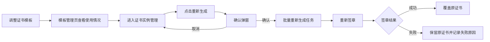
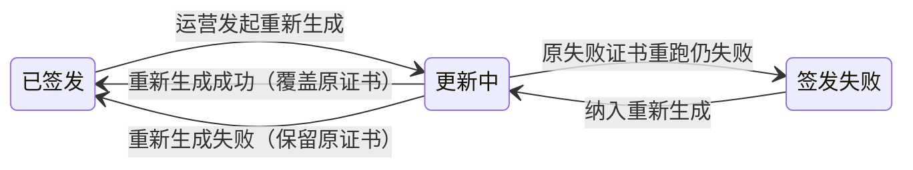

# 20260816 证书重新生成 PRD

## 1. 项目背景

AISE 电子证书按「证书模板 → 证书实例 → 用户证书」三层模型运作：模板定义样式，实例绑定测评与模板，用户证书按模板渲染生成。现行规则下，模板调整只对之后新生成的证书生效，已签发证书保留旧样式。运营调整模板后，如需历史证书同步更新，只能找技术后台手动处理。本次需求在运营后台新增「重新生成」能力：运营可对某个测评的已签发和失败证书批量按当前模板重新生成，覆盖原证书，证书编号与签发日期保持不变，实现模板调整后的自助更新，不再依赖技术人工处理。

## 2. 业务流程简述

### 2.1 功能全景

### 2.2 与现有签发体系的关系

- 重新生成走现有电子签发管道（生成 → 签章），复用签发中心的全局启停开关：开关关闭时任务照常提交并排队，恢复后自动执行
- 重新生成期间证书对外状态保持「已签发」，原证书持续可访问，用户端无状态回退
- 与签发中心既有「重签」能力互斥：同一证书同时只允许一个重签任务
- 设计原则修订说明：原设计原则为「运营后台不关心签发内部流水线」。本次修订为——运营后台可感知重新生成的「更新中」状态与最终结果；签发中心仍是签发细节状态的管理中心，单条重签、批量重签失败职责不变

## 3. 详细功能说明

### 3.1 证书实例管理（改造）

#### 3.1.1 重新生成入口

证书实例列表的操作列新增「重新生成」按钮。显示条件：实例已绑定模板，且已签发证书数大于 0 或存在失败证书。未绑定模板的实例不显示该按钮；已绑定模板但尚无任何证书的实例也不显示。已禁用的实例仍可发起重新生成——禁用的含义是「不再生成新证书」，不影响已有证书。

#### 3.1.2 确认弹窗

点击按钮后弹出确认弹窗，内容包括：

- 实例信息：测评名称、实例编号、绑定模板名称
- 数量统计：已签发张数、失败张数、合计重新生成张数
- 操作说明：证书编号不变、签发日期保留原日期、重新生成成功后原证书将被覆盖、再次发起重新生成将对全部已签发证书重新签章
- 全局签发开关为关闭状态时，提示「当前签发已暂停，任务提交后将排队，恢复签发后自动执行」
- 绑定模板为禁用状态时，提示「绑定模板已禁用，仍将按该模板重新生成」
- 确认按钮为警示样式，体现批量操作的影响

#### 3.1.3 重新生成规则

- 重跑范围：提交时点状态为「已签发」或「签发失败」的证书。待签发证书不需要重新生成（签发时自然使用当前模板）；签发中的证书不纳入，避免与原签发任务冲突，同时天然保证与签发中心重签互斥（同一证书同一时刻只在一个任务中）
- 样式锁定：任务提交时锁定当时的模板样式，整批证书按同一版样式生成，避免任务执行期间模板再次调整导致同批证书样式不一致
- 编号与日期：证书编号不变；证书上显示的签发日期保留原值；签章平台的签章时间以重新生成时刻为准，两者不一致时以证书上日期为对外口径
- 覆盖规则：重新生成成功后新证书覆盖原证书，验签信息指向新证书；重新生成失败则保留原证书，不影响用户使用

#### 3.1.4 状态呈现

- 已签发证书重新生成期间，对外状态保持「已签发」，原证书持续可访问；失败证书重跑期间，对外状态保持「签发失败」（其没有原证书可访问），成功后转「已签发」
- 用户端成绩与证书查询等页面展示以对外状态为准，与签发管道内部状态解耦，不出现「证书生成中」类状态回退
- 更新进展仅在运营后台可见：任务提交后实例行内即显示「更新中」标记，排队等待期间同样显示「更新中」；排队任务本期不支持取消
- 完成后行内显示本次结果：全部成功时显示「已更新」；存在失败时显示成功与失败数量，并可查看失败原因
- 行内已签发数量按对外口径更新：重新生成失败的原已签发证书仍计入已签发（数量不变），原失败证书恢复成功后计入已签发

#### 3.1.5 防重复触发

- 同一实例有进行中的重新生成任务时，「重新生成」按钮不可点击，防止重复提交
- 确认提交后按钮立即置灰，重复点击确认不产生第二个任务
- 再次发起重新生成会对全部已签发证书重新签章，确认弹窗中已说明该影响
- 「仅重跑上次失败」本期不做，失败证书可通过再次发起重新生成一并重跑

### 3.2 证书模板管理（改造）

#### 3.2.1 使用情况提示

模板卡片新增「已被 N 个证书实例使用」提示，让运营调整模板前了解影响范围。统计口径为所有绑定该模板的实例，含已禁用实例。未被任何实例使用的模板不显示该提示。

#### 3.2.2 引导文案

已被实例使用的模板卡片上展示引导文案「调整模板不影响已签发证书，需重新生成请前往证书实例管理」，并提供跳转入口直达证书实例管理页，将「改模板」和「重出证书」两个动作串联起来。

## 4. 流程与状态图表

> 说明：「更新中」为运营后台内部任务状态。对外证书状态在重新生成期间始终为「已签发」，原证书持续可访问，替换成功后才更新样式。

## 5. 验收标准

| 编号 | 验收项 | 验收标准 | 优先级 |
|---|---|---|---|
| 1 | 重新生成生效 | 已签发证书重新生成后样式更新为当前模板，证书编号与签发日期不变，验签信息指向新证书 | P0 |
| 2 | 失败证书重跑 | 提交时点状态为失败的证书纳入重新生成，成功后转为已签发 | P0 |
| 3 | 对外状态稳定 | 重新生成期间已签发证书对外保持已签发、失败证书保持签发失败，用户端无「证书生成中」类回退；成功后替换，失败保留原证书 | P0 |
| 4 | 重跑范围正确 | 仅重跑提交时点已签发和签发失败的证书，不含待签发与签发中 | P0 |
| 5 | 入口显示条件 | 未绑定模板的实例、无任何证书的实例不显示按钮；已禁用实例正常显示 | P1 |
| 6 | 弹窗信息完整 | 弹窗包含数量统计、编号日期不变、覆盖说明；开关关闭时含排队提示；绑定模板禁用时含警告 | P0 |
| 7 | 防重复触发 | 有进行中任务时按钮不可点击；确认提交后按钮立即置灰，重复点击不产生第二个任务；弹窗取消不产生任何任务 | P1 |
| 8 | 结果反馈 | 完成后行内显示本次结果，失败可查看原因；已签发数量随结果更新 | P1 |
| 9 | 样式一致性 | 同一批任务按提交时锁定的模板样式生成，整批样式一致 | P0 |
| 10 | 开关联动 | 全局签发开关关闭时任务照常提交并排队，恢复签发后自动执行 | P0 |
| 11 | 模板使用提示 | 模板管理页正确显示使用实例数（含禁用实例），被使用的模板展示引导文案与跳转入口 | P1 |

## 6. 附录

### 6.1 依赖与前置条件

- 依赖 20260512 电子证书签发流程的三层模型、签发管道与签发中心能力（全局启停开关、重签互斥校验）
- 本次不改动签发中心、学生证书管理、用户端成绩与证书查询等页面；重新生成结果通过现有签发管道自动同步
- 消息中心本期不接入，重新生成结果仅在证书实例管理页查看
- 模板快照、批量任务、排队机制等技术实现方案由研发确定

### 6.2 已定案决策记录

| 决策点 | 结论 |
|---|---|
| 入口位置 | 证书实例管理（非模板管理） |
| 签发日期 | 保留原日期 |
| 旧证书 | 覆盖式更新，不留档 |
| 重跑范围 | 已签发 + 失败一起重跑 |
| 全局开关关闭时 | 可提交任务并排队，恢复后自动执行 |

### 6.3 版本记录

| 版本 | 日期 | 说明 |
|---|---|---|
| V1.0 | 2026-08-16 | 初稿，基于方案概要（含审查整合）与交互原型产出 |
| V1.1 | 2026-08-16 | 响应终审：补充弹窗二次重跑说明、区分已签发/失败证书的对外状态口径、明确排队期间呈现与数量更新口径、补充设计原则修订声明与互斥说明、验收 3/7 修订 |
