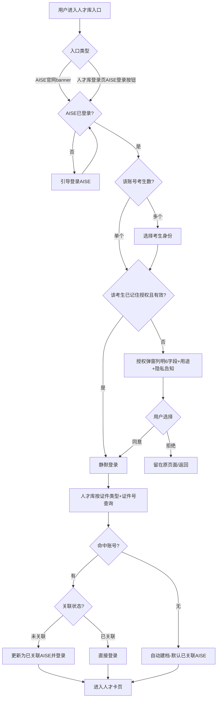

# AISE 人才库账号打通 业务需求梳理

> 版本 V3.0 ｜ 日期 2026-08-18 ｜ 状态：V3 修订稿（回应 Reviewer 第 2 轮）

## 需求总览

| 编号 | 模块 | 需求概述 | 优先级 |
|------|------|---------|--------|
| M1 | AISE 侧授权入口与 banner 链接 | AISE 官网 banner 引导已登录用户一键登录人才库；人才库登录页新增「AISE 登录」按钮 | 高 |
| M2 | 授权弹窗与授权流程（含多考生选身份） | 首次授权弹窗列明字段、单独同意；多考生先选考生身份再授权；支持「记住授权」静默登录（考生级） | 高 |
| M3 | 人才库登录入口改造 | 保留独立登录/注册入口，新增「AISE 登录」第三方登录入口 | 高 |
| M4 | 账号桥接与自动建档 | 按「证件类型+证件号」查询：有则直接登录（含未关联账号更新为已关联）、无则自动建档且默认「已关联 AISE」 | 高 |
| M5 | 合规（撤回授权、数据最小化、授权记录留存） | 授权字段最小化、单独同意、支持撤回授权、授权记录留存与访问控制 | 高 |

---

## 0. PRD 类型判定

🏗 **功能型** — 跨平台账号打通功能（AISE 测评平台 ↔ 人工智能人才资源库独立网站）。

---

## 1. 项目背景与收益预估

### 1.1 需求简介

在 AISE 测评平台与人才库独立网站之间建立账号打通能力：AISE 已登录用户可通过官方入口（官网 banner 或人才库登录页「AISE 登录」按钮）授权后直接登录人才库，人才库按证件类型+证件号自动桥接或建档，避免重复注册与重复填写信息。

### 1.2 业务诉求

现行人才库与 AISE 是两套独立用户体系，仅在注册时以用户填写的证件号做一次性匹配（出处：[AISE人才库_PRD §4 系统关联与依赖](<../20260615 人才库/AISE人才库_PRD.md>)）。用户若已在 AISE 报名考试，再到人才库仍需重新注册、重新填写姓名/证件号/手机号等信息，重复且易因填写不一致导致无法关联测评数据。本次打通后，AISE 用户可"一键登录"人才库，免重复注册。

### 1.3 收益预估（待埋点验证的假设）

> ⚠️ 收益降级声明：以下收益均为**待埋点验证的假设**（依据等级 E，经验判断），非已验证结论，不构成重大决策的唯一依据；上线后以 §7 埋点数据验证为准，验证前不作为收益承诺。

- **用户收益**：AISE 考生到人才库免重复注册、免重复填表，授权一次即可登录并自动关联测评数据；减少因证件号填错导致的"未关联"情况。
- **业务收益**：打通"测评→入库→展示"闭环，提高 AISE 考生向人才库的转化率与关联率，减少人才库侧"未关联"账号占比。
- **不做风险**：AISE 考生仍须重复注册填写，人才库"未关联"账号持续累积，人才卡无法自动展示测评数据，影响人才库对学员的价值与吸引力。

> 注：上述收益为定性判断，暂无量化数据支撑（依据等级 E，经验判断，仅作方向参考）。量化口径见 §7 建议埋点（授权转化率、关联率、建档率等），上线后以埋点数据为准。

---

## 2. 业务流程简述

1. AISE 已登录用户进入人才库入口：从 AISE 官网 banner 点击进入，或在人才库登录页点击「AISE 登录」按钮。
2. 判断 AISE 账号下的考生身份数量：
   - 单个考生：直接进入授权环节。
   - 多个考生：先弹出「选择考生身份」，选中后再进入授权环节。
3. 首次授权弹窗：逐项列明授权字段（姓名/证件类型/证件号/手机号/邮箱/性别）及各自用途，附「隐私告知」链接，由用户单独勾选同意，可同时勾选「记住授权」。
4. 用户同意后，人才库以该考生「证件类型+证件号」查询：
   - 命中已有账号：直接登录人才库；若原关联状态为「未关联」，同步更新为「已关联 AISE」。
   - 未命中：自动建档，AISE 关联状态默认「已关联 AISE」，默认密码为证件号后 6 位。
5. 登录/建档成功后进入人才卡页。
6. 已勾选「记住授权」且授权仍有效的考生，下次从 banner 进入时静默登录，不再弹授权窗（记住授权为考生级，各考生分别记录，见 5.2.4）。

---

## 3. 版本管理

### 3.1 PRD 版本记录

| 版本号 | 日期 | 修订人 | 修订内容 |
|--------|------|--------|---------|
| V1.0 | 2026-08-18 | — | 初稿 |
| V2.0 | 2026-08-18 | Lead PM | 回应 Reviewer 第 1 轮 8 条：①记住授权改考生级 ②未关联账号授权后更新为已关联 ③数据最小化逐字段标注用途 ④撤回授权停用桥接+停止同步、已存字段默认保留 ⑤数据同步改一次性读取 ⑥收益降级为待埋点验证假设 ⑦授权记录补留存期限与访问控制、弹窗附隐私告知 ⑧桥接键改「证件类型+证件号」组合 |
| V3.0 | 2026-08-18 | Lead PM | 回应 Reviewer 第 2 轮 4 条：①§5.3.1 补注册表单含证件类型字段、账号侧存储证件类型、授权桥接组合键查询 vs 独立登录维持证件号+密码匹配；新增 Q6 存量账号证件类型字段完整性待确认 ②§5.5.3「不再同步」改「不再读取/不再桥接」呼应一次性读取 ③§5.5.3 区分撤回授权与账号注销、已读字段处置待合规确认（个保法第47条）④Q4 默认长期有效直至撤回、记住授权与授权记录留存生命周期独立 |

### 3.2 产品版本信息

| 项目 | 内容 |
|------|------|
| 涉及平台 | AISE 测评平台（user 端）＋ 人工智能人才资源库（独立网站） |
| 本期范围 | 授权入口、授权弹窗与授权流程、人才库登录入口改造、账号桥接与自动建档、合规（撤回授权/数据最小化/授权记录留存） |
| 后续范围 | 账号合并（本期不做、延后） |

---

## 4. 系统关联与依赖

- **AISE 测评系统（user 端）**：提供授权入口（官网 banner）、登录态识别、考生身份列表，以及授权字段（姓名/证件号/证件类型/手机号/邮箱/性别）。
- **人工智能人才资源库（独立网站）**：登录/注册入口、账号体系、人才卡。桥接键为「证件类型+证件号」组合（对现行 PRD §5.2 以「证件号」为唯一标识口径的修正，详见 §5.4.1）。
- **两套独立用户体系**：人才库与 AISE 各自维护账号，通过授权以「证件类型+证件号」桥接；人才库不修改 AISE 数据，仅**一次性读取**授权字段用于建档/关联，授权有效期内不持续同步、不回写覆盖人才库侧用户已手动修改的字段（与现行"注册仅读取、不修改 AISE 数据"一致，出处：[AISE人才库_PRD §4 系统关联与依赖](<../20260615 人才库/AISE人才库_PRD.md>)）。
- **跨域名登录的技术实现**：由研发自评确定具体实现方案，业务侧不写死（见附录 A）。

---

## 5. 详细功能说明

### 5.1 AISE 侧授权入口与 banner 链接

**位置**：AISE 官网（user 端）首页及相关页面的 banner 区域；人才库登录页。

**目标**：为 AISE 已登录用户提供"一键登录人才库"的入口。

#### 5.1.1 banner 入口

- AISE 官网首页 banner 增加人才库推广位，沿用现有 Banner 管理能力配置（出处：[AISE&爱测评平台能力梳理 §21_Banner管理](<../../Functional_Specs/AISE&爱测评平台能力梳理.md>)）。
- banner 链接指向人才库，点击行为按 AISE 登录态分支：
  - **AISE 已登录**：直接进入人才库自动登录（首次弹授权窗；该考生已勾选记住授权则静默登录）。
  - **AISE 未登录**：先引导登录 AISE，登录成功后回跳人才库继续授权流程。

#### 5.1.2 人才库登录页「AISE 登录」按钮

- 人才库登录页新增「AISE 登录」按钮，作为第三方登录入口（详见 5.3）。

#### 5.1.3 边界与异常

- AISE 登录态失效（会话过期）：点击 banner 后按"未登录"分支处理，引导重新登录 AISE。
- banner 未配置或已下线：不影响人才库独立登录/注册入口，仅失去一键登录入口。

### 5.2 授权弹窗与授权流程（含多考生选身份）

**位置**：从 banner 或「AISE 登录」按钮触发。

**目标**：在用户明确知情、单独同意的前提下，取得授权字段用于桥接/建档。

#### 5.2.1 多考生选身份

- 当 AISE 账号关联多个考生身份时，先弹出「选择考生身份」页，交互形态复用现有 [10_选择考生身份.html](<../../html/user/10_选择考生身份.html>)。
- 用户选中某个考生后，以该考生「证件类型+证件号」组合作为桥接键，进入授权弹窗。
- 桥接粒度为「考生身份」：一个 AISE 账号下的不同考生分别授权、分别对应人才库不同档案。
- 仅有一个考生时跳过此步骤，直接进入授权弹窗。

#### 5.2.2 授权弹窗内容

- 标题与说明：说明"人才库将获取以下信息，用于建立/关联您的人才档案"。
- 逐项列明授权字段（共 6 项）及各自用途：

  | 字段 | 用途 |
  |------|------|
  | 证件类型＋证件号 | 桥接键：在人才库定位/建立账号的唯一标识 |
  | 姓名、性别 | 人才卡展示 |
  | 手机号 | 找回密码 / 身份校验 |
  | 电子邮箱 | 通知（选填） |

  > 上述字段均仅用于建档与人才卡展示，不超范围收集（详见 5.5.1 数据最小化）。

- 「隐私告知」链接：授权弹窗内附「隐私告知」链接，指向隐私政策/授权说明页，向用户说明授权字段用途与授权记录留存期限。
- 「记住授权」勾选项：勾选后，下次**该考生**从 banner 进入时静默登录，不再弹授权窗（记住授权为考生级，各考生分别记录，见 5.2.4）。
- 操作按钮：同意授权 / 拒绝。
- 首次授权必须弹窗列明字段、由用户单独勾选同意（符合个保法单独同意要求），不可默认勾选、不可与人才库注册协议捆绑。

#### 5.2.3 授权结果分支

- **同意授权**：进入账号桥接与自动建档（见 5.4）。
- **拒绝**：不获取任何字段、不登录；banner 场景返回 AISE 原页面，按钮场景返回人才库登录页。

#### 5.2.4 记住授权的生效与失效

- 勾选「记住授权」并同意后，记录该 AISE 账号下**该考生**对人才库的授权状态（记住授权为**考生级**：同一 AISE 账号下多个考生各自独立记录、互不影响）。
- 之后该考生从 banner 进入时静默完成登录，不再弹授权窗。
- 用户撤回授权后（见 5.5.3），该考生的记住授权状态同步失效，下次进入重新弹授权窗。
- 记住授权有效期：默认**长期有效直至撤回**，不设置定期失效（原待确认 Q4 已收敛，见待确认事项）。
- 记住授权（授权状态）与授权记录留存（审计记录）为两个相互独立的生命周期：记住授权状态随撤回即时失效，授权记录按 §5.5.4 留存期限独立保留、互不影响。

### 5.3 人才库登录入口改造

**位置**：人才库登录页（现有 [login.html](<../../html/talent_pool/login.html>)）。

**目标**：在保留独立登录/注册能力的前提下，新增 AISE 第三方登录入口。

#### 5.3.1 登录表单（保留不变）

- 证件号码（必填）
- 密码（必填，默认密码为证件号后 6 位）
- 图形验证码（必填，点击刷新）

登录逻辑与异常处理沿用现行规则（出处：[AISE人才库_PRD §5.3 登录](<../20260615 人才库/AISE人才库_PRD.md>)）。

> 说明（桥接键 vs 独立登录）：现行人才库**注册表单**含「证件类型」字段（出处：[AISE人才库_PRD §5.2.1](<../20260615 人才库/AISE人才库_PRD.md>)），账号侧存储证件类型；仅**登录表单**只采证件号是现状。授权桥接按「证件类型+证件号」组合键查询，独立登录维持证件号+密码匹配规则不变。

#### 5.3.2 新增「AISE 登录」按钮

- 在登录表单下方新增「AISE 登录」按钮（第三方登录入口）。
- 点击后走 5.2 授权流程；授权通过后按 5.4 桥接/建档并登录。
- 独立注册入口保留，不因新增按钮而移除。

### 5.4 账号桥接与自动建档

**位置**：授权同意后的后台处理环节。

**目标**：以授权得到的「证件类型+证件号」在人才库侧定位或建立账号，完成登录。

#### 5.4.1 桥接规则

- 桥接键：授权字段中的「证件类型+证件号」组合（对现行 PRD §5.2 以「证件号」作唯一标识口径的修正，出处：[AISE人才库_PRD §5.2 注册逻辑](<../20260615 人才库/AISE人才库_PRD.md>)）。
- 人才库按「证件类型+证件号」查询：
  - **命中已有账号**：直接以该账号登录，无需输入密码；若该账号 AISE 关联状态为「未关联」，登录成功后将其更新为「已关联 AISE」（原待确认 Q1 已收敛，见待确认事项）。
  - **未命中**：自动建档，并默认「已关联 AISE」。

#### 5.4.2 自动建档字段

- 用授权字段一次性初始化新账号：姓名、证件类型、证件号、手机号、电子邮箱、性别。
- 默认密码：证件号后 6 位。
- AISE 关联状态：默认「已关联 AISE」（区别于现行注册流程中的"未关联"/"关联查询失败"状态，出处：[AISE人才库_PRD §5.2.2 注册逻辑](<../20260615 人才库/AISE人才库_PRD.md>)）。
- 建档成功后自动登录并进入人才卡页。

#### 5.4.3 账号合并（本期不做）

- AISE 与人才库账号体系的合并本期不做、延后。
- 若同一「证件类型+证件号」在人才库已有账号（含手动注册但尚未关联的账号），本期仅通过桥接登录，不执行账号合并、不迁移历史数据。
- 账号合并方案纳入后续范围。

#### 5.4.4 边界与异常

- 「证件类型+证件号」在人才库已有账号但 AISE 关联状态为「未关联」：授权登录后自动更新为「已关联 AISE」（原待确认 Q1 已收敛，见待确认事项）。
- 授权字段缺失（如 AISE 侧无手机号/邮箱）：以已有字段建档，缺失字段留空，不影响登录。
- 证件类型或证件号为空/格式异常：阻断桥接，提示重新授权或走独立注册。

### 5.5 合规（撤回授权、数据最小化）

**位置**：贯穿授权与桥接全流程。

**目标**：满足个保法对授权同意与数据最小化的要求。

#### 5.5.1 数据最小化

- 仅申请桥接/建档所必需的 6 个字段，不超范围收集。逐字段用途如下：

  | 字段 | 用途 |
  |------|------|
  | 证件类型＋证件号 | 桥接键（唯一标识） |
  | 姓名、性别 | 人才卡展示 |
  | 手机号 | 找回密码 / 身份校验 |
  | 电子邮箱 | 通知（选填） |

- 全部字段均用于建档 + 人才卡展示，无超出建档/展示之外的其他用途，符合数据最小化原则。
- 授权字段仅用于建立/关联人才档案，不用于其他用途。

#### 5.5.2 单独同意

- 首次授权必须弹窗列明字段、单独取得用户同意（见 5.2.2），不可默认勾选。

#### 5.5.3 撤回授权

- 提供撤回授权入口（具体位置见待确认事项 Q2）。
- 撤回授权 ≠ 账号注销，两者独立、分别处理。用户撤回后：
  - 桥接失效：AISE 侧不再静默登录人才库，下次进入重新走授权弹窗。
  - 停止读取/桥接：人才库不再读取、不再桥接来自 AISE 的字段（呼应 5.5.5 一次性读取语义——撤回前本就无持续同步，撤回后仅停止后续读取）。
  - 账号与档案保留：撤回授权仅停用桥接 + 停止后续读取，人才库账号与人才档案均保留，用户可另行请求注销账号/删除档案。
  - 已读取字段处置：基于授权读取字段的处置细则（保留/删除/匿名化）标注「待合规确认」（个保法第 47 条）；默认暂保留在人才档案中、不主动删除、不做匿名化处理（原待确认 Q3 已收敛，见待确认事项）。

#### 5.5.4 授权记录留存

- 保存授权记录：授权时间、授权字段范围、授权状态（有效/已撤回），供审计与客服追溯。
- 留存期限：默认与账号生命周期一致，待合规确认（见待确认事项 Q5）。
- 访问控制：授权记录仅客服、审计角色可查，不对其他角色开放。
- 生命周期独立性：授权记录留存（审计记录）与「记住授权」（授权状态，见 5.2.4）生命周期相互独立——记住授权状态随撤回即时失效，授权记录按上述留存期限独立保留，不因记住授权失效而删除。

#### 5.5.5 数据同步语义（一次性读取）

- 授权字段仅在授权通过时一次性读取，用于桥接与建档。
- 授权有效期内不持续同步、不建立周期性回传。
- 人才库侧用户已手动修改的字段，不会被来自 AISE 的字段自动回写覆盖。

---

## 6. 流程与状态图表

授权与桥接主流程：

---

## 7. 数据埋点与实验设计

> 本 PRD 为功能型，埋点与实验非强制；以下为建议埋点，用于量化 §1.3 的收益口径（授权转化率、关联率、建档率等），验证 §1.3 中「待埋点验证的假设」。

| 事件 | 触发条件 | 上报字段 |
|------|---------|---------|
| authorize_entry_show | 授权入口（banner/按钮）曝光 | 入口类型（banner/按钮） |
| authorize_entry_click | 点击授权入口 | 入口类型、AISE 登录态 |
| authorize_modal_show | 授权弹窗曝光 | 是否多考生、是否首次授权 |
| authorize_confirm | 点击同意授权 | 是否勾选记住授权 |
| authorize_cancel | 点击拒绝授权 | — |
| bridge_login | 桥接直接登录成功 | 命中类型（已有账号）、更新前关联状态 |
| bridge_create | 自动建档成功 | 建档字段完整度 |

---

## 8. 验收标准

| # | 测试场景 | 前置条件 | 操作 | 期望结果 | 判定 |
|---|---------|---------|------|---------|------|
| 1 | 人才库登录页新增按钮 | 打开人才库登录页 | 查看登录表单 | 保留证件号+密码+验证码，下方新增「AISE 登录」按钮 | 按钮正常展示，独立登录仍可用 |
| 2 | banner 一键登录（已登录·单考生·首次） | AISE 已登录，账号下仅 1 个考生，未授权过 | 点击 AISE 官网 banner | 弹授权窗列明 6 字段+用途+隐私告知链接，勾选同意后直接登录人才库 | 授权字段完整，登录成功 |
| 3 | 记住授权静默登录（考生级） | 某考生已勾选记住授权且授权有效 | 再次以该考生点击 banner | 不再弹授权窗，直接进入人才卡页 | 静默登录成功；同账号其他未勾选考生仍需弹窗 |
| 4 | banner 未登录引导 | AISE 未登录 | 点击 banner | 引导先登录 AISE，登录后回跳继续授权 | 回跳路径正确 |
| 5 | 多考生选身份 | AISE 账号关联多个考生 | 点击授权入口 | 先弹「选择考生身份」，选中后进入授权弹窗 | 以所选考生证件类型+证件号桥接 |
| 6 | 授权拒绝 | 授权弹窗展示中 | 点击「拒绝」 | 不获取字段，留在原页面/返回，不登录 | 不产生任何桥接 |
| 7 | 已有关联账号直接登录 | 该证件类型+证件号在人才库已有账号且已关联 | 同意授权 | 以已有账号登录，无需输密码 | 进入人才卡页 |
| 8 | 自动建档 | 该证件类型+证件号在人才库无账号 | 同意授权 | 自动建档，关联状态「已关联 AISE」，默认密码为证件号后6位 | 建档成功并登录 |
| 9 | 撤回授权 | 已授权用户 | 撤回授权后从 banner 进入 | 重新弹授权窗，不再静默登录 | 该考生记住授权失效 |
| 10 | 授权字段缺失 | AISE 侧无手机号/邮箱 | 同意授权 | 以已有字段建档，缺失字段留空，仍可登录 | 建档成功 |
| 11 | 未关联账号授权后更新为已关联 | 该证件类型+证件号在人才库已有账号且关联状态「未关联」 | 同意授权登录 | 登录成功且关联状态更新为「已关联 AISE」 | 关联状态正确更新 |
| 12 | 手动修改字段不被回写覆盖 | 人才库侧用户已手动修改姓名 | 授权有效期内再次登录 | 人才库字段保持用户手动修改值，不被 AISE 字段覆盖 | 无回写覆盖 |

---

## 9. 辅助材料清单

| 材料 | 位置 |
|------|------|
| 现行人才库 PRD | [AISE人才库_PRD.md](<../20260615 人才库/AISE人才库_PRD.md>) |
| AISE 登录原型 | [01_登录注册.html](<../../html/user/01_登录注册.html>) |
| AISE 多考生选身份原型 | [10_选择考生身份.html](<../../html/user/10_选择考生身份.html>) |
| 人才库登录原型 | [login.html](<../../html/talent_pool/login.html>) |
| 平台能力总索引 | [AISE&爱测评平台能力梳理.md](<../../Functional_Specs/AISE&爱测评平台能力梳理.md>) |

---

## 待确认事项

| 编号 | 事项 |
|------|------|
| ~~Q1~~ | ~~证件号在人才库已有账号但 AISE 关联状态为「未关联」时，通过授权登录后是否将其更新为「已关联 AISE」？~~ → 已收敛：授权登录后更新为「已关联 AISE」（见 §5.4.1） |
| Q2 | 撤回授权的入口具体放在人才库个人设置、AISE 个人中心，还是两者都有？ |
| ~~Q3~~ | ~~撤回授权后，已自动建档的人才档案是保留（仅停用桥接）还是删除？~~ → 已收敛：撤回授权 ≠ 账号注销，撤回授权仅停用桥接 + 停止后续读取，人才库账号与档案保留（用户可另行请求注销/删除）；基于授权读取字段的处置细则待合规确认（个保法第 47 条）（见 §5.5.3） |
| ~~Q4~~ | ~~「记住授权」是否需要设置有效期（永久 / 定期失效）？~~ → 已收敛：默认「长期有效直至撤回」，不设置定期失效；记住授权（授权状态）与授权记录留存（审计记录）生命周期不同、相互独立（见 §5.2.4、§5.5.4） |
| Q5 | 授权记录留存期限「与账号生命周期一致」需合规确认（见 §5.5.4） |
| Q6 | 存量账号证件类型字段完整性待研发确认，缺失需补登记（见 §5.3.1） |

## 依据清单

| 依据 | 说明 |
|------|------|
| 现行人才库 PRD（§4、§5.2、§5.3） | 两套独立用户体系、默认密码证件号后6位、登录表单结构；§5.2 以「证件号」作唯一标识的口径在本文档修正为「证件类型+证件号」组合 |
| AISE 登录原型（01_登录注册.html） | AISE user 端登录/注册现状 |
| AISE 多考生选身份原型（10_选择考生身份.html） | 多考生选身份交互形态 |
| 人才库登录原型（login.html） | 人才库登录/注册现状 |
| 平台能力总索引 | Banner 管理、user 端页面能力 |

## 附录 A：跨域名登录技术实现（研发自评）

- 跨域名账号打通采用标准授权码流程，具体授权协议、跳转、回调、令牌管理等技术细节由研发自评确定，PRD 不写死。
- 本附录仅作说明，不构成业务需求约束。
