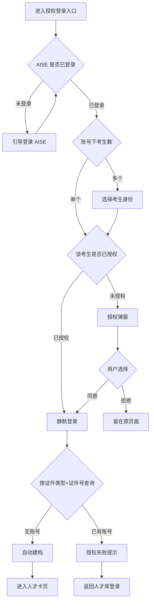

# AISE 人才库账号打通

## 1. 项目背景与收益预估

### 1.1 需求简介

AISE 已登录用户通过人才库的授权登录入口授权后，一键登录人才库；人才库按「证件类型 + 证件号」自动建档或分流，免去重复注册与重复填表。

### 1.2 业务诉求与收益

人才库与 AISE 目前是两套独立账号，AISE 考生进入人才库需重新注册、重复填写姓名/证件号/手机号，且易因填写不一致导致无法关联测评数据（出处：[AISE人才库_PRD §4](<../20260615 人才库/AISE人才库_PRD.md>)）。打通后 AISE 用户可授权一键登录、免重复注册填表。本期不做收益量化，账号合并、撤回授权等事项后置。

## 2. 业务流程简述

1. 用户进入人才库授权登录入口（人才库登录页「AISE 登录」按钮；运营可在官网 banner 等位置配置链接指向该入口）。
2. AISE 未登录或登录态失效，先引导登录 AISE；已登录则继续。
3. 若 AISE 账号下关联多个考生，先选择考生身份；仅一个则跳过。
4. 该考生已授权则静默登录；首次授权则弹授权窗，列明授权字段与用途，由用户单独同意。
5. 人才库按「证件类型 + 证件号」查询：无账号则自动建档并登录；已有账号则授权失败，提示使用人才库账号直接登录。
6. 登录后进入人才卡页。

## 3. 详细功能说明

### 3.1 人才库登录入口改造

**位置**：人才库登录页（现有 [login.html](<../../html/talent_pool/login.html>)）。

**目标**：在保留独立登录 / 注册能力的前提下，新增 AISE 授权登录入口。

- 登录表单维持「证件号 + 密码（默认证件号后 6 位）+ 图形验证码」不变，独立登录逻辑与异常处理沿用现行规则（出处：[AISE人才库_PRD §5.3](<../20260615 人才库/AISE人才库_PRD.md>)）。
- 登录表单下方新增「使用 AISE 账号登录」按钮，作为授权登录入口。
- 运营可在官网 banner 或其他位置配置链接指向该授权登录入口；入口的展示与配置属运营行为，非本期开发功能。
- 独立注册入口保留，不因新增按钮而移除。

**登录态判断**：用户从授权登录入口进入时，判断 AISE 登录态：

- 已登录：进入授权登录流程（3.2–3.4）。
- 未登录或登录态失效：先引导登录 AISE，登录成功后回到授权登录流程。

### 3.2 选择考生身份

**位置**：从授权登录入口进入后，当该 AISE 账号下关联多个考生时展示。

**目标**：在授权前明确本次登录人才库的考生身份，作为桥接与建档的唯一指向。

- 展示该 AISE 账号下关联的考生列表（姓名 + 证件类型 + 证件号），交互形态复用现有 [10_选择考生身份.html](<../../html/user/10_选择考生身份.html>)。
- 用户选中某个考生后，以该考生的「证件类型 + 证件号」作为桥接键进入授权弹窗。
- 仅关联一个考生时跳过本步，直接进入授权弹窗。

**设计说明（保留本步的考虑）**：

- 用户从 AISE 侧进入时，AISE 侧通常已处于某个考生身份上下文，理论上人才库侧无需再次选择。
- 但考虑到用户可能在 AISE 侧不清楚如何切换学生账号，为避免带错身份或无法切换，人才库侧仍保留「选择考生身份」一步作为兜底，让用户在此确认或切换本次登录的考生身份。

### 3.3 授权弹窗

**位置**：确定考生身份后展示。

**目标**：在用户明确知情、单独同意的前提下，取得授权字段用于桥接与建档。

- 说明「人才库将获取以下信息，用于建立或关联您的人才档案」。
- 逐项列明授权字段与用途，共 6 项：

| 授权字段 | 用途 |
|---------|------|
| 证件类型 + 证件号 | 定位 / 建立人才库账号（唯一标识） |
| 姓名、性别 | 人才卡展示 |
| 手机号 | 找回密码、身份校验 |
| 电子邮箱 | 接收通知（选填） |

- 附《隐私告知》入口，说明授权字段用途与授权记录的可查范围。
- 操作按钮：同意授权 / 拒绝。
- 首次授权必须弹窗列明字段、由用户单独同意，不可默认勾选、不可与人才库注册协议捆绑。

**边界与异常**：拒绝则不获取任何字段、不登录；返回人才库登录页。

### 3.4 账号桥接与自动建档

**位置**：授权同意后的处理环节。

**目标**：以授权得到的「证件类型 + 证件号」在人才库侧定位或建立账号，完成登录。

- **桥接键**：「证件类型 + 证件号」组合（对现行 PRD §5.2 以「证件号」作唯一标识口径的修正，出处：[AISE人才库_PRD §5.2](<../20260615 人才库/AISE人才库_PRD.md>)）。
- 人才库按「证件类型 + 证件号」查询，分支如下：

| 查询结果 | 处理 |
|---------|------|
| 无账号 | 自动建档，默认「已关联 AISE」，默认密码为证件号后 6 位，建档后自动登录进入人才卡页 |
| 已有账号 | 授权失败，提示「该证件号已在人才库注册，请使用人才库账号直接登录」；不自动登录、不合并、不迁移历史数据 |

- **自动建档字段**：用授权字段一次性初始化新账号，包括姓名、证件类型、证件号、手机号、电子邮箱、性别。
- **字段缺失**：授权字段在 AISE 侧为空时（如电子邮箱），不传该字段，建档时留空，不影响登录。
- **静默登录**：首次授权成功即记录该考生的授权状态；之后该考生从入口进入时静默登录，不再弹授权窗。

**边界与异常**：证件类型或证件号为空 / 格式异常则阻断桥接，提示重新授权或走独立注册；账号合并本期不做。

## 4. 流程与状态图表

## 5. 验收标准

| # | 测试场景 | 前置条件 | 操作 | 期望结果 | 判定 |
|---|---------|---------|------|---------|------|
| 1 | 登录页新增按钮（回归） | 打开人才库登录页 | 查看登录表单 | 保留证件号+密码+验证码，下方新增「使用 AISE 账号登录」按钮 | 按钮正常展示，独立登录仍可用 |
| 2 | 授权入口一键登录（已登录·单考生·首次） | AISE 已登录，账号下仅 1 个考生，未授权过 | 点击「AISE 登录」入口 | 弹授权窗列明 6 字段+用途+隐私告知，同意后自动建档登录 | 授权字段完整，登录成功 |
| 3 | 多考生先选身份 | AISE 账号关联多个考生 | 点击授权登录入口 | 先弹「选择考生身份」，选中后进入授权弹窗 | 以所选考生证件类型+证件号桥接 |
| 4 | 静默登录 | 某考生已授权且有效 | 再次以该考生进入授权登录入口 | 不再弹授权窗，直接进入人才卡页 | 静默登录成功 |
| 5 | 未登录引导 | AISE 未登录 | 点击授权登录入口 | 引导先登录 AISE，登录后回跳继续授权 | 回跳路径正确 |
| 6 | 授权拒绝 | 授权弹窗展示中 | 点击「拒绝」 | 不获取字段、不登录，留在原页面 | 不产生任何桥接 |
| 7 | 撞号授权失败 | 该证件类型+证件号在人才库已有账号 | 同意授权 | 提示「该证件号已在人才库注册，请使用人才库账号直接登录」 | 不自动登录、不建档 |
| 8 | 自动建档 | 该证件类型+证件号在人才库无账号 | 同意授权 | 自动建档，关联状态「已关联 AISE」，默认密码为证件号后 6 位 | 建档成功并登录 |
| 9 | 字段缺失留空 | AISE 侧无电子邮箱 | 同意授权 | 以已有字段建档，邮箱留空，仍可登录 | 建档成功 |
| 10 | 独立登录回归 | 老用户在人才库已有账号 | 用证件号+密码登录 | 正常登录人才卡页，不受新增按钮影响 | 独立登录正常 |

## 待确认事项

| 编号 | 事项 |
|------|------|
| Q1 | 存量人才库账号「证件类型」字段完整性待研发确认；若存量账号未存证件类型，组合键桥接可能无法命中，需补登记（关联 3.4 桥接键） |
