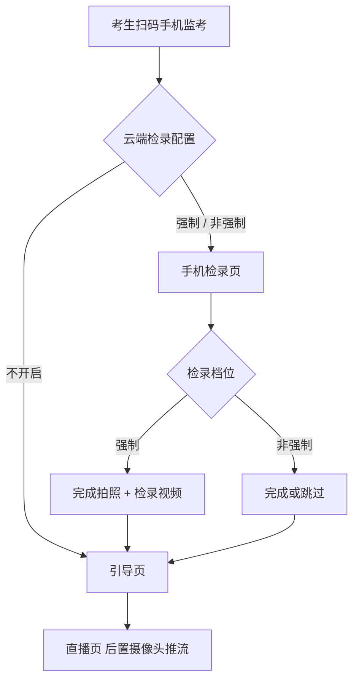
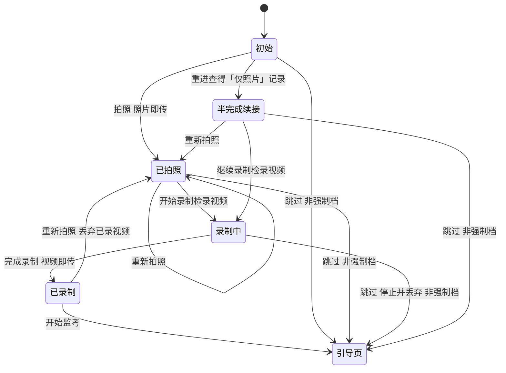

# AISE 手机端检录 PRD

> 本文档由「检录触发与配置」「手机检录页」两模块方案（V3）最终整合而成，遵循 §0-§9 标准结构。
> 需求来源：手机端检录（20260818）；目标产品：AISE 考试系统手机监考通道。

---

## 0. PRD 类型判定

| 判定项 | 结论 |
|--------|------|
| PRD 类型 | 🏗 **功能型**（新功能上线：手机监考通道新增「手机检录页」） |
| 必须包含 | 收益预估、验收标准、用户场景、辅助材料 |
| 可简化 | 埋点实验（本节仅保留埋点设计，不设实验方案） |
| 专项说明 | 非车载/座舱场景，车载/座舱专项不适用 |

---

## 1. 项目背景与收益预估

### 1.1 需求简介

手机监考通道现有流程「扫码 → 引导页 → 直播页」全程无检录环节，本需求在「扫码 → 引导页」之间插入「手机检录页」，使无电脑摄像头的考生可在手机上完成检录（前置自拍正面照 + 检录视频），让检录三态配置在所有进入考试的通道上一致生效。

### 1.2 业务诉求

- 无电脑摄像头的考生（典型为台式机未配外接摄像头）电脑端设备调试无法通过，只能走手机监考备选通道，但该通道缺检录，导致「检录配置强制但手机通道无检录记录」的覆盖缺口（依据：平台能力梳理 §考试保障）。
- 电脑端检录依赖电脑摄像头拍照（依据：检录 demo `../html/iceping/10_检录.html`），无摄像头考生在电脑端同样无法完成检录。

### 1.3 收益预估

| 收益层级 | 内容 |
|---------|------|
| 1️⃣ **用户收益** | 无电脑摄像头的考生不再被卡在考试入口之外，可扫码手机监考并在手机上完成检录。无电脑摄像头考生占比无量化数据（D 级运营反馈，见 [手机监考 PRD §1.2](<20260730 手机监考/AISE_手机监考_PRD.md>)，**待验证**） |
| 2️⃣ **业务收益** | 检录三态配置在手机监考通道一致生效，所有进入考试的考生都有可追溯检录记录；量化目标为「检录覆盖缺口」（检录=强制 + 手机监考场次中无任何检录记录的考生占比）降至 **0**（目标值，指标定义见 §7，首轮以埋点回填基准） |
| 3️⃣ **不做风险** | 手机监考通道维持「无检录」现状，检录=强制的考试中走手机监考的考生无检录记录，监考端无法核验其检录，不满足考试机构「全员检录」要求，且与电脑端「开考后仍强制检录」形成不对称（见 [候考 PRD §2.1](<20260809 候考页面/AISE_候考_PRD.md>)） |

> 说明：本需求所有量化指标均标「待验证」（首轮上线以埋点回填基准值），不预置假设数值，避免凭空编造（依据 Lead PM 数据规范：数字须标来源/假设值/待验证三者之一）。

---

## 2. 业务流程简述

无电脑摄像头考生在电脑端设备调试失败 → 扫码手机监考 → 落地按检录配置分流：

- **强制 / 非强制档**：进入「手机检录页」完成拍照 + 检录视频（强制档无跳过；非强制档可跳过）→ 引导页。
- **不开启档**：直接进引导页（原流程，无检录页）。

检录完成/跳过后去向为「引导页」，再到「直播页」（切后置摄像头推流），电脑端感知手机连接后摄像头项标记通过，考生进入考试。手机监考通道**不经过候考流程**。

---

## 3. 版本管理

### 3.1 PRD 文档修订记录

| 版本号 | 日期 | 修订人 | 修订内容 |
|--------|------|--------|---------|
| V1.0 | 2026-08-18 | 主力产品经理 | 初稿：整合「检录触发与配置」「手机检录页」两模块方案（V3）为正式 PRD |

### 3.2 产品版本信息

| 项目 | 内容 |
|------|------|
| 所属平台 | AISE 考试系统 · 手机监考通道（手机端 Web） |
| 目标上线版本 | 待定（与考试侧发版节奏对齐） |
| 兼容要求 | 前置摄像头（考生自备手机）；视频录制能力要求浏览器支持（iOS 14.5 起默认支持，见 §4.5） |
| 本期范围 | 手机检录页 + 检录触发与配置（触发分流、三态分支、双重检录边界、去向、扫码凭证衔接） |
| 后续范围 | 电脑端「进入测评」对手机检录结果的消费（放行判定）落地，见待确认 #3 |

---

## 4. 系统关联与依赖

### 4.1 依赖模块列表

| 依赖模块 | 完成顺序 | 依赖内容 |
|---------|---------|---------|
| 手机监考通道（扫码/引导页/直播页） | 已上线 | 复用扫码凭证生成/绑定、页面路由、直播推流能力 |
| 考试管理 · 检录配置 | 已上线 | 检录三态（强制/非强制/不开启）配置，需可被落地接口实时读取 |
| 检录结果存储 | 需改造 | 新增「来源通道」字段、追加保留（多份共存）、「仅照片」部分记录查询 |
| 电脑端设备调试/进入测评 | 已上线 | 进入测评时查询（拉取）检录状态做放行判定（待确认 #3） |

### 4.2 页面与路由清单（本文以「扫码凭证」指代 URL 中的 token 参数）

| 页面 | 路由 | 说明 |
|------|------|------|
| 扫码落地入口 | `/proctor/mobile?token={token}` | 落地即分流，不渲染页面 |
| 手机检录页 | `/proctor/mobile/checkin?token={token}` | 新增 |
| 引导页 | `/proctor/mobile/guide?token={token}` | 现有 |
| 直播页 | `/proctor/mobile/live?token={token}` | 现有 |

### 4.3 扫码凭证（token）机制

- 复用现有生成与绑定机制（见 [手机监考 PRD §3.1.2/§3.4](<20260730 手机监考/AISE_手机监考_PRD.md>)）：同一考生同一场次复用同一扫码凭证，新增检录页不重新生成。
- 三页间跳转通过 URL 查询参数透传同一扫码凭证，检录页不重新签发。
- 检录结果上传时以扫码凭证反查「考生 + 考试场次」落库，与推流会话同源。
- 安全约束沿用既有机制：绑定「考生 + 场次」、短有效期（考试窗口 + 30 分钟缓冲）、单路踢旧（同一考生仅 1 路）、传输加密。
- **泄露面说明**：新增检录页后，扫码凭证泄露后果由「劫持推流」扩大为「代考生伪造检录记录」。定性为既有高危风险的次级衍生后果，不构成新的独立高危面；缓解沿用既有机制 + 检录照片「仅实时拍摄、禁用相册/滤镜」（见 §5.2），抬升伪造门槛，不新增独立安全建设。

### 4.4 检录结果存储（改造点）

- 新增「来源通道」字段，取值「手机/电脑」二元（电脑端多入口统一记「电脑」）。
- 检录记录**追加保留**：同一考生同一场次多次检录不覆盖，各带来源通道共存；生效/通过判定取**最后一次**。
- 检录结果按「账号 + 场次 + 来源通道」存在「无记录 / 仅照片 / 完整（照片+视频）」三态，仅「完整」视为检录通过；需支持「来源通道=手机」的「仅照片」部分记录查询（用于半完成态续接）。
- 上传接口以「业务 ID（考生+场次+来源通道+对象类型）+ 内容哈希」幂等：同一次上传重试命中同一键不重复落库；考生主动多次拍照因内容哈希不同而追加多份记录。二者不冲突。

### 4.5 硬件与软件兼容

| 依赖项 | 类型 | 验证状态 |
|--------|------|---------|
| 前置摄像头（考生自备手机） | 硬件 | 手机监考通道既有前置依赖（直播页已调用摄像头），无新增硬件门槛 |
| 视频录制能力 | 软件能力 | 新增依赖；浏览器需支持视频录制，iOS 14.5 起默认支持（14.0–14.4 仅实验特性，需手动开启），老机型兼容待确认 #7 |
| 前置摄像头分辨率满足检录照片规格 | 硬件参数 | 待确认 #1（向爱测评要线上检录实现参数） |

### 4.6 耦合度评估

- 与手机监考通道强耦合（复用扫码凭证、路由、推流），但检录页为独立新增页面，无回改既有页面主逻辑。
- 与电脑端「进入测评」存在跨端消费依赖（手机检录结果 → 电脑端放行判定），该处既有 PRD 未明确，属本需求推断（待确认 #3），需与爱测评技术侧对齐后锁定。
- 可解耦点：推送（push）通知电脑端为可选优化，默认以查询（pull）为主。

---

## 5. 详细功能说明

### 5.1 模块一：检录触发与配置

- **位置 / 入口**：考生扫码手机监考（扫码落地分流）。
- **目标**：让检录三态配置在手机监考通道一致生效，消除「检录强制但手机通道无检录记录」的覆盖缺口。

**（1）触发条件**

触发条件 = 「云端开启检录功能（强制或非强制）」**且**「考生走手机监考通道（扫码）」，两条件为「与」关系；「不开启」档即未开检录，直接走原流程。

**（2）落地分流（三态）**

| 检录配置 | 落地行为 |
|---------|---------|
| 强制 / 非强制 | 进入手机检录页 |
| 不开启 | 进入引导页（原流程，无检录页） |

**（3）三态分支行为（检录页内）**

| 检录配置 | 检录页行为 | 完成/跳过后去向 |
|---------|-----------|----------------|
| 强制 | 必须完成拍照 + 检录视频方可进入引导页，**无「跳过」按钮** | 完成 → 引导页 |
| 非强制 | 有「跳过」按钮，可跳过检录直接进入引导页 | 完成或跳过 → 引导页 |
| 不开启 | 不出现检录页（分流直接到引导页） | — |

> 强制档阻塞语义：未完成检录不能进入引导页/直播页，即不能开始推流。此取舍的风险见 §9.3 待确认 #5。

**（4）双重检录边界（不去重）**

- 手机检录页入口**不查询电脑端状态**（不查电脑摄像头状态、不查电脑检录是否完成）——扫码即进检录页。
- 续接例外：重进检录页时查询「来源通道=手机」的自身「仅照片」记录以续接（见 §5.2 半完成态续接），属手机端自身状态查询，非「查电脑端」。
- 重复检录结果**追加保留**（各带来源通道），生效/通过判定取最后一次。
- **跨端不对称（预期行为，非缺陷）**：手机入口不去重 + 电脑端去重叠加，客观产生——「电脑→手机」方向（先电脑检录再扫码手机）产生两份记录；「手机→电脑」方向（先手机检录再电脑进入）只产生一份记录。代价由「双重检录重复率」指标量化（见 §7）。

**（5）检录完成/跳过的去向（候考边界）**

- 手机检录完成/跳过 → **引导页**（非候考页、非等候页）。
- 手机监考通道**完全不经过候考流程**（不等候、不倒计时、无「开始考试」按钮），与电脑端检录出口（候考窗口内 → 等候页）明确分界（见 [候考 PRD §3.3](<20260809 候考页面/AISE_候考_PRD.md>)）。
- 候考时序（开考前 N 分钟入口三态、等候页倒计时）只作用于电脑端入口，手机端不参与。

**（6）电脑端检录结果消费（推断，待确认 #3）**

手机检录结果落库（账号+场次+来源通道）后，电脑端「进入测评」时按「账号+场次」**查询（拉取）**检录状态，去重判定键 = **完整态（照片+视频）**：已存在完整检录记录（含手机端完成）→ 不重复电脑检录；「仅照片」部分记录不触发「不重复电脑检录」。与 [候考 PRD §3.4](<20260809 候考页面/AISE_候考_PRD.md>)「检录结果与账号绑定，已完成检录不重复」一致，查询（拉取）为主，推送（push）为可选优化。

**（7）边界与异常（模块一）**

| 场景 | 行为 |
|------|------|
| 扫码凭证过期（考试窗口 + 30 分钟缓冲之外） | 沿用现有机制，扫码落地即失效，检录页/引导页/直播页均无法进入 |
| 扫码凭证被新连接踢旧（同一考生仅 1 路） | 沿用现有机制，旧会话失效 |
| 三页间扫码凭证丢失/被篡改 | 引导页/直播页校验无效 → 阻断进入，引导回扫码 |
| 检录=强制，考试已开考后才扫码 | 仍进检录页，须完整完成拍照+视频方可进引导页（**无时间豁免、不兜底**，与电脑端对齐） |
| 检录=强制，手机摄像头权限被拒 | 检录页显示摄像头不可用 + 重试；无法完成则被卡在检录页 |
| 检录=强制，考试配置了候考 | 手机端无等候页/倒计时，候考时序由电脑端承载，手机端不受影响 |
| 模拟测 + 手机监考 | 检录完成/跳过 → 引导页 → 直播页（同正式测去向，不经候考、不经模拟测入口） |

### 5.2 模块二：手机检录页

- **位置 / 入口**：手机检录页（强制/非强制档扫码落地进入）。
- **目标**：在竖屏手机页面完成「拍照（前置自拍）+ 检录视频」闭环，可重试、可续接、可逃生。

**（1）竖屏界面结构（自上而下单列）**

| 区域 | 内容 |
|------|------|
| 顶部标签 + 标题 | 检录档位标签（强制/非强制）+「手机检录」标题 + 检录要求一句话（「请端正面对摄像头，拍摄检录照片」） |
| 取景框 | 前置实时画面，统一 4:3 取景框（与线上检录 demo 对齐），居中裁剪保证所见即所得，底部浮层「实时画面 · 仅实时拍摄，不支持相册选图」 |
| 照片示意区 | 拍照前显示检录示意图；拍照后替换为实际照片 |
| 按钮组 | 按状态切换（见下方状态机），吸底 |
| 跳过（仅非强制档） | 常驻次要入口，文本按钮 |

> 容器与配色沿用手机监考引导页（单列布局、品牌主色、底部圆角主按钮）；非强制档「跳过」为次要样式，不喧宾夺主。

**（2）按钮状态机（五态）**

| 状态 | 取景框 | 照片示意区 | 主按钮组 | 说明 |
|------|--------|-----------|---------|------|
| 初始 | 前置实时画面 | 检录示意图 | 「拍照」（主） | 进入即申请前置摄像头；非强制档另有「跳过」 |
| 已拍照 | 前置实时画面 | 实际照片 | 「重新拍照」（次）+「开始录制检录视频」（主） | 拍照即上传；上传中主按钮禁用显「上传中…」；上传失败显「重试上传」 |
| 录制中 | 前置画面 + 录制红点/计时 | 实际照片 | 「完成录制」（主） | 时长/自动停止规则见待确认 #1 |
| 已录制 | 前置画面 | 实际照片 | 「重新拍照」（次）+「开始监考」（主） | 视频录制完成即上传；「开始监考」= 去向引导页；「重新拍照」→ 丢弃已录视频（不上传）→ 回已拍照重拍 + 重录（照片/视频同轮一致） |
| 半完成续接 | 前置实时画面 | 已传照片（回显，取最后一次） | 「重新拍照」（次）+「继续录制检录视频」（主） | 重进检录页查到「仅照片」记录时进入 |

> 与电脑端检录 demo「拍照 → 重新拍照/开始答题」的映射：手机端为「拍照 →（录制检录视频）→ 重新拍照/开始监考」。检录 = 照片 + 视频，故在「已拍照 → 已录制」间插入录制步骤。

**（3）前置摄像头调用与权限拒绝重试**

- 检录页**强制前置摄像头**（自拍考生正面照），**不提供翻转切后置**（防止误拍环境当作本人）；进入直播页后再切后置。
- 进入检录页即调用摄像头，成功则进入初始态；失败分两种：
  - 权限被拒绝：显示「无法访问摄像头，请检查权限设置后重试」+「重试」按钮。
  - 未检测到摄像头：显示「未检测到摄像头」。
- 权限被永久拒绝（系统级不再弹窗）：提示「请在系统设置中开启摄像头权限后返回」+ 引导；是否内置「去设置」跳转见待确认 #9。
- 前置摄像头失败但设备有后置：不自动降级后置（检录不拍环境），提示用户检查前置摄像头。
- 取景约束：统一 4:3（与取景框一致），设备不支持 4:3 时取景框居中裁剪保证所见即所得；实际分辨率以线上检录规格为准（待确认 #1）。
- 检录照片**仅实时拍摄，禁用相册选图、禁用美颜/滤镜**，保证监考端核验的实时性与真实性。

**（4）照片 / 检录视频上传（即产生即上传 + 失败重试 + 卡死兜底）**

| 对象 | 产生时点 | 上传时点 | 落库反查 | 失败处理 |
|------|---------|---------|---------|---------|
| 照片 | 点击「拍照」，从实时画面截取生成 | 即拍即传 | 扫码凭证反查「考生+场次+来源通道=手机」 | 按钮显「重试上传」；连续失败（≥3 次或 10 秒超时）→「检查网络」引导 +「退出检录」；非强制档可跳过 |
| 检录视频 | 点击「完成录制」，停止录制产出视频文件 | 录制完成即传 | 同上 | 同上（超时阈值 60 秒） |

- 照片与视频**各自独立上传、可分别成功/失败**；上传状态在按钮组就地反馈，不弹窗打断。
- **卡死判定**：超时阈值分设——照片 10 秒、视频 60 秒（视频体积大，弱网合法上传时长更长；可按文件大小动态调整）；**有上传进度则重置计时、不判卡死**，仅在无任何进度回传的静默期内计时，避免误杀弱网长传。
- **卡死兜底 = 逃生通道，非跳过**：连续失败提供「检查网络」引导 +「退出检录」按钮，回到设备调试页重新扫码（扫码凭证复用），重进触发半完成态续接，已上传成果不丢；但强制档仍**不允许跳过检录**。
- 检录视频默认**静音（不含音频）**，是否含音频待确认 #1 与线上检录规格对齐。

**（5）半完成态续接**

- 拍照已传、视频未录时退出重进：查「来源通道=手机」自身「仅照片」记录 → 进入半完成续接态，回显**最后一次**照片 + 「继续录制检录视频」；也可「重新拍照」（追加新记录）。
- 照片+视频均已传（完整态）重进：按「不去重」允许重新检录**追加**，不拦截。
- 「仅照片」记录查询失败（服务端未支持）：降级为初始态（需重拍），隐藏续接入口（待确认 #2）。

**（6）去向衔接**

- 「开始监考」（已录制态）→ 引导页（扫码凭证沿 URL 查询参数透传）。
- 「跳过」（非强制档，任意状态可点）→ 去向引导页；录制中点击「跳过」时立即停止录制并丢弃（不上传），回初始态后进引导页。
- 「退出检录」（上传卡死兜底）→ 回设备调试页重新扫码，重进触发半完成态续接。
- 检录页不经过候考，不出现倒计时/等候元素。

**（7）边界与异常（模块二）**

| 场景 | 行为 |
|------|------|
| 首次进入弹权限，点「允许」 | 进入初始态正常取景 |
| 拍照时取景画面卡顿/黑屏 | 输出空帧时提示「拍摄失败，请重试」，不生成照片、不触发上传 |
| 录制中切后台/锁屏/来电 | 停止录制，录制中断（视频不完整），提示重新录制 |
| 录制中画面流意外中断 | 提示「录制中断，请重试」，回退已拍照态 |
| 用户反复拍照多次 | 每次拍照均即传并追加记录，生效/通过判定取最后一次 |
| 录制中（非强制档）点击「跳过」 | 立即停止录制并丢弃（不上传），回初始态后进引导页 |
| 已录制点击「重新拍照」 | 丢弃已录视频（不上传）→ 回已拍照重拍 + 重录（照片/视频同轮一致） |
| 服务端已成功但响应丢失 | 重试上传命中幂等键（业务 ID + 内容哈希），不重复落库 |
| 上传中切后台/锁屏 | 上传中断，回到「重试上传」；照片已截取未上传成功 → 无落库，重进需重拍（即产生即上传下无「已拍未传」悬置态） |
| 上传接口返回扫码凭证无效 | 阻断并引导回扫码 |
| 强制档未完成（照片或视频任一未成功上传） | 「开始监考」不可用/不可进入引导页 |
| 检录=不开启 | 不出现本页（分流直接到引导页），本模块无逻辑 |

---

## 6. 流程与状态图表

### 6.1 落地分流流程图

### 6.2 手机检录页状态机

---

## 7. 数据埋点设计

> 功能型 PRD 不设实验方案，仅保留埋点设计；事件覆盖曝光、点击、成功、失败四类。

| 事件名 | 触发时机 | 关键参数 |
|--------|---------|---------|
| 手机检录_扫码落地 | 扫码落地分流 | 检录配置档（强制/非强制/不开启） |
| 手机检录_进入检录页 | 检录页加载 | 扫码凭证摘要、检录配置档、来源通道=手机 |
| 手机检录_摄像头权限_拒绝 | 调用摄像头被拒 | 拒绝类型（权限拒绝/无摄像头） |
| 手机检录_摄像头权限_重试 | 点击权限拒绝「重试」 | 重试结果（成功/失败） |
| 手机检录_拍照 | 点击「拍照」 | — |
| 手机检录_拍照上传_成功/失败 | 照片上传结果 | 失败原因、文件大小、耗时 |
| 手机检录_重新拍照 | 点击「重新拍照」 | 当前状态 |
| 手机检录_开始录制视频 | 点击「开始录制检录视频」 | — |
| 手机检录_视频录制_中断 | 录制中切后台/锁屏/流中断 | 中断原因、已录时长 |
| 手机检录_完成录制 | 点击「完成录制」（停止录制成功产出视频） | 已录时长、文件大小 |
| 手机检录_视频上传_成功/失败 | 视频上传结果 | 失败原因、文件大小、耗时 |
| 手机检录_上传重试 | 点击「重试上传」 | 对象（照片/视频） |
| 手机检录_退出检录 | 点击兜底「退出检录」 | 触发原因（连续失败次数/超时）、当前状态 |
| 手机检录_完成 | 照片+视频均成功上传 | 总耗时 |
| 手机检录_跳过 | 点击「跳过」 | 当前状态、是否录制中 |
| 手机检录_半完成态续接 | 进入半完成续接态 | — |
| 手机检录_开始监考 | 点击「开始监考」 | — |
| 手机检录_去向引导页 | 跳转引导页 | 去向原因（完成/跳过） |

**核心指标口径**（均待验证，首轮以埋点回填基准）：

| 指标 | 定义 |
|------|------|
| 手机检录完成率（强制档） | 检录=强制 + 手机监考场次中，完成检录（完整态）的扫码会话占比 |
| 手机检录完成率（非强制档） | 检录=非强制 + 手机监考场次中，完成检录（未跳过）的扫码会话占比 |
| 拍照成功率 | 拍照上传成功次数 /（拍照 + 重新拍照）总点击次数（两事件合并计数） |
| 视频上传成功率 | 视频上传成功次数 / 完成录制次数 |
| 检录覆盖缺口 | 检录=强制 + 手机监考场次中，「无任何检录记录」的考生占比（目标 0） |
| 双重检录重复率 | 手机检录前已存在「来源通道=电脑」完整态检录记录的会话占比 |
| 手机检录耗时 | 进入检录页 → 检录完成（或跳过）的中位时长 |

---

## 8. 验收标准

| # | 测试场景 | 前置条件 | 操作 | 期望结果 | 判定 |
|---|---------|---------|------|---------|------|
| 1 | 强制档完整检录（主流程） | 检录=强制，手机扫码，前置摄像头可用 | 拍照 → 录制检录视频 → 点击「开始监考」 | 依次进入引导页；照片与视频均上传成功；检录记录为完整态、来源通道=手机 | 记录完整、去向正确 |
| 2 | 非强制档跳过 | 检录=非强制，手机扫码 | 点击「跳过」 | 进入引导页，不留存检录记录 | 去向正确 |
| 3 | 不开启档 | 检录=不开启，手机扫码 | 扫码落地 | 直接进入引导页，不出现检录页 | 分流正确 |
| 4 | 摄像头权限拒绝 | 检录=强制，首次进入 | 拒绝摄像头权限 | 显示「无法访问摄像头」+「重试」按钮，不进入取景 | 拒绝态正确 |
| 5 | 权限拒绝后重试成功 | 已拒绝，系统设置开启权限 | 点击「重试」 | 进入初始态正常取景 | 恢复正确 |
| 6 | 拍照上传失败 | 检录=强制，弱网 | 拍照后上传失败 | 显示「重试上传」，不可进入引导页 | 阻断正确 |
| 7 | 上传卡死兜底 | 检录=强制，上传连续失败 ≥3 次/超时 | 点击「退出检录」 | 回设备调试页，重新扫码后重进可续接已传成果 | 逃生通道生效、非跳过 |
| 8 | 半完成态续接 | 照片已传、视频未录后退出 | 重新扫码进入 | 回显最后一次照片 + 「继续录制检录视频」 | 续接正确 |
| 9 | 录制中断 | 检录=强制，录制中 | 切后台/锁屏 | 录制中断，提示重新录制，不产出无效视频 | 中断处理正确 |
| 10 | 已录制态重新拍照 | 检录=强制，已录制 | 点击「重新拍照」 | 丢弃已录视频，回已拍照态重拍 + 重录 | 照片/视频同轮一致 |
| 11 | 双重检录追加保留 | 已电脑检录（完整态），又扫码手机 | 完成手机检录 | 追加保留多份记录、各带来源通道，生效取最后一次 | 追加语义正确 |
| 12 | 开考后强制档 | 检录=强制，已开考 | 扫码进入 | 仍须完整检录方可进引导页（不豁免、不兜底） | 与电脑端对齐 |
| 13 | 录制中跳过（非强制档） | 检录=非强制，录制中 | 点击「跳过」 | 立即停止录制并丢弃，进入引导页 | 去向正确 |
| 14 | 拍照空帧失败 | 检录=强制，取景黑屏 | 点击「拍照」 | 提示「拍摄失败，请重试」，不生成照片、不上传 | 异常兜底正确 |

---

## 9. 辅助材料清单

### 9.1 辅助材料

| 审查项 | 材料 | 说明 |
|--------|------|------|
| 🖼 UI 设计稿/原型 | [33_手机监考_检录页.html](../html/user/33_手机监考_检录页.html) | 手机检录页原型已存在；与方案口径差异见待确认 #8 |
| 🧩 流程图 | 本文档 §6.1、§6.2 | Mermaid 流程图 + 状态机图 |
| 📐 线框图 | 竖屏 UI 结构见 §5.2(1) | 视觉稿待确认 #8 |
| 参考 demo | [10_检录.html](../html/iceping/10_检录.html)、[30_手机监考_引导页.html](../html/user/30_手机监考_引导页.html)、[31_手机监考_直播页.html](../html/user/31_手机监考_直播页.html) | 交互语义、竖屏布局、摄像头权限拒绝 fallback 的对齐来源 |

### 9.2 依据清单（相对 `AISE_PRD/PRD/` 路径，含空格用 `<>` 包裹）

| # | 依据 | 出处 | 用途 |
|---|------|------|------|
| 1 | 手机监考 PRD | [20260730 手机监考 PRD](<20260730 手机监考/AISE_手机监考_PRD.md>) §1.2、§2、§3.1.2、§3.3.2、§3.4 | 通道现状、扫码凭证机制、路由规范、摄像头方向（直播默认后置） |
| 2 | 候考 PRD | [20260809 候考 PRD](<20260809 候考页面/AISE_候考_PRD.md>) §1.1、§2.1、§3.3、§3.4 | 检录三态、检录结果账号绑定（不重复）、开考后仍检录、候考边界 |
| 3 | 平台能力梳理 | [AISE&爱测评平台能力梳理](<../Functional_Specs/AISE&爱测评平台能力梳理.md>) §考试保障 | 检录三态配置事实、侧边栏检录徽章 |
| 4 | 检录 demo | ../html/iceping/10_检录.html | 电脑端检录页交互（实时画面拍照/重新拍照）、4:3 取景框 |
| 5 | 设备检测 demo | ../html/iceping/09_设备检测.html | 手机监考入口、「手机连接视同摄像头通过」 |
| 6 | 引导页 demo | ../html/user/30_手机监考_引导页.html | 竖屏单列布局、底部按钮、品牌主色 |
| 7 | 直播页 demo | ../html/user/31_手机监考_直播页.html | 摄像头权限拒绝 fallback、翻转按钮、录制红点/计时 |
| 8 | 检录页 demo | ../html/user/33_手机监考_检录页.html | 手机检录页 UI 原型（取景框为竖屏 3:4，与方案 4:3 有差异，见待确认 #8） |

### 9.3 待确认事项（合并两模块方案后重编号）

| # | 待确认 | 一句话说明 | 建议获取方式 |
|---|--------|-----------|------------|
| 1 | 线上检录照片/视频规格 + 上传接口/存储/鉴权 + 视频是否含音频 | 分辨率、视频时长、大小上限；照片与视频的上传接口、存储桶、鉴权方式；检录视频默认静音（不含音频），若线上含音频则同步录制音频 | 向爱测评要线上检录实现参数 |
| 2 | 检录结果存储改造 | 新增「来源通道」字段 + 追加保留 + 支持「来源通道=手机」的「仅照片」部分记录查询（用于半完成态续接） | 与爱测评技术侧对齐 |
| 3 | 电脑端「进入测评」对手机检录结果的消费逻辑 | 手机检录完成后，电脑端「进入测评」以查询（拉取）方式判定是否跳过电脑检录；是否追加推送（push）优化待定 | 与爱测评技术侧对齐 |
| 4 | 检录三态配置的读取接口与实时性 | 扫码落地分流能否实时读到「强制/非强制/不开启」 | 与爱测评技术侧对齐 |
| 5 | 强制档是否需要兜底/豁免（含开考后） | 手机摄像头不可用、或开考后扫码时，是否允许豁免路径，避免新阻塞点 | 产品决策 + 运营确认 |
| 6 | 双重检录追加记录在监考端的展示规则 | 多份检录记录追加保留时，监考端「查看检录」如何展示全部记录、区分来源通道、标注生效（最后一次） | 与监考端产品对齐 |
| 7 | 视频录制能力兼容性与线上录制兜底 | 浏览器不支持视频录制（iOS 14.5 以下老机型）如何处理；线上检录视频是否已有录制方案可复用 | 与爱测评技术侧对齐 + 线上检录实现核对 |
| 8 | 取景框裁剪策略与竖屏布局视觉稿 + 原型/方案比例差异 | 方案取景框统一 4:3（对齐电脑端检录 demo），但既有原型 [33_手机监考_检录页.html](../html/user/33_手机监考_检录页.html) 为竖屏 3:4 且仅含拍照、无检录视频步骤；需统一口径并补齐视频录制 | 视觉/设计评审 |
| 9 | 跳过按钮位置/文案、权限「去设置」引导是否内置 | 非强制档「跳过」入口摆放；永久拒绝时是否内置跳系统设置引导 | 产品决策 + 设计评审 |
| 10 | 「开始录制检录视频」是否可合并/简化 | 检录=照片+视频的录制步骤是否可优化为「拍照后自动进入录制」减少一步操作 | 产品决策 + 与电脑端检录对齐 |

---

**用户价值依据等级汇总**：本需求用户价值依据以 D 级（运营反馈/既有机制延伸，引源 PRD 与自研 demo）为主，个别为 E 级（经验判断，仅辅助，如非强制档「跳过」、半完成态续接）；无 A/B/C 级依据（未引用用研/行业报告/竞品）。所有重大决策（三态沿用、双重检录不去重、去向引导页、拍照即上传、检录页强制前置）均锚定线上既有机制与既定锁定决策，未以 E 级作为唯一依据。
