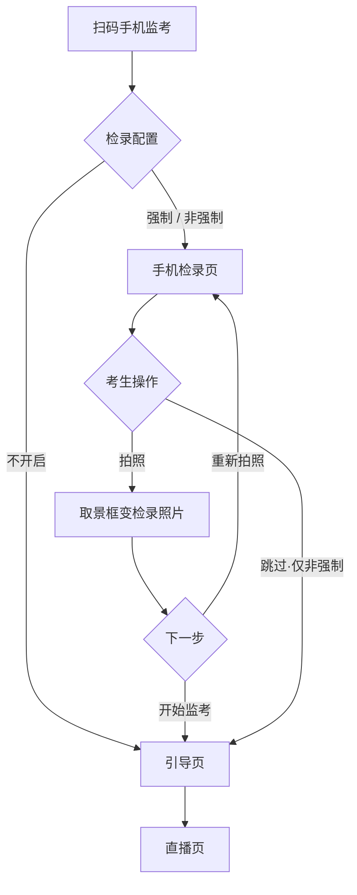

# AISE 手机端检录

## 1. 背景与收益

为手机监考通道新增「手机检录页」：某场考试在组织后台开了检录、且考生扫码用手机监考时，考生进「开始监考」页面前先经过一个检录页（照片示意 + 取景框 + 拍照上传），拍照流程与线上检录一致，堵上「考试开了检录、手机通道考生却无检录记录」的覆盖缺口。

手机监考通道现有流程是「扫码 → 引导页 → 直播页」，全程没有检录环节（依据：[手机监考 PRD](<../20260730 手机监考/AISE_手机监考_PRD.md>) §2）。无电脑摄像头的考生走手机监考时，电脑端检录做不了、手机端又没有，会造成「检录配置强制、但该考生无检录记录」的缺口。新增手机检录后，检录三态配置在所有进入考试的通道一致生效、每个考生都有可追溯的检录记录；不做则强制检录要求出现覆盖缺口，监考端无法核验该考生身份照片。

## 2. 业务流程

```
考生电脑端设备调试 → 电脑摄像头检测失败 → 扫码手机监考
  → 按该场次的检录配置分流：
    · 不开启      → 直接进引导页 → 直播页（原流程，无检录页）
    · 强制/非强制 → 手机检录页（拍照上传）→ 引导页 → 直播页
```

「引导页 → 直播页」是手机监考通道原有顺序，本次仅在「扫码落地」与「引导页」之间插入「手机检录页」。

## 3. 详细功能说明

### 3.1 页面结构

手机扫码落地后、进入引导页之前的新页面（自上而下）：

1. 检录配置标签：区分「强制 / 非强制」，提示完成后去向。
2. 标题与引导文案：「请端正面对摄像头，拍摄检录照片」。
3. 取景框：前置摄像头实时画面，横向 4:3，仅实时拍摄（不支持从相册选图）。
4. 检录要求卡片：照片示意（示例图）+ 拍照要求说明。
5. 底部操作区：「拍照」（初始）/「重新拍照」+「开始监考」（拍照后）/「跳过检录」（仅非强制档）。

### 3.2 三态分支

| 检录配置 | 检录页行为 | 完成/跳过后去向 |
|---|---|---|
| 强制 | 无「跳过」，必须拍照成功才能「开始监考」 | 引导页 |
| 非强制 | 有「跳过」，可跳过直接进引导页；也可正常拍照 | 引导页 |
| 不开启 | 不进检录页，扫码直接进引导页（原流程） | — |

### 3.3 拍照交互

- 点「拍照」→ 截取取景框实时画面 → 上传 → 取景框区域变为检录照片（右上角标「已上传」）→ 按钮变为「重新拍照」+「开始监考」。
- 点「重新拍照」→ 恢复实时取景框，可重新拍。
- 点「开始监考」→ 进入引导页，继续监考流程。

### 3.4 跳过交互（非强制档）

- 点「跳过检录」→ 弹二次确认「跳过检录将不留存检录照片，是否继续？」→「确认跳过」进入引导页；「返回」留在本页。

### 3.5 异常与边界

- 摄像头权限被拒 / 不可用：取景框显示「无法访问摄像头」+「重试」按钮；此时点「拍照」会被拦截并提示先开启摄像头。
- 拍照上传失败：提示重试；强制档未上传成功不可「开始监考」，非强制档可跳过。
- 强制档无豁免：手机摄像头不可用、或开考后才扫码，仍须完成检录才能继续（与 PC 端强制检录一致，不留豁免路径）。

## 4. 流程图



## 5. 验收标准

| # | 测试场景 | 前置条件 | 操作 | 期望结果 | 判定 |
|---|---|---|---|---|---|
| 1 | 强制档正常检录 | 考试检录=强制，考生扫码 | 拍照 → 开始监考 | 拍照后取景框变照片，「开始监考」进引导页 | 流程完整 |
| 2 | 强制档重新拍照 | 强制档，已拍照 | 点「重新拍照」 | 恢复实时取景框，可重新拍 | 恢复正确 |
| 3 | 非强制档跳过 | 考试检录=非强制，考生扫码 | 点「跳过」→「确认跳过」 | 弹二次确认，确认后进引导页 | 跳过可用 |
| 4 | 非强制档跳过取消 | 非强制档 | 点「跳过」→「返回」 | 弹窗关闭，留在本页 | 未误跳 |
| 5 | 不开启直进引导页 | 考试检录=不开启，考生扫码 | 扫码 | 不进检录页，直接进引导页 | 原流程不变 |
| 6 | 摄像头权限被拒 | 强制档，摄像头被拒 | 点「拍照」 | 拦截并提示先开启摄像头 | 不崩溃、有提示 |
| 7 | 摄像头重试 | 摄像头被拒后授权 | 点「重试」 | 恢复实时取景框 | 恢复正确 |

## 待确认事项

1. 手机端检录是否同步 PC 端的「检录视频」环节：线上检录含「拍照 + 检录视频」，但本次需求原文与原型仅覆盖「拍照」；照片/视频规格与 PC 端同步，待与爱测评确认。
2. 电脑端「进入测评」对手机检录结果的消费逻辑（手机检录完成后，电脑端是否跳过电脑检录），待与爱测评对齐。
3. 双重检录多份记录时监考端「查看检录」的展示规则，待与监考端产品对齐。
