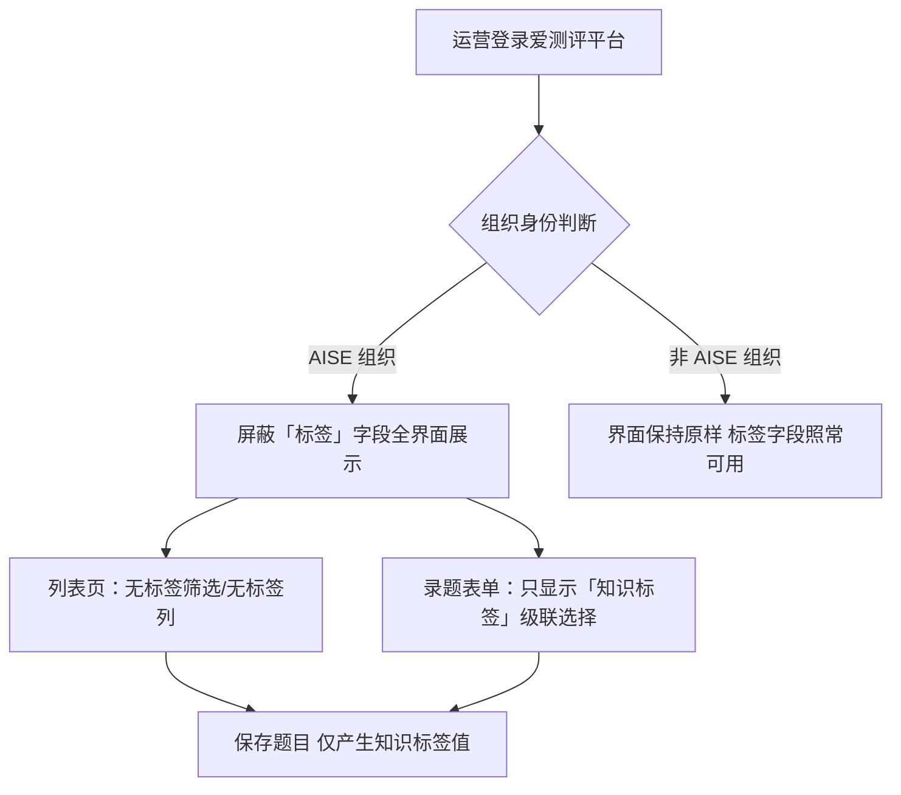

# 爱测评平台 AISE 组织后台「标签」字段屏蔽 PRD

> 依据：2026-08-22 用户口述迭代需求（6 项待确认事项当日全部拍板）+ 《PRD_个人考级报告与知识标签管理.md》（20260728，V1.2，定义「知识标签」体系）+ 《AISE&爱测评平台能力梳理.md》平台说明
> 需求性质：对「20260807 个人报告 & 题目标签管理」（即 20260728 PRD V1.2）的迭代，仅涉及爱测评平台（iceping 端）AISE 组织后台的字段展示

## 1. 背景与收益

**需求简介**：爱测评平台录题界面同时存在 AISE 知识标签体系的「知识标签」字段（20260728 PRD 定义，知识树级联选择，已有）与爱测评原生的「标签」字段（自由标签，如"高频""2024秋招"）。本需求在爱测评平台针对 AISE 组织后台（爱测评视角下 AISE 为特殊学校组织）屏蔽「标签」字段的全界面展示，AISE 运营录入题目时只能看到「知识标签」。

**业务诉求与预期收益**：AISE 知识标签是个人报告「知识点掌握情况」模块的数据源（题目「知识点」字段，一级模块→二级知识点→三级标签），报告掌握度统计完全依赖该字段。两个「标签」并存，AISE 运营录题时容易混淆、误填爱测评自由标签，污染题库与报告统计口径。屏蔽后 AISE 题库题目统一归属知识标签体系，保证报告掌握度口径纯净；非 AISE 组织界面不受影响。

## 2. 业务流程简述

AISE 运营登录爱测评平台（AISE 组织身份）→ 进入题目管理列表页（无「标签」筛选控件、无「标签」列表列）→ 新增/编辑题目（录题表单不显示「标签」输入，只显示「知识标签」知识树级联选择）→ 保存题目（题目仅产生「知识标签」值，不产生「标签」值）。

## 3. 详细功能说明

### 3.1 录题/编辑表单屏蔽「标签」字段

- **位置**：爱测评平台题目管理 → 新增/编辑题目表单
- **现状**：表单存在爱测评原生「标签」输入字段（自由标签）；「知识标签」字段已有（知识树级联选择，20260728 PRD 定义）
- **改造**：AISE 组织身份下「标签」字段不展示；「知识标签」字段保留展示，形态与现有实现一致，本次不调整
- **边界**：历史题目已挂的「标签」值保留在数据中，界面不展示、不迁移、不删除

### 3.2 题目列表页屏蔽「标签」维度

- **位置**：爱测评平台题目管理列表页
- **现状**：筛选区存在「标签」筛选控件（占位示例如"高频"）；表格存在「标签」列
- **改造**：AISE 组织身份下「标签」筛选控件、「标签」列均不展示；其余筛选维度（题干关键词、所属题库、题型、难度等）与列表列不变
- **边界**：屏蔽只影响展示，不影响题目数据本身

### 3.3 组织维度生效范围

- 仅 AISE 组织后台生效；非 AISE 组织（其他学校/机构）录题界面保持原样，「标签」字段照常可用
- **实现方式**（组织身份识别、字段可见性控制的具体机制）由研发自定义，本 PRD 不做限制
- **API 层**：是否限制「标签」字段写入由研发定义，本 PRD 不定义

## 4. 流程图

## 5. 验收标准

| # | 测试场景 | 前置条件 | 操作 | 期望结果 | 判定 |
|---|---------|---------|------|---------|------|
| 1 | 录题表单-屏蔽 | AISE 组织身份打开录题/编辑表单 | 查看表单字段 | 无「标签」输入字段；「知识标签」知识树级联选择正常展示 | 标签字段不出现，知识标签可正常选择 |
| 2 | 列表页-屏蔽 | AISE 组织身份打开题目管理列表页 | 查看筛选区与表格 | 无「标签」筛选控件、无「标签」列；其余筛选与列不变 | 标签维度全部不展示 |
| 3 | 非 AISE 组织-不受影响 | 非 AISE 组织身份打开题目管理 | 查看列表页与录题表单 | 「标签」筛选、「标签」列、「标签」输入均照常展示 | 与原界面一致 |
| 4 | 历史数据保留 | AISE 题库存在已挂「标签」的历史题目 | 查看历史题目列表/详情 | 界面不展示「标签」值；数据未删除未迁移 | 展示屏蔽、数据完好 |
| 5 | 知识标签功能回归 | AISE 组织身份 | 录题并保存 | 「知识标签」正常保存；保存后题目无「标签」值产生 | 知识标签链路不受影响 |
| 6 | 屏蔽范围-全界面 | AISE 组织身份 | 遍历录题表单、列表筛选区、列表表格 | 三处均无「标签」字段展示 | 全界面一致 |

## 6. 待确认事项

| # | 事项 | 结论 | 状态 |
|---|------|------|------|
| 1 | 屏蔽范围 | 全界面（录题表单 + 列表筛选 + 列表列） | ~~待确认~~ → 2026-08-22 用户确认 |
| 2 | 「知识标签」字段形态 | 知识树级联选择 | ~~待确认~~ → 2026-08-22 用户确认 |
| 3 | 「知识标签」字段现状 | 已有，即 20260728 PRD（个人考级报告与知识标签管理 V1.2）定义的字段，本次仅屏蔽「标签」不新增 | ~~待确认~~ → 2026-08-22 用户确认 |
| 4 | 组织维度控制方式 | 研发自定义，PRD 不做限制 | ~~待确认~~ → 2026-08-22 用户确认 |
| 5 | API 层是否限制「标签」写入 | 研发定义，PRD 不定义 | ~~待确认~~ → 2026-08-22 用户确认 |
| 6 | 需求文档落盘位置 | 新建 `PRD/20260822 爱测评标签字段屏蔽/` 独立文件夹 | ~~待确认~~ → 2026-08-22 用户确认 |
